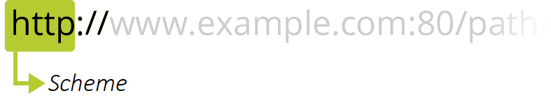
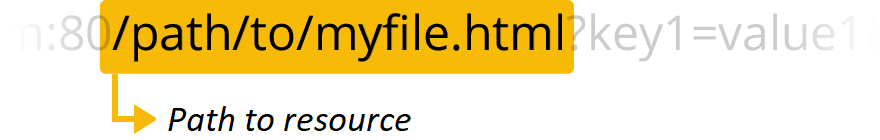
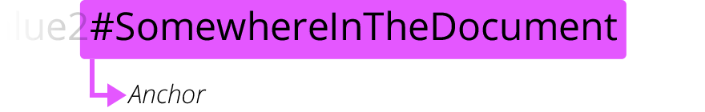

# What is a URL?
This article discusses Uniform Resource Locators (URLs), explaining what they are and how they're structured.

***URL stands for Uniform Resource Locator.*** A URL is nothing more than the address of a given unique resource on the Web. In theory, each valid URL points to a unique resource. Such resources can be an HTML page, a CSS document, an image, etc. In practice, there are some exceptions, the most common being a URL pointing to a resource that no longer exists or that has moved. As the resource represented by the URL and the URL itself are handled by the Web server, it is up to the owner of the web server to carefully manage that resource and its associated URL.

## Basics: anatomy of a URL
Here are some examples of URLs:
```
https://developer.mozilla.org
https://developer.mozilla.org/en-US/docs/Learn/
https://developer.mozilla.org/en-US/search?q=URL
```
Any of those URLs can be typed into your browser's address bar to tell it to load the associated page (resource).

A URL is composed of different parts, some mandatory and others optional. The most important parts are highlighted on the URL below (details are provided in the following sections):


## Scheme

***The first part of the URL*** is the scheme, which indicates the protocol that the browser must use to request the resouce (a protocol is a set method for exchanging or transferring data around a computer network). Usually for websites the protocol is HTTPS or HTTP (its unsecured version). Addressing web pages requires one of these two, but browsers also know how to handle other schemes such as mailto: (to open a mail client), so don't be surprised if you see other protocols.
# Authority

Next follows the authority, which is separated from the scheme by the character pattern ://. If present the authority includes both the domain (e.g. www.example.com) and the port (80), separated by a colon:

* The domain indicates which Web server is being requested. Usually this is a domain name, but an IP address may also be used (but this is rare as it is much less convenient).
* The port indicates the technical "gate" used to access the resources on the web server. It is usually omitted if the web server uses the standard ports of the HTTP protocol (80 for HTTP and 443 for HTTPS) to grant access to its resources. Otherwise it is mandatory.
```
Note: The separator between the scheme and authority is ://. The colon separates the scheme from the next part of the URL, while // indicates that the next part of the URL is the authority.
One example of a URL that doesn't use an authority is the mail client (mailto:foobar). It contains a scheme but doesn't use an authority component. Therefore, the colon is not followed by two slashes and only acts as a delimiter between the scheme and mail address.
```
# Path to resource

```/path/to/myfile.html``` is the path to the resource on the Web server. In the early days of the Web, a path like this represented a physical file location on the Web server. Nowadays, it is mostly an abstraction handled by Web servers without any physical reality.
# Parameters

```?key1=value1&key2=value2``` are extra parameters provided to the Web server. Those parameters are a list of key/value pairs separated with the ```&``` symbol. The Web server can use those parameters to do extra stuff before returning the resource. Each Web server has its own rules regarding parameters, and the only reliable way to know if a specific Web server is handling parameters is by asking the Web server owner.
# Anchor

```#SomewhereInTheDocument``` is an anchor to another part of the resource itself. An anchor represents a sort of "bookmark" inside the resource, giving the browser the directions to show the content located at that "bookmarked" spot. On an HTML document, for example, the browser will scroll to the point where the anchor is defined; on a video or audio document, the browser will try to go to the time the anchor represents. It is worth noting that the part after the #, also known as the *fragment identifier, is never sent to the server with the request.*