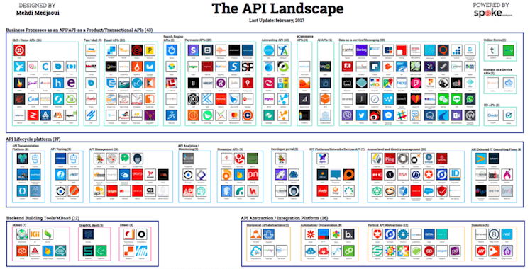

# What is an API (Application Programming Interface)
* allows systems to work together.
* APIs allow us to leverage the functionality of external services to unlock great potential.
* Makes it possible for applications to share data and take actions on one another’s behalf without requiring developers to share all of their software’s code.
* limits outside program access to a specific set of features—often enough, requests for data of one sort or another.
* APIs are great time savers.
* https://www.programmableweb.com/ tons of APIs

