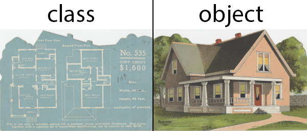

# Classes are blueprints
Think about the relationship between a blueprint for a house, and the house itself. The blueprint is a template for creating a new house. It has all the details and instructions needed to build a house, but it is not a house. If we use the blueprint as a guide, we can create a new house. In fact, we can create as many new houses as we want. Each house will be separate from the other ones. Completely unique houses, but all based on the same blueprint.

In OOP, classes are blueprints (templates) that we use to create instances of objects. A class describes what the object is going to be and we can create new objects using the class.



## Class
To declare a class, you use the class keyword with the name of the class. *If you wanted to create a bunch of pizza objects,* you would start by creating a Pizza class.
```javascript
class Pizza {

}
```
>We can use any name for the class but *****a class name should always be a noun, and the first letter should always be capitalized.*****

To create a new object from a class, we use the new keyword:
```javascript
let pizza1 = new Pizza();
let pizza2 = new Pizza();
```
```pizza1``` and ```pizza2``` are pizza objects. When you create an object using a class, it is an instance of that class. So pizza1 and pizza2 are instances of the Pizza class.

These objects are **both instances of the same class.** They were created from the same class, *but they are completely separate objects.*Two houses made from the same blueprint are still completely separate houses after all, right?
```javascript
pizza1 === pizza2; // false
```
Right now there is nothing inside the Pizza class. Our blueprint is blank, so it will just create an empty object ```{}```.

Let's change that.

## Methods and Properties
Let's update the class so that it can allow all pizzas to have toppings. *If we wanted every pizza instance to start off with cheese,* but allow other toppings to be added, here's how we could implement that:
```javascript
class Pizza {

  constructor() {
    this.toppings = ["cheese"];
  }

  addTopping(topping) {
    this.toppings.push(topping);
  }

}
```

**Our Pizza blueprint is now describing two methods** (constructor and addTopping) as well as a property toppings. You can **add a method to a class with the following syntax:**
```javascript
class SomeClass {
  methodName(parameters) {
    // this is a method
  }
}
```
*****To add properties to a class, simply use the this keyword followed by the property name, then assign it a value:*****
```javascipt
class SomeClass {
  someMethod() {
    this.hello = "hi"; // Created a property called hello
  }
}
```
Any pizza object created from this Pizza class will have its own version of these properties and methods. **This means we can call the addTopping() method on pizza1 without it affecting pizza2.**

Since a class is just a blueprint for creating objects, methods like addTopping will exist on the instances created from the class, but not on the class itself.
```javascript
// This will **NOT** work.
// That's because addTopping is a method only available to actual instances of Pizza
// Give it a try!
Pizza.addTopping();
```
## Introduction to constructor
constructor is **a special kind of method** that gets executed when an object instance is created from a class. *Everything inside the Pizza's constructor method will get run for the new instance of the class when we call new ```Pizza();```.* This is a great place to setup default state for new instances. In other words, *****the constructor is for setting default values for any new object's properties.*****
```javascript
class Pizza {
  constructor() {
    this.toppings = ["cheese"];
  }
}
```
We are currently using the Pizza's constructor to setup the toppings array and add "cheese" as the first topping.
## Primitives as Objects
**Each primitive in JavaScript** (excluding symbol which has weird rules) *has a corresponding object constructor;* you can see this in the following example:
```javascript
typeof(true); 
// "boolean" 
typeof(Boolean(true)); 
// => "boolean" 
typeof(new Boolean(true));
// => "object"
```
An object constructor can be invoked with the word new, as seen above. Note that when we call object constructors we create new, unique instances of the objects requested. When we use the object constructor to create a primitive, we run into issues when we try to compare two different strings, for instance.

>In the next example we can see that the```==``` (type-coercion vulnerable) comparative returns true, while the ```===``` comparative returns false.
```javascript
const greeting = "Hello, world!" 
const objGreeting = new String("Hello, world!");

greeting == objGreeting; 
// => true

greeting === objGreeting; 
// => false
```
We see above that despite having the same string content, the primitive string is not the exact same as an object string. However, using == allows JS to convert one of them so that their types match. To avoid these kinds of issues, *it's generally considered bad practice to use object constructors when you're creating primitives,* but object constructors are extremely useful for instantiating the complex objects that you'll be defining with your classes in the future.

>You can read more about primitives and their object constructors in this stretch reading. https://web.compass.lighthouselabs.ca/ea6df177-5ab1-4987-87f0-fa7753ffe65e

# Conclusion
In this section, you learned about how to use classes as a way of simplifying the creation of objects that share the same set of behaviour and properties. You also became familiar with:

* The class syntax.
* The purpose of the new keyword and the concept of constructor functions.
* The difference between classes and instances.
* How we are able to create new object instances with and without class.

# MORE Primitives and Objects in JS
## Primitive Types Don't Have Properties
In JavaScript, **primitive values do not have properties.**

At first when you read this, you might not notice what's surprising about this. "So what?", you say. Well, if a property is that thing you can access like object.property, and if primitive values don't have properties, and a string is a primitive... then what's the deal with "some string".length or 5.toString()?

These statements do in fact work. Yet it appears that we are calling properties on primitive types, which technically shouldn't be possible based on the rule stated above!

You next thought may be: "Ah right, good point! So how does that work then?". Well, we're glad you asked!

## Primitive Types Have Corresponding Objects
Each primitive (excluding symbol which has weird rules) has a corresponding object constructor; you can see this clearly in the following example:
```javascript
typeof(true); 
// "boolean" 
typeof(Boolean(true)); 
// => "boolean" 
typeof(new Boolean(true));
// => "object"
/*  
  It is generally considered bad practice to use primitive object constructors (as shown in the final line above). 
*/
```
An object constructor can be invoked with the word new, as seen above. Each object has methods associated with them based on what constructor was used.

As stated above, primitive data types do not have properties. So why exactly does "someString".length work? Let's take you back to the behaviour of ```==``` vs ```===```. When you use ```==```, JavaScript does this fun thing called **type coercion**. This means that JavaScript will take different data types, and one of them will be converted to an "equivalent". A good example of this is:
```javascript
'1' == 1; // type coercion occurs
// => true 
'1' === 1; 
// => false
```
Similarly, in the case of ```"someString".length```, ```"someString"``` **is coerced to a string object** in order to access the property length. However, ```"someString"``` *itself is still a primitive data type.*

Here are some examples of *****calling String object properties, on a primitive string:*****
```javascript
// some examples of String properties: 
const someString = "Lighthouse Labs"; 

console.log(someString.toUpperCase()); 
// => 'LIGHTHOUSE LABS'

console.log(someString.toLowerCase()); 
// => 'lighthouse labs'

console.log(someString.split("")); 
// => [ 'L', 'i', 'g', 'h', 't', 'h', 'o', 'u', 's', 'e', ' ', 'L', 'a', 'b', 's' ]
```
You can actually *test the difference between the constructor and actual primitive.* In the next example we can see that the ```==``` (type-coercion vulnerable) comparative returns true, while the ```===``` comparative returns false.
```javascript
const greeting = "Hello, world!" 
const objGreeting = new String("Hello, world!");

greeting == objGreeting; 
// => true

greeting === objGreeting; 
// => false
```
We see above that **despite having the same string content**, the *primitive string is not the exact same as an object string.* However, *using ```==``` allows JS to convert one of them so that their types match.*

