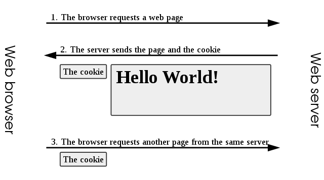

# 🍪🍪🍪🍪🍪 Intro to Cookies 🍪🍪🍪🍪🍪
Communication between the browser and our application is done over HTTP, **which is stateless**, meaning that each request is treated independently of every other, and requests can happen in any order.

In order to treat each user independently, we need a way to distinguish each user's HTTP requests. Cookies, a feature of HTTP, help us fill this need.

*****An HTTP server can tell a client to remember certain keys and values ("cookies") using the Set-Cookie header in an HTTP response.*****
  * In all subsequent HTTP requests from the client to the server, these keys and values are included in the Cookie header.
  * the server can ask a client to "keep reminding" the server of the client's identity (or other information) with every subsequent request.



* Cookies store preferences (Lang, name, theme)
* The website that creates a cookie is the only one that can read it
* Cookies have a max size
  * To get a much larger size a work around was developed. It involves using the cookie to store a unique user ID for each user then cross checking that ID with a database stored on the server
  * These are called 3rd Party cookies

# Background/History
* The term "cookie" was coined by web-browser programmer Lou Montulli.
  * It was derived from the term "magic cookie", which is a packet of data a program receives and sends back unchanged, used by Unix programmers.
* Cookies provided a solution to the problem of reliably implementing a **virtual shopping cart**.
* The first use of cookies (out of the labs) was checking whether visitors to the Netscape website had already visited the site.
* Support for cookies was integrated with Internet Explorer in version 2, released in October 1995.
* The introduction of cookies was not widely known to the public at the time. In particular, **cookies were accepted by default**, and *users were not notified of their presence.* 

# Terminology
## Session cookie
* Also known as an *in-memory cookie*, *transient cookie* or *non-persistent cookie*
* **Exists only in temporary memory** while the user navigates a website.
* Session cookies **expire or are deleted when the user closes the web browser.**
* Identified by the browser by the **absence of an expiration date** assigned to them.
## Persistent cookie
* **expires at a specific date** or after a specific length of time.
* **Lifespan set by its creator,** its information will be **transmitted to the server every time the user visits the website** that it belongs to, or every time the **user views a resource belonging to that website from another website** (*such as an advertisement*).
* Persistent cookies are sometimes referred to as **tracking cookies** because they can be used by advertisers to record information about a user's web browsing habits over an extended period of time.
## Secure Cookie
* Can only be **transmitted over an encrypted connection** (i.e. HTTPS)
* They cannot be transmitted over unencrypted connections
* **Helps to prevent eavesdropping**
* **A cookie is made secure by adding the Secure flag to the cookie.**
## HTTP-only Cookie
* **Cannot be accessed by client-side APIs**, such as JavaScript.
* Eliminates the threat of **cookie theft via cross-site scripting (XSS)**.
  * The cookie *remains vulnerable* to cross-site tracing (**XST**) and cross-site request forgery (**CSRF**) attacks.
* **A cookie is given this characteristic by adding the HttpOnly flag to the cookie.**
## Same-site Cookies
* Has the attribute ```SameSite```
  * can have a value of ```Strict```, ```Lax``` or ```None```
* ```SameSite=Strict``` browsers would only send cookies to a target domain that is the same as the origin domain.
  * This would effectively mitigate cross-site request forgery (CSRF) attacks.
* ```SameSite=Lax```, browsers would send cookies with requests to a target domain even it is different from the origin domain, but only for safe requests such as GET (POST is unsafe) and not third-party cookies (inside iframe). 
* ```SameSite=None``` would allow third-party (cross-site) cookies,   
  * Most browsers require ```secure``` attribute on ```SameSite=None``` cookies.
## Third-party cookie
* Normally, a *cookie's domain attribute will match the domain that is shown in the web browser's address bar.*
  * This is called a **first-party cookie**.
  * **A third-party cookie**, however, belongs to a domain different from the one shown in the address bar.
    * This sort of cookie typically appears when web pages feature content from external websites, such as banner advertisements.
    * This opens up the potential for tracking the user's browsing history and is often used by advertisers in an effort to serve relevant advertisements to each user.
* |**EX**|
  * a user visits ```www.example.org```
  * This website contains an advertisement from ```ad.foxytracking.com```, which, when downloaded, sets a cookie belonging to the advertisement's domain (```ad.foxytracking.com```).
  * the user visits another website, ```www.foo.com```
  * which also contains an advertisement from ```ad.foxytracking.com``` and sets a cookie belonging to that domain (```ad.foxytracking.com```)
  * Eventually, both of these cookies will be sent to the advertiser when loading their advertisements or visiting their website.
  * *****The advertiser can then use these cookies to build up a browsing history of the user across all the websites that have ads from this advertiser, through the use of the HTTP referer header field.*****
* As of 2014, some websites were setting cookies readable for over 100 third-party domains.
  * On average, a single website was setting 10 cookies
  * With a maximum number of cookies (first- and third-party) reaching over 800.
* Most modern web browsers contain privacy settings that can block third-party cookies, and some now block all third-party cookies by default
## Supercookie 
* A  cookie with an **origin of a top-level domain** (such as ```.com```) **or a public suffix** (such as ```.co.uk```). 
  * **Ordinary cookies**, by contrast, have an **origin of a specific domain name**, such as ```example.com```.
* **Can be a potential security concern and are therefore often blocked by web browsers.**
### Other Supercookie uses
* sometimes used for tracking technologies that do not rely on HTTP cookies.
* on Microsoft websites in August 2011: cookie syncing that respawned MUID (machine unique identifier) cookies, and ETag cookies.
## Zombie cookie (Evercookie)
* **Is data and code** that has been placed by a web server on a visitor's computer or other **device in a hidden location** outside the visitor's web browser's dedicated cookie storage location
  * That *****automatically recreates a HTTP cookie as a regular cookie after the original cookie had been deleted.*****
* The zombie cookie may be stored in multiple locations, such as Flash Local shared object, HTML5 Web storage, and other client-side and even server-side locations, and when the cookie's absence is detected,[clarification needed] the cookie is recreated[clarification needed] using the data stored in these locations.
## Cookie wall
* A cookie wall **pops up on a website and informs the user of the website's cookie usage.** It has no reject option, and the **website is not accessible without tracking cookies.**

# Cookie Uses
## Session management
* provide a way for users to record items they want to purchase as they navigate throughout a website (a virtual "shopping cart" or "shopping basket").
  * Today, however, the contents of a user's shopping cart are usually stored in a database on the server, rather than in a cookie on the client. 
  * Because cookies are sent to the server with every request the client makes, that session identifier will be sent back to the server every time the user visits a new page on the website, which lets the server know which shopping cart to display to the user.
* Logging into websites
  * When the user visits a website's login page, the web server typically sends the client a cookie containing a unique session identifier.
  * When the user successfully logs in, the server remembers that that particular session identifier has been authenticated and grants the user access to its services.
* **Because session cookies only contain a unique session identifier, this makes the amount of personal information that a website can save about each user virtually limitless**
* Session cookies also help to improve page load times, since the amount of information in a session cookie is small and requires little bandwidth.
## Personalization
* Remember information about the user in order to show relevant content to that user over time. 
* These options are encoded on the cookie then sent to the clients computer, each reconnect will send the cookie, thus setting the preferences on the web page
## Tracking
* Used to track users' web browsing habits.
* This can also be done to some extent by using the IP address of the computer requesting the page or the referer field of the HTTP request header, **but cookies allow for greater precision.**
* Works as follows:
  1. If the **user requests a page of the site,** but **the request contains no cookie,** the *server presumes that this is the first page visited by the user.* So the *server creates a unique identifier* (typically a string of random letters and numbers) and sends it as a cookie back to the browser together with the requested page.
  2. From this point on, the cookie will automatically be sent by the browser to the server every time a new page from the site is requested. The server not only sends the page as usual but also stores the URL of the requested page, the date/time of the request, and the cookie in a log file.
* By analyzing this log file, it is then possible to find out which pages the user has visited, in what sequence, and for how long.