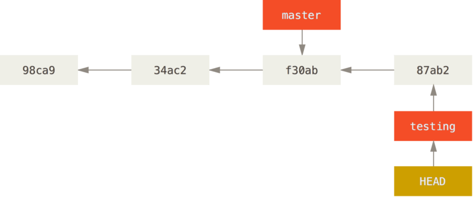

# Git Branches --- branch early, and branch often!
* A remote repository holds the 'master' version of each of the files for our project, while we work on a copy of those files locally.
* The power of branching:
  * With the power of branches a project's features, bugs, and updates can be sectioned off into their own versions of the source code.
  * This allows people to make many different changes to the source, which can later be reviewed before being 'merged' into the master version.

>NOTE ---- The **“master” branch** in Git *is not a special branch.* It is **exactly like any other branch.** The only reason nearly every repository has one is that the git init command creates it by default and most people don’t bother to change it.
## Example
* David, Sarah, and Quinn are working on a chat app together. They have the main functionality complete. Users can chat with each other through the web browser.

* o spice things up, the team decides it would be nice if each user's display name was a different color.
* Quinn goes ahead and **creates a branch called feature/display-name-color.**

* Now Quinn *can work on the code in this branch and even push it to GitHub without effecting the master branch.*
  * If he *writes some code that breaks the rest of the app*, the **working version of the app is protected.**
  * Quinn's **new branch can be tested separately** to make sure it works, before pushing it to the release (or 'production') version.

* The team also discovers *a nasty bug where messages are being duplicated!* Sarah **gets to work on fixing it and creates a branch called bug/duplicate-message.**

* The same principles apply to this branch as they did to Quinn's.
  * Sarah can fix the bug and insure that everything still works correctly before the team releases the fix.

* *When both Sarah and Quinn complete their changes*, the team gets together and **'merges' the branches into the master branch.** Now the code is ready for release!


# Branches in a nutshell [LINK](https://git-scm.com/book/en/v2/Git-Branching-Branches-in-a-Nutshell)
* Branching means you **diverge from the main line of development** and continue to do work without messing with that main line.
* Why is git branching great?
  * The way Git branches is **incredibly lightweight**, making branching operations **nearly instantaneous**, and **switching back and forth between branches generally just as fast.**
  * Unlike many other VCSs, Git encourages workflows that branch and merge often, even multiple times in a day.
* How does Git work?
  * Git doesn’t store data as a series of changesets or differences, but instead as a series of snapshots.
  * When you make a commit, Git stores a commit object that contains a pointer to the snapshot of the content you staged.
  * This object also contains the author’s name and email address, the message that you typed, and **pointers to the commit or commits that directly came before this commit** (its parent or parents)
    * **Zero parents for the initial commit**
    * **one parent for a normal commit**
    * **multiple parents for a commit that results from a merge of two or more branches**
  * |**EX**| Let’s assume that you have a directory containing **three files, and you stage them all and commit.**
    * **Staging the files computes a checksum for each one** (the SHA-1 hash) 
    * Stores that version of the file in the Git repository (Git refers to them as blobs)
    * Then adds that checksum to the staging area
    * When you create the commit by running git commit
      * Git checksums each subdirectory (in this case, just the root project directory) 
      * Then stores them as a tree object in the Git repository. 
      * Git then creates a commit object that has the metadata and a pointer to the root project tree so it can re-create that snapshot when needed.
  * Git repository now contains five objects:
    * Three blobs (each representing the contents of one of the three files)
    * One tree that lists the contents of the directory and specifies which file names are stored as which blobs 
    * One commit with the pointer to that root tree and all the commit metadata.
   ^^^^^^ A commit & it's tree ^^^^^
  * If you **make some changes and commit again**, the **next commit stores a pointer to the commit that came immediately before it.**
   ^^^^Commits & their parents^^^^^^
* *****A branch in Git is simply a lightweight movable pointer to one of these commits.***** 
  * The **default branch** name in Git **is master**. 
  * As you start making commits, you’re given a master branch that points to the last commit you made. 
  * **Every time you commit, the master branch pointer moves forward automatically.**
 ^^^ A branch and it's commit history^^^^
## Creating a new Branch
* Doing so **creates a new pointer for you to move around.** Let’s say you want to create a new branch called ```testing```. You do this with the git branch command:
```shell
$ git branch testing
```
* This creates a new pointer to the same commit you’re currently on.

>Two branches pointing into the same series of commits
**How does Git know what branch you’re currently on?** It keeps a **special pointer called HEAD.** In Git, *this is a pointer to the local branch you’re currently on.* *****In this case, you’re still on master. The git branch command only created a new branch — it didn’t switch to that branch.*****


> HEAD pointing to a branch
You can easily see this by running a simple ```git log``` command that **shows you where the branch pointers are pointing.** *This option is called* ```--decorate```.
```shell
$ git log --oneline --decorate
f30ab (HEAD -> master, testing) Add feature #32 - ability to add new formats to the central interface
34ac2 Fix bug #1328 - stack overflow under certain conditions
98ca9 Initial commit
```
* You can see the master and testing branches that are right there next to the f30ab commit.
> NOTE -- **git log doesn’t show all the branches all the time**
Git just doesn’t know that you’re interested in a branch and it is trying to show you what it thinks you’re interested in. In other words, by default, *****git log will only show commit history below the branch you’ve checked out.*****
**To show commit history for the desired branch you have to explicitly specify it:** ```git log <branch name>```. *****To show all of the branches,***** ```add --all``` to your git log command.
## Switching Branches
To **switch to an existing branch**, you run the ```git checkout``` command. Let’s switch to the new testing branch:
```shell
$ git checkout testing
```
This moves HEAD to point to the testing branch.

 ^^^^ HEAD points to the current branch ^^^^

**What is the significance of that? Well, let’s do another commit:**
```shell
$ vim test.rb
$ git commit -a -m 'made a change'
```
 ^^^^^The HEAD branch moves forward when a commit is made^^^^^^

This is interesting, because now your testing branch has moved forward, but your master branch still points to the commit you were on when you ran git checkout to switch branches.***Let’s switch back to the master branch:***
```shell
$ git checkout master
```
 ^^^^^HEAD moves when you checkout^^^^^^^
That command **did two things.**
  * It moved the **HEAD pointer back to point to the master branch**,  
  * It **reverted the files in your working directory back to the snapshot that master points to.** This also means the changes you make from this point forward will diverge from an older version of the project.

It essentially **rewinds the work you’ve done in your testing branch** so you can *go in a different direction.*

> NOTE -- *****Switching branches changes files in your working directory*****
It’s important to note that when you switch branches in Git, **files in your working directory will change.** If you switch to an older branch, your working directory will be reverted to look like it did the last time you committed on that branch. **If Git cannot do it cleanly, it will not let you switch at all.**

Let’s make a few changes and commit again:
```shell
$ vim test.rb
$ git commit -a -m 'made other changes'
```
Now your project history has diverged. You created and switched to a branch, did some work on it, and then switched back to your main branch and did other work. Both of those changes are isolated in separate branches: you can switch back and forth between the branches and merge them together when you’re ready. And you did all that with simple branch, checkout, and commit commands.
 ^^^^Divergent history^^^^

* You can also see this easily with the ```git log``` command.
* If you run ```git log --oneline --decorate --graph --all``` it will **print out the history of your commits,** showing where your branch pointers are and **how your history has diverged.**

```shell
$ git log --oneline --decorate --graph --all
* c2b9e (HEAD, master) Made other changes
| * 87ab2 (testing)branch early, and branch often Made a change
|/
* f30ab Add feature #32 - ability to add new formats to the central interface
* 34ac2 Fix bug #1328 - stack overflow under certain conditions
* 98ca9 initial commit of my project
```

## ** Creating a new branch is as quick and simple as writing 41 bytes to a file (40 characters and a newline).

