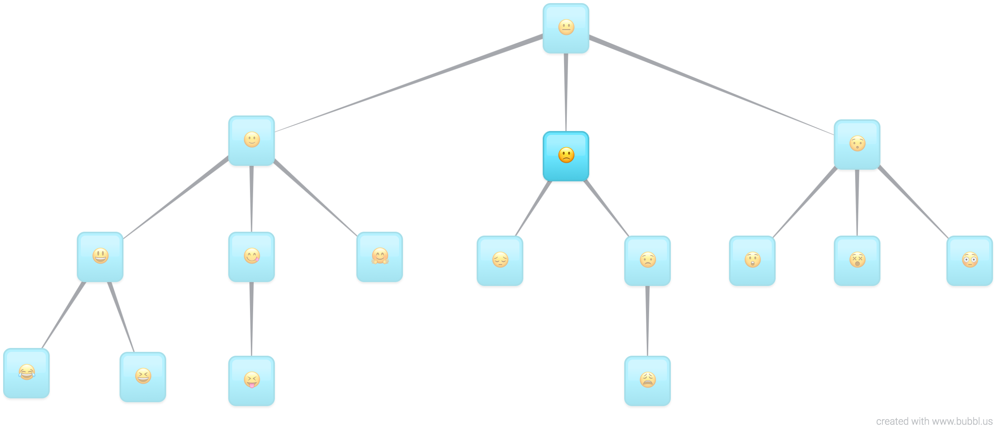

# Two ways to traverse a tree
  1. Breadth first traversal
  2. Depth first traversal
EX
Let's say you have the following tree of emojis:


And your job is to find the node with the jazz hands emoji 🤗.

You're going to have to search through each and every node in the tree until you find the node that contains 🤗.

## 1. Breadth First Traversal
* Breadth first traversal **will check the nodes closest to the root node,** before checking the nodes that are farther away. *A breadth first traversal would visit the nodes in this order:*


Start by checking if the root node contains 🤗.


The root node 😐 is not 🤗 so we move on to the root node's children. The second row in the tree.


🙂 is not 🤗 so we move on to the next sibling.



🙁 is not 🤗 so we move on to the next sibling.


😯 is not 🤗 so we move on. There are no more siblings, so we now visit all the children of each of these nodes. The third row in the tree.


Finally we find 🤗 so we stop traversing any farther.

This is an example of breadth first search. **We're looking for a particular node, so we start traversing through every node, row by row, until we find it.**

Breadth first traversal:

* Start with the root node.
* Then move onto the root's children.
* Then move onto those node's children.

You'll have noticed that we access each node row-by-row. Breadth first traversal will always visit the nodes closest to the root node before moving on to the nodes that are farther away.

## 2. Depth First Traversal

Depth first traversal will accomplish the same task as breadth first traversal, **but we will always be trying to visit the leaf nodes.** Depth first traversal will ***visit each node on an entire path, all the way out to a leaf node, before visiting nodes on the next path.*** A depth first traversal would visit the nodes in this order:


Start by checking if the root node contains 🤗.


The root node 😐 is not 🤗 so we move on to the root node's first child.


🙂 is not 🤗 so we move on to that node's first child.


😃 is not 🤗 so we move on to that node's first child.


😂 is not 🤗 and this node has no children, so we move onto the next sibling.


😆 is not 🤗 and this node has no children, and there are no more siblings, so we move back to the parent's next sibling.


😋 is not 🤗 so we move on to that node's first child.


😝 is not 🤗 and this node has no children, and there are no siblings, so we move back to the parent's next sibling.


Finally we find 🤗 so we stop traversing any farther.

For depth first traversal, we can imagine that there's a little stick man visiting each node for us. He's going to walk around the tree and check each node one by one. He will only walk around the tree, never crossing over any nodes or edges.


# Implementation
We're going to look at how to implement a depth first traversal in JavaScript.

## Sub Trees

***A tree is a recursive data structure.*** A tree is actually made up of smaller sub trees, which themselves are made up of even smaller sub trees.

**Every node in the tree, apart from the root node, is actually the root node of a smaller tree.**

This is what the entire tree looks like with 😐 at the root:


But this tree is just made of smaller sub trees. Let's zoom into the first child node 🙂.


This is also a tree, **known as a subtree.** But *this tree is also just made of smaller sub trees.* 

Let's zoom into the first child node 😃.


Every node is the root node of a smaller sub tree. Even a leaf node like 😂 is the root node of a tree with 0 children.

## Traversal
For depth first traversal, we're going to take advantage of the recursive nature of the tree and write a recursive algorithm.

Traverse tree:

1. Visit the root node of the tree.
2. Get the first unvisited child sub-tree of the current node.
3. Do step 1 with the sub-tree.

Here's what the pseudo code might look like:

---
```
traverse tree:

  visit the root node of the tree.
  let subTree = the first unvisited child sub-tree of the root node.

  Recursive Case:
    If there's a subTree, traverse subTree.
  Base Case:
    If there's no subTree, do nothing
```
---
First Unvisited Child Sub-Tree |	Second Unvisited Child Sub-Tree |	No Unvisited Child Sub-Tree|
|------------------------------|----------------------------------|----------------------------|
|  |  | |

Visit the root node of the tree.


Get the first unvisited child sub-tree of the root node. Repeat the previous step with this sub-tree.


Keep repeating this.


When you get to a node with no children, or you've already visited all it's children, get the next unvisited child sub-tree of the parent node. Repeat the first step with this sub-tree.


Keep repeating this.


If you continue to do this for every node in the tree, you will visit every node using depth first traversal.

## Code

Here's what the implementation of this algorithm looks like:

```javascript
class Node {

  constructor(data) {
    this.data = data;
    this.parent = null;
    this.children = [];
  }

  depthFirstTraversal() {

    console.log(this); // 1

    for (const childNode of this.children) {
      childNode.depthFirstTraversal(); // 2
    }
  }
}
```

1. Visit the current node. In this case, we're just printing out the data.
2. Loop through every child of the current node and repeat the first step with that node.

We can use recursion to implement depth first traversal, so it's a little bit easier to implement than breadth first traversal because a tree is a recursive data structure.

