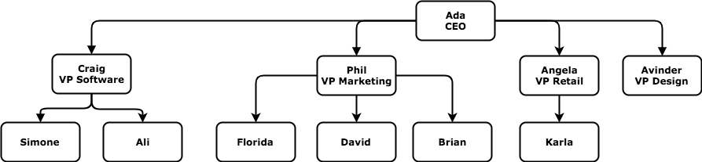
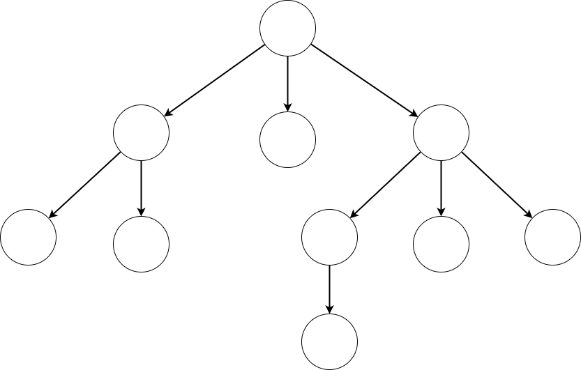
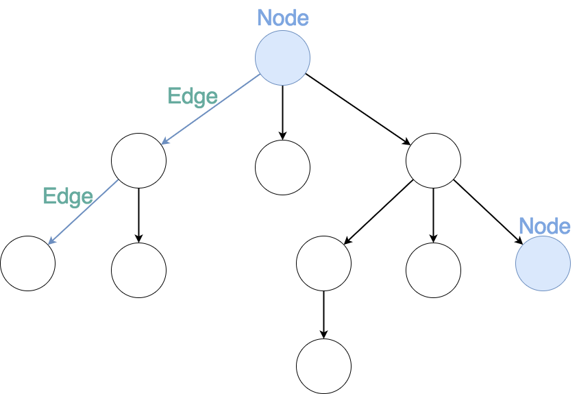
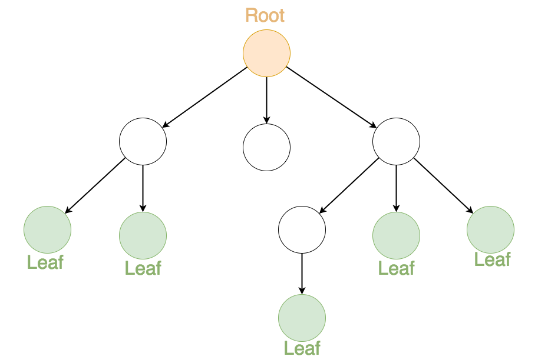
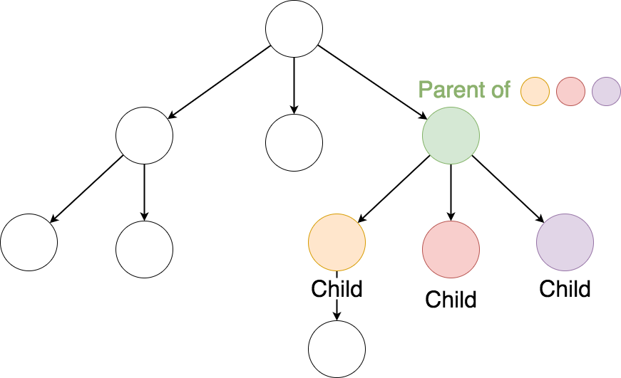
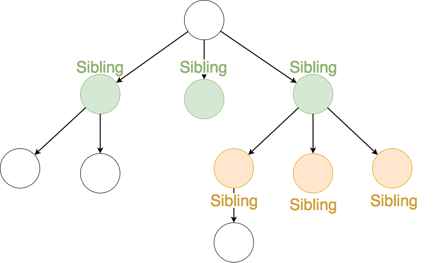
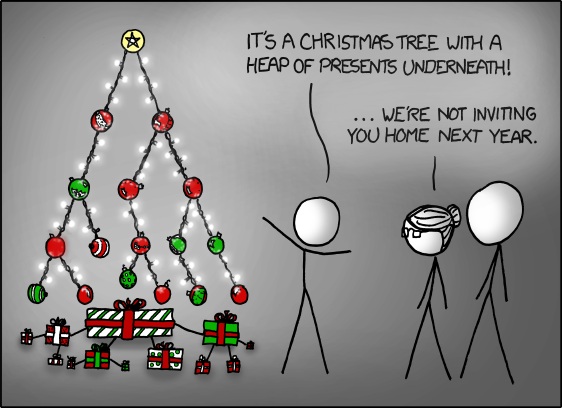

# Introduction To Data Structures
* Arrays are great when we have a list of data, especially when that list is in some order. 
* Objects are great when we want to be able to look up data quickly using a key. 
* These are the most common data types that exist in most languages,** but these are not the only data structures out there. In fact, there are many other data structures that exist for organizing data in different ways.**
## Introduction to Trees
EX
* Durian has specifically hired you to create an app that manages all of the employees in their company.
* This app will contain data about all of the employees at Durian and will need to be able to quickly tell someone the following things about each employee:

  1. Who an employee's boss is.
  2. The total number of people that an employee supervises.
  3. How many people there are between an employee and the CEO.
  4. Do two employees share the same boss.

* our supervisor hands you a list of all the employee's names, something that looks like this:
```javascript
[Ada, Craig, Arvinder, Angela, Phil, Simone, Ali, Karla, David, Brian, Florida]
```
* Let's start by choosing an employee from the list at random, "Phil", and try to determine the data for the first feature. Who is Phil's boss?
* Given just this list of information, it's difficult to find out who Phil's boss is. There's really no obvious way to determine his boss. So you tell your supervisor that you're having trouble with this information. Your supervisor goes away for a couple of minutes and when she returns, she gives you a table of all the employees that looks like this:

<center>

| Employee | Boss |
|---------:|:----:|
|  Ada     |No one|
|  Craig   |	Ada |
|Arvinder	 | Ada  |
| David    | Phil |
| Angela	 | Ada  |
| Ali      | Craig|
|Brian	   |Phil  |
| Phil     |	Ada |
| Simone   |Craig |
| Karla    |Angela|
|Florida   | Phil |

</center>

* **Next feature,** how many people does Phil supervise? If we count every time "Phil" appears in the right hand column, we can figure that out. It looks like 3. While that wasn't too difficult to figure out, we do have to check every row in the table to find this out. This could take a really long time for a table with a lot of employees in it. Something as simple as how many employees someone supervises should be a pretty easy task. It should definitely be easier than checking every single employee's boss.
* So you let your supervisor know that this table is better than the list, but it's still not good enough. Your supervisor takes the table and goes away again. But this time when she returns, she hands you this:



* Phil's boss is Ada and without having to look at everyone we can tell that Phil supervises 3 people. Great!
* For our final feature request, we can also use this diagram to quickly tell that there is one person between Phil and the CEO, and that's Phil. Well, that was easy!
* ***This is a nice little data structure known as a Tree.****
* This structure is composed of individual employees and their relationships with other employees. It's these relationships between the different people that really sets this data structure apart from the others. All of the problems that you're trying to solve are based on the relationships of the employees, so storing your data like this makes all of your tasks a lot easier.

## Tree
This is an abstract representation of a Tree:



* **Each circle in the tree is called a node.** ***A node represents a key entity and contains data about that entity.*** In this case, each node represents an employee and the data contains their name. **All the connections between the nodes are called edges.**
* Terms to note!:
  1. Each circle in the tree is called **a node.**
  2. **A node represents a key entity** and contains data about that entity.
  3. All the **connections between the nodes are called edges.**



* The *node at the very top of the tree* is **called the root node** and the *nodes on the very bottom* are called the **leaf nodes.**



* NOTE: Computer scientists seem to have this upside down, but they're computer scientists and they don't go outside much.
* *Every node except for the root node has a single parent node.* **Every node that is not a leaf node has 1 or more children nodes.**



* *All children with the same parent* are **siblings**.



> Note: If this is starting to sound like the same terminology we use for the DOM, that's because the DOM is a tree. But more on that later.

## Here are some other "real world" examples where trees are a great solution.

1.  The Browser's DOM

|Node |	HTMLElement |
|:---:|:-----------:|
|parent |	Parent Element |
|children |	Child Elements |
|data |	Attributes (id, class, etc) |

2. The File System

|Node |	Directory or File |
|:---:|:-----------:|
|parent |	Parent Directory ../|
|children |	All the sub-directories or files within this directory |
|data |	Contents of the file (if file) + metadata (permissions, etc) |

3. A Christmas Tree?

