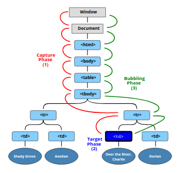

# Bubbling and Capturing
* Since DOM elements are nested within other elements, in a tree-like structure, **events that affects a child element bubble up through its parents.**
* It is also possible **to prevent an event from continuing its propagation** at any stage using ```stopPropagation()```.

Let’s start with an example.

This handler is assigned to ```<div>```, but also runs if you click any nested tag like ```<em>``` or ```<code>```:
```javascript
<div onclick="alert('The handler!')">
  <em>If you click on <code>EM</code>, the handler on <code>DIV</code> runs.</em>
</div>
```
If you click on **EM**, *the handler* on **DIV** runs.

Isn’t it a bit strange? Why does the handler on ```<div>``` run if the actual click was on ```<em>```?

## Bubbling
*When an event happens on an element,* it **first runs the handlers on it**, **then on its parent**, ***then all the way up on other ancestors.***

Let’s say we have 3 nested elements **FORM > DIV > P** with a handler on each of them:
```javascript
<style>
  body * {
    margin: 10px;
    border: 1px solid blue;
  }
</style>

<form onclick="alert('form')">FORM
  <div onclick="alert('div')">DIV
    <p onclick="alert('p')">P</p>
  </div>
</form>
```
A click on the inner ```<p>``` first runs ```onclick```:

1. On that ```<p>```.
2. Then on the outer ```<div>```.
3. Then on the outer ```<form>```.
4. And so on upwards till the document object.

So if we click on ```<p>```, then we’ll see 3 alerts: p → div → form.

**The process is called “bubbling”**, because ***events “bubble” from the inner element up*** through parents like a bubble in the water.

    🚫 Almost all events bubble.
    The key word in this phrase is “almost”.
    For instance, a focus event does not bubble. There are other examples too, we’ll meet them. But still it’s an exception, rather than a rule, most events do bubble.

### **```event.target```**

A handler on a parent element **can always get the details about where it actually happened.**

**The most deeply nested element that caused the event is called a target element, accessible as event.target.**

Note the differences from this (=event.currentTarget):
* event.target – is the “target” element that initiated the event, it doesn’t change through the bubbling process.
* this – is the “current” element, the one that has a currently running handler on it.

For instance, if we have a single handler form.onclick, then it can “catch” all clicks inside the form. No matter where the click happened, it bubbles up to <form> and runs the handler.

In ```form.onclick``` handler:
* this (=event.currentTarget) is the <form> element, because the handler runs on it.
* event.target is the actual element inside the form that was clicked.

### Stopping bubbling
A bubbling event goes from the target element straight up. Normally it goes upwards till ```<html>```, and then to document object, and some events even reach window, calling all handlers on the path.

But any handler may decide that the event has been fully processed and stop the bubbling.

The method for it is ```event.stopPropagation()```.

## Capturing
There’s another phase of event processing called “capturing”. It is rarely used in real code, but sometimes can be useful.

The standard DOM Events **describes 3 phases of event propagation:**
1. **Capturing phase** – the event goes down to the element.
2. ** Target phase** – the event reached the target element.
3. **Bubbling phase** – the event bubbles up from the element.

Here’s the picture of a click on ```<td>``` inside a table, taken from the specification:



That is: for a click on ```<td```> the event first goes through the ancestors chain down to the element (capturing phase), then it reaches the target and triggers there (target phase), and then it goes up (bubbling phase), calling handlers on its way.

#### Before we only talked about bubbling, because the capturing phase is rarely used. Normally it is invisible to us.

Handlers added using on```<event>```-property or using HTML attributes or using two-argument addEventListener(event, handler) don’t know anything about capturing, they only run on the 2nd and 3rd phases.

To catch an event on the capturing phase, we need to set the handler capture option to true:

```javascript
elem.addEventListener(..., {capture: true})
// or, just "true" is an alias to {capture: true}
elem.addEventListener(..., true)
```

There are two possible values of the capture option:

1. If it’s false (default), *then the handler* is set on the **bubbling phase**.
2. If it’s true, *then the handler* is set on the **capturing phase**.


            While it's important to know about both Bubbling and Capturing, most front-end apps only really make use of the Bubbling phase where events propagate up the tree. As such, you can de-prioritize the Capturing part of the reading above.