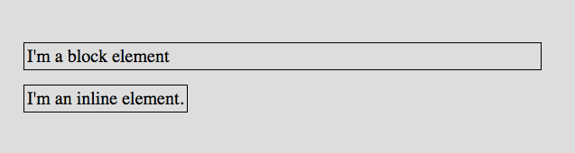
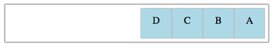
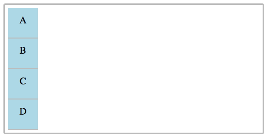

# Flexbox

## display
* We know that our browser applies default styles to our HTML elements. **One of these default styles is display.**

### display: block
* A block level element will **take up the entire space of its parent element.** It can contain other block elements or inline elements.
* EX of a block level element 'paragraph'
```html
<p>
  I'm a block level element.
</p>
```
* The paragraph element will stretch all the way across its parent:


Other block elements include:

* headings (```<h1>```,```<h2>```, ```<h3>```,```<h4>```,```<h5>```,```<h6>```)
* div (```<div>```)
* section (```<section>```)
* footer (```<footer>```)
* article (```<article>```)
* paragraph (```<p>```)
* lists (```<ul>```, ```<ol>```)
* nav (```<nav>```)

### display: inline
* Inline elements **do not start a new line when they are rendered in the browser**. They only **take up as much space as the content needs**. A ```span``` tag is an example of an inline element.
```html
<span>
  I'm an inline element.
</span>
```

When we compare a block element (the paragraph) to an inline element, the size difference becomes apparent.



* Inline elements **contain only data and other inline elements**. Unlike block elements, ***we can't add a width, height, padding or margin to inline elements.*** They simply take up as much room as they need to display their content. No more, and no less.

Other inline elements include:

* anchor (```<a>```)
* em (```<em>```)
* strong (```<strong>```)
* span (```<span>```)

### display: inline-block

* An inline-block element has, as you might have guessed, **properties of both**. It **doesn't automatically create a new line in the browser**, but it ***can have a margin, padding, height, and width.***
* Image tags (``````) and buttons (```<button>```) ***are the only two HTML tags who have a default inline-block display property.***

### display: flex

* **Flexbox** (also known as *CSS Flexible Box*) is a layout module in CSS. It allows us to specify how elements on our page should appear. ***It is great for layouts that need to adapt to different screen sizes and display devices.***

```html
<section class="parent">
  <div class="a">A</div>
  <div class="b">B</div>
  <div class="c">C</div>
  <div class="d">D</div>
</section>
```

To start using Flexbox, we add the ```display: flex``` property **to the parent element**.

```html
.parent {
  display: flex;
}
```

#### Parent Properties

* These are a list of properties we can apply to the parent element when we're using Flexbox. 
* The ***parent element is also sometimes referred to as the container element.***

#### flex-direction 

* Defines ***the direction that the children (also know as flex items) will appear in***. 
* We can set these to ***columns or rows***, and dictate **if the child elements should be displayed in reverse order.** 
* The flex direction also **determines the main axis for the flex container.** 
  * If **we set to a row** (the default), **the main axis is horizontal**; if we set the ***flex direction to use columns, it will be vertical.***

```html
.parent {
  display: flex;
  flex-direction: row;
}
```



```html
.parent {
  display: flex;
  flex-direction: column;
}
```



### Some other parent properties include:
* **```justify-content```**, determines **where the flex items are along the main axis.**
* **```align-items```**, determines **how flex items are laid out on the cross axis.**

### Child Properties
* Some of the child properties include: - ```order```, which controls ***the order elements appear in without changing your HTML*** (its *default value is 0*) - ```flex-grow```, dictates ***how much space a flex item should take up.***