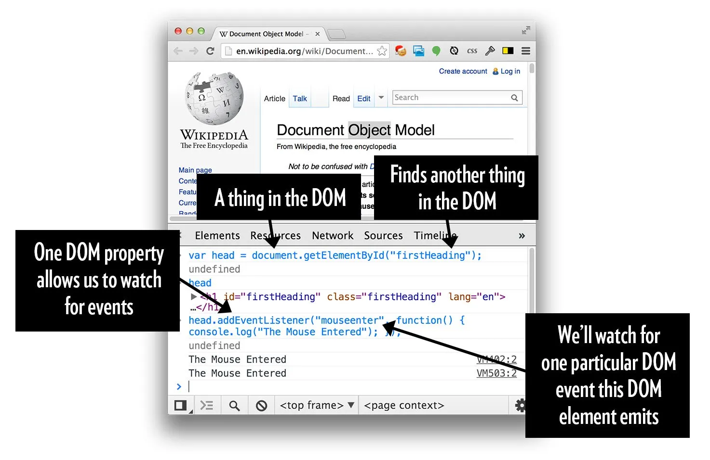

# JavaScript in the Browser
* The basics of how (and why) to add JavaScript into a webpage. There are multiple ways to include JavaScript, with some subtle but important distinctions.
* Much of client-side web development involves the DOM. It is important to be aware of how browsers render the DOM, its structure, and how to inspect/manipulate it (using JavaScript and manually for debugging).

## JS and the DOM with DYNAMIC web pages (Ref [HERE](https://css-tricks.com/dom/))
* The HTML in a source file is not the DOM
* The browser **parses** the html to make the DOM
* When you’re looking at the panel in whatever DevTools you are using that shows you stuff that looks like HTML, **that is a visual representation of the DOM!**

### When is the DOM different than the HTML?
* There are **mistakes in your HTML** and the browser has fixed them for you.

### JavaScript can manipulate the DOM
Imagine you have an empty element like this in your HTML:
```html
<div id="container"></div>
```
Then later in your HTML, there is a bit of JavaScript:
```html
<script>
  var container = document.getElementById("container");
  container.innerHTML = "New Content!";
</script>
```
Even if you don’t know JavaScript, you can reason that bit of code out. On the screen you’ll see New Content! rather than nothing, because that empty div was filled with some, ahem, new content.

If you use DevTools to check out the visual representation of the DOM, you’ll see:
```html
<div id="container">New Content!</div>
```
***Which is different than your original HTML or what you would see in View Source.***

### JavaScript vs. the DOM
* A lot of what you might think of as a “JavaScript Thing” is ***more accurately a “DOM API”.***
* For instance, we can write JavaScript that watches for a ```mouseenter``` event on an element.
  * *But that “element” is really a DOM node.* 
  * We **attach that listener via a DOM property on that DOM node.** When that event happens, it’s the DOM node that emits that event.



## Adding JavaScript

3 Ways to add JS to html
  1. ```<script>``` in ```<head>``` or ```<body>``` 
  2. ```<script src="path/to/.js">``` a js file
  3. inline <u>BAD</u> (i.e adding an ```onclick()``` attribute)


    * By putting the script in the ```<head>``` the page will not load until the JS has FULLY executed 
    * In ```<body>``` the script will execute after the page load