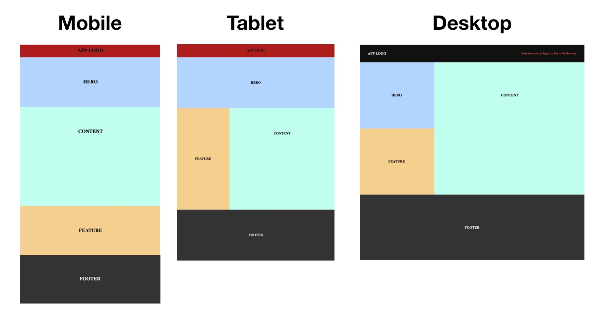

# Responsive Design - Walkthrough (Result [HERE](https://codepen.io/drummstick/pen/yLoZwBj))
## The fruits of the labour


## A few notes on design
* In the real world, it is up to your web designer to supply you with these kinds of mockups. Your job as a developer is to implement the individual layouts using media queries to separate out the various CSS rules that apply to each one.

* Even though the decisions of which responsive design patterns to use are in the realm of design, which is outside the scope of this code-oriented walkthrough, there are two concepts that you should understand as a developer:

1. A “fluid” layout is one that stretches and shrinks to fill the width of the screen.
2. A “fixed-width” layout is the opposite: it has the same width regardless of the screen dimensions.

* In our example web page, the mobile and tablet versions are fluid, and the desktop version is capped at a fixed-width. Almost all responsive design patterns have similar behavior.

## Choosing breakpoints
* Following our designs, we will be using two breakpoints: the tablet layout at minimum 768px, and the desktop layout at minimum 1024px. Wait, that's it? Yes, that's it.

* Imagine if we require breakpoints for every device with slightly different screen sizes out there; not only would design and implementation be onerous, maintenance would also be impossible with any new device releases.

* ***Ideally you want to choose your breakpoints around your content and design, not around devices. Some common breakpoints are:***
```css
  /* Smartphones: minimum width of 320px to maximum width of around 420px */
  @media only screen and (min-width: 320px) and (max-width: 420px) {
    /* Write smartphone only styles here */
  }

  /* Another smartphone breakpoint is maximum width of around 420px */
  @media only screen and (max-width: 420px) {
    /* Write smartphone only styles here */
  }

  /* Tablet: minimum width of 768px to maximum width of 1024px */
  @media only screen and (min-width: 768px) and (max-width: 1024px) {
    /* Write Tablet only CSS here */
  }

  /* Another tablet breakpoint is maximum width of 1024px */
  @media only screen and (max-width: 1024px) {
    /* Write CSS rules that target Tablets screen sizes downwards - including smartphones */
  }

  /* Another tablet breakpoint is minimum width of 768px */
  @media only screen and (min-width: 768px) {
    /* Write CSS rules that target Tablets screen sizes upwards - including desktops */
  }

  /* Laptops / Desktops: minimum width of 1024px */
  @media only screen and (min-width: 1024px) {
    /* Write CSS rules that target Laptop/Desktop screen sizes and beyond */
  }

  /* Laptops / Desktops: minimum width of 960px */
  @media only screen and (min-width: 960px) {
    /* Write CSS rules that target small laptop screen sizes and beyond */
  }
```

## Tablet Layout
On to the tablet layout. Some interesting layout shifts we want to achieve here are:

Form a two-column layout with the content section and the feature section.
Increase the feature column's height to match the content section.
And of course, we don't want this behavior to apply to mobile-sized screens, so it needs to go into a @media rule. What we are saying with our @media rule here is that this set of rules applies only to screens whose width is 768px and above (including desktop screens).

Append the code below to your CSS.

To see these changes, make sure your browser window is at least 768px wide. You should see the tablet two-column design.
```css
/* Tablet Styles */
@media only screen and (min-width: 768px) {
  .feature {
    width: 33.3%;
    line-height: 600px;
  }

  .content {
    width: 66.7%;
    float: right
  }

  .footer {
    clear: right;
  }
}
```
## Desktop Layout
For the desktop layout, we are taking advantage of the extra real estate we have to do more with the two-column layout.

The strategy will be:

* Make the .hero section one-third of the full width.
* Make the .feature section one-third of the full width.
* Decrease the height of the .feature section from 600px on tablet to 300px.
* Change the appearance (colors and text alignment) of the menu bar. Because the mockup says so :)
* Reveal the .tagline.
* Reduce the .main font size.
* And lastly cap the layout width so it does not stretch too thin on really large screens, as well as center the layout with auto margins.
* Append the code below to your CSS; make sure this goes below the Tablet styles.

To see these changes, make sure your browser window is at least 1024px wide. You should see our two-column desktop layout in action.
```css
/* Desktop styles */
@media only screen and (min-width: 1024px) {
  .hero {
    width: 33.3%;
    float: left;
  }

  .feature {
    line-height: 300px;
  }

  .menu {
    background-color: #111111;
    color: #f0f0f0;
    text-align: left;
  }

  .tagline {
    display: inline;
    font-style: italic;
    font-weight: normal;
    font-size: 12px;
    color: tomato;
    float: right;
  }

  .main {
    max-width: 1024px;
    font-size: 16px;
    margin: 0 auto;
  }
}
```
Notice our breakpoint here is set to a min-width of 1024px. Now this is an overlap of the @media rule we set for the tablet layout, the idea here is to reuse as many of the styles in our previous breakpoint as possible. For this to work as planned, we need to make sure that the desktop styles are below the tablet styles. This is a good way to take advantage of the cascading nature of CSS.

# Disabling Viewport Zooming (IMPORTANT!)
We’ve got one final task for making a responsive web page. Before responsive design was a thing, mobile devices only had a desktop layout to work with. To cope with this, they zoomed out to fit the entire desktop layout into the width of the screen, letting the user interact with it by zooming in when necessary.

This default behavior will prevent mobile devices from using our mobile layout, which is obviously very terrible.

Disable viewport zooming by adding the following element to the <head> your document
```html
<meta name='viewport' content='width=device-width, initial-scale=1.0, maximum-scale=1.0' />
```
This is a critical element that should be on every single web page you create.

## Conclusion
Believe it or not, that is actually all you need to know to create responsive websites. If we boil it down, we are really only concerned with three things:

1. The responsive design (the mockups for each layout)
2. CSS rules for implementing each of those layouts
3. Media queries for conditionally applying those CSS rules