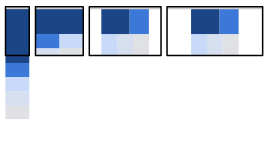
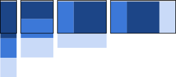
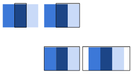

# Responsive Web Design Patterns (ref [HERE](https://developers.google.com/web/fundamentals/design-and-ux/responsive/patterns))
Most layouts used by responsive web pages can be categorized into one of five patterns:
  1. mostly fluid
  2. column drop
  3. layout shifter
  4. tiny tweaks
  5. off canvas

## 1. Mostly Fluid (Reference "Try Me" [HERE](https://googlesamples.github.io/web-fundamentals/fundamentals/design-and-ux/responsive/mostly-fluid.html))
* The mostly fluid pattern **consists primarily of a fluid grid**. 
  * ***On large or medium screens, it usually remains the same size, simply adjusting the margins on wider screens.***
  * **On smaller screens**, the ***fluid grid causes the main content to reflow***, while ***columns are stacked vertically***. 
    * One major advantage of this pattern is that it usually ***only requires one breakpoint between small screens and large screens.***



* **In the smallest view**, each content div is stacked vertically.
* **When the screen width hits 600px**, the primary content div remains at width: 100%, while the secondary div's are shown as two columns below the primary div.
* **Beyond 800px,** the container div becomes fixed width and is centered on the screen.

CSS for that:
```css
.container {
  display: -webkit-flex;
  display: flex;
  -webkit-flex-flow: row wrap;
  flex-flow: row wrap;
}

.c1, .c2, .c3, .c4, .c5 {
  width: 100%;
}

@media (min-width: 600px) {
  .c2, .c3, .c4, .c5 {
    width: 50%;
  }
}

@media (min-width: 800px) {
  .c1 {
    width: 60%;
  }
  .c2 {
    width: 40%;
  }
  /* Using 33.33%, doesn't always work right due to rounding */
  .c3, .c4 {
    width: 33%;
  }
  .c5 {
    width: 34%;
  }
}

@media (min-width: 800px) {
  .container {
    width: 800px;
    margin-left: auto;
    margin-right: auto;
  }
}
```

## 1. Column drop (Reference "Try Me" [HERE](https://googlesamples.github.io/web-fundamentals/fundamentals/design-and-ux/responsive/column-drop.html))
* For full-width multi-column layouts, column drop simply **stacks the columns vertically as the window width becomes too narrow for the content.**
* Eventually this results in all of the columns being stacked vertically. Choosing breakpoints for this layout pattern is dependent on the content and changes for each design.



* Like the mostly fluid sample, content is stacked vertically in the smallest view,
* but as the screen expands beyond 600px, the primary and secondary content div's take the full width of the screen.
* The order of the div's is set using the order CSS property.
* At 800px all three content div's are shown, using the full screen width.

css here:
```css
.container {
  display: -webkit-flex;
  display: flex;
  -webkit-flex-flow: row wrap;
  flex-flow: row wrap;
}

.c1, .c2, .c3 {
  width: 100%;
}

@media (min-width: 600px) {
  .c1 {
    width: 60%;
    -webkit-order: 2;
    order: 2;
  }

  .c2 {
    width: 40%;
    -webkit-order: 1;
    order: 1;
  }

  .c3 {
    width: 100%;
    -webkit-order: 3;
    order: 3;
  }
}


@media (min-width: 800px) {
  .c2 {
    width: 20%;
  }

  .c3 {
    width: 20%;
  }
}
```

## 3. Layout shifter (Reference "Try Me" [HERE](https://googlesamples.github.io/web-fundamentals/fundamentals/design-and-ux/responsive/layout-shifter.html))
* The layout shifter pattern ***is the most responsive pattern, with multiple breakpoints across several screen widths.***
* Key to this layout is the way content moves about, instead of reflowing and dropping below other columns. Due to the significant differences between each major breakpoint, ***it is more complex to maintain and likely involves changes within elements, not just overall content layout.***


* This simplified example shows the layout shifter pattern, on smaller screens content is stacked vertically, but changes significantly as the screen becomes larger, with a left div and two stacked div's on the right.

css here:
```css
.container {
  display: -webkit-flex;
  display: flex;
  -webkit-flex-flow: row wrap;
  flex-flow: row wrap;
}

.c1, .c2, .c3, .c4 {
  width: 100%;
}

@media (min-width: 600px) {
  .c1 {
    width: 25%;
  }

  .c4 {
    width: 75%;
  }

}

@media (min-width: 800px) {
  .container {
    width: 800px;
    margin-left: auto;
    margin-right: auto;
  }
}

```

## 4. Tiny tweaks (Reference "Try Me" [HERE](https://googlesamples.github.io/web-fundamentals/fundamentals/design-and-ux/responsive/tiny-tweaks.html))
* Tiny tweaks simply makes small changes to the layout, such as adjusting font size, resizing images, or moving content around in very minor ways.
* It works well on single column layouts such as one page linear websites and text-heavy articles.


* As its name implies, not much changes with this sample as the screen size changes. As the screen width gets larger, so do the font size and padding.

css here:
```css
.c1 {
  padding: 10px;
  width: 100%;
}

@media (min-width: 500px) {
  .c1 {
    padding: 20px;
    font-size: 1.5em;
  }
}

@media (min-width: 800px) {
  .c1 {
    padding: 40px;
    font-size: 2em;
  }
}
```

## 5. Off canvas (Reference "Try Me" [HERE](https://googlesamples.github.io/web-fundamentals/fundamentals/design-and-ux/responsive/off-canvas.html))
* Rather than stacking content vertically, the off canvas pattern ***places less frequently used content—perhaps navigation or app menus—off screen,*** only showing it when the screen size is large enough, and on smaller screens, content is only a click away.



* Rather than stacking content vertically, **this sample uses a ```transform: translate(-250px, 0)``` declaration to hide two of the content divs off screen.**
* JavaScript is used to show the ```div```s by adding an open class to the element to make visible. As the screen gets wider, the off-screen positioning is removed from the elements and they're shown within the visible viewport.

>Note in this sample, Safari for iOS 6 and Android Browser do not support the flex-flow: row nowrap feature of flexbox, so we’ve had to fall back to absolute positioning.

css here:
```css
body {
  overflow-x: hidden;
}

.container {
  display: block;
}

.c1, .c3 {
  position: absolute;
  width: 250px;
  height: 100%;

  /*
    This is a trick to improve performance on newer versions of Chrome
    #perfmatters
  */
  -webkit-backface-visibility: hidden;
  backface-visibility: hidden; 

  -webkit-transition: -webkit-transform 0.4s ease-out;
  transition: transform 0.4s ease-out;

  z-index: 1;
}

.c1 {
  /*
  Using translate3d as a trick to improve performance on older versions of Chrome
  See: http://aerotwist.com/blog/on-translate3d-and-layer-creation-hacks/
  #perfmatters
  */
  -webkit-transform: translate(-250px,0);
  transform: translate(-250px,0);
}

.c2 {
  width: 100%;
  position: absolute;
}

.c3 {
  left: 100%;
}

.c1.open {
  -webkit-transform: translate(0,0);
  transform: translate(0,0);
}

.c3.open {
  -webkit-transform: translate(-250px,0);
  transform: translate(-250px,0);
}

@media (min-width: 500px) {
  /* If the screen is wider then 500px, use Flexbox */
  .container {
    display: -webkit-flex;
    display: flex;
    -webkit-flex-flow: row nowrap;
    flex-flow: row nowrap;
  }
  .c1 {
    position: relative;
    -webkit-transition: none 0s ease-out;
    transition: none 0s ease-out;
    -webkit-transform: translate(0,0);
    transform: translate(0,0);
  }
  .c2 {
    position: static;
  }
}

@media (min-width: 800px) {
  body {
    overflow-x: auto;
  }
  .c3 {
    position: relative;
    left: auto;
    -webkit-transition: none 0s ease-out;
    transition: none 0s ease-out;
    -webkit-transform: translate(0,0);
    transform: translate(0,0);
  }
}
```