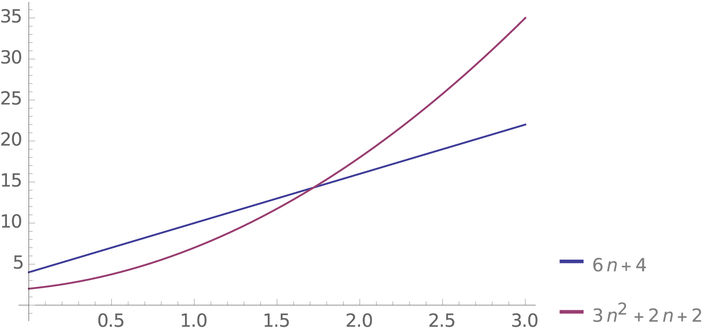
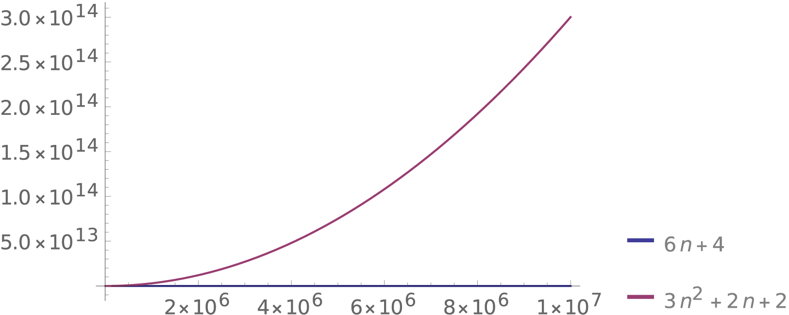
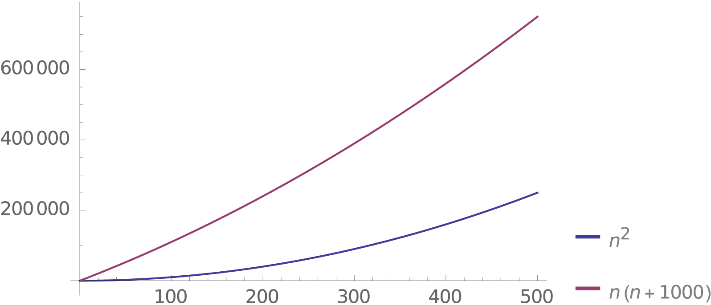
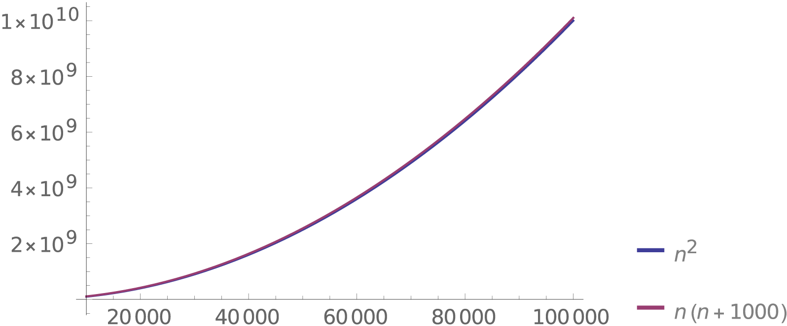
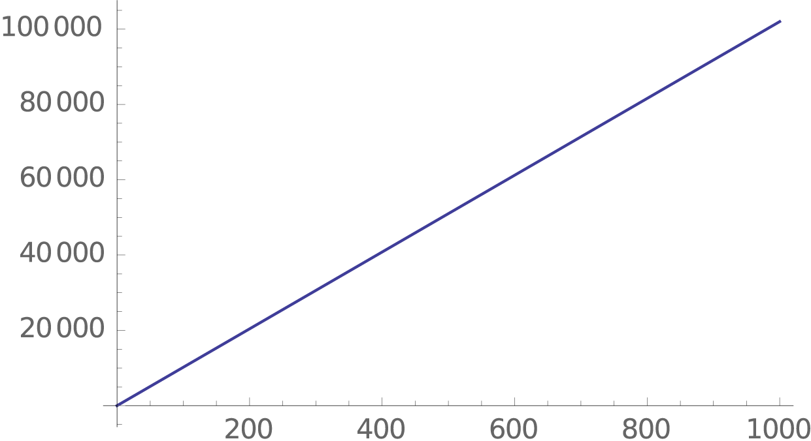
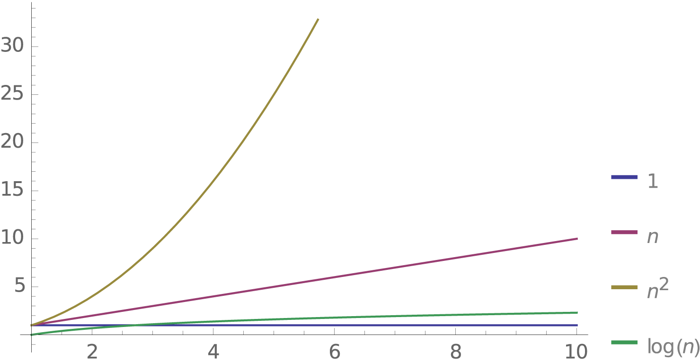

# Big O Notation

    Big O notation **describes how the number of steps in an algorithm scales relative to its input.**


* when we want to determine the efficiency of an algorithm, we are more concerned about how the algorithm's run time scales as a whole, rather than the total number of individual steps.

* Big O notation, written as ```O()```, describes how the number of steps in an algorithm scales relative to its input. As we increase the amount of data, does the algorithm grow linearly, exponentially, or logarithmically?

When we evaluate an algorithm using Big O notation, there are three main things to remember:

1. We only care about **arbitrarily large input**.
  * What does the ***run time of binary search look like when we give it an array of one million items?***
2. We **drop the non-dominant terms**.
  * When our algorithm had a running time of ```(n^2+n)/2```, it was the ```n^2``` that was hurting us. So we'll just forget about everything else.
3. We **drop constant terms**.
  * If you graph ```(n^3)/2 or (n^3)*2```, it has pretty much the same curve as ```n^3```, so let's just get rid of the constant 2.

# Arbitrarily Large Input
When we evaluate an algorithm using Big O notation, we only care about arbitrarily large input.

Let's compare the following two algorithms:

Algorithm a:
```javascript
for (let i = 0; i < array.length; i++) {
  doSomething();
}
for (let i = 0; i < array.length; i++) {
  doSomething();
}
```
Algorithm b:
```javascript
for (let i = 0; i < array.length; i++) {
  for (let ii = 0; ii < array.length; ii++) {
    doSomething();
  }
}
```
Here are their running times:

|a  |	b |
|---|---|
|4 + 6n| 	2 + 2n + 3n^2 |

Let's see what that looks like for small values of n:

| n |	a |	b |
|---|---|---|
| 1	| 10|	7 |
| 2	| 16|	18|
| 3 |	22|	35|



When n = 1, algorithm b is faster than a. For all other values, algorithm b is slower than a, but not by that much. For small values of n, it's hard to tell which algorithm is more efficient.

Also, for small values like this, it doesn't really matter which one is efficient. If an algorithm can achieve something in 1 elementary operation vs 100, it's not that big of a deal. 99 is a small number of operations for a computer. If you run the following two algorithms in JavaScript, they will both appear to happen instantly:
```javascript
console.log("hello");
for (let i = 0; i < 100; i++) {
  console.log("hello");
}
```
However, when n gets really big, the more efficient algorithm becomes way easier to identify. Let's look at a and b again, ***but this time with large input sizes:***

| n |	a |	b |
|---|---|---|
|100,000|	600,004|	30,000,200,002|
|1,000,000 |	6,000,004|	3,000,002,000,002|
| 10,000,000|	60,000,004	|300,000,020,000,002|



When ***n is 10,000,000***, **algorithm b is 5 million times slower than a!** That means that if algorithm a takes just 1 second to finish, algorithm b would take 5 million seconds, which is roughly 58 days. No one is going to use your app if it takes 58 days to run one algorithm.

Self driving cars constantly need to process data in short amounts of time to avoid crashing. If a car was processing a small amount of data, either of these algorithms would be fine. If it's processing a large amount of data, one of these algorithms could result in a fatal decision (queue dramatic music).

*****Since we shouldn't normally worry about optimizing algorithms dealing with small inputs, Big O notation focuses on how an algorithm performs when it's given arbitrarily large input.*****

# Drop the Non-Dominant Terms.
When we evaluate an algorithm using Big O notation, **we drop the non-dominant terms.**

Let's say we have an algorithm that has a running time of ```1000n + n^2```. When n is small, the ```1000n``` part of the algorithm is significant. Here's a graph of ```n^2``` and ```n^2 + 1000n``` to demonstrate what we mean by this:



In the chart above we see that actually 1000n makes a difference when n is small. However, ***let's see what happens when n gets arbitrarily large:***



**Wondering where the second curve is? It's hiding underneath the other!**

1000n becomes a very insignificant part of the running time. **It becomes so insignificant that adding 1000n to n^2 actually appears to do nothing and it just becomes a burden to keep the 1000n around.** When n gets arbitrarily large, 1000n + n^2 and n^2 are so close to each other that we can simply get rid of the 1000n.

        Therefore, in Big O notation, 1000n + n^2 is written as O(n^2). In case you are wondering, we typically read this aloud as "O n squared".

In other words, ***Big O is only interested in the highest order term.*** The larger the exponential number, the bigger the term:

|n^0|	n^1|	n^2|	n^3|	n^4|
|---|----|-----|-----|-----|
|1	|1	|1	|1	|1|
|1|	2|	4|	8|	16|
|1|	3|	9|	27|	81|
|1|	4|	16|	64|	256|
|1|	5|	25|	125|	625|
|1|	6|	36|	216|	1,296|
|1|	7|	49|	343|	2,401|
|1|	8|	64|	512|	4,096|
|1|	9|	81|	729|	6,561|
|1|	10|	100|	1,000|	10,000|
|1|	100|	10,000|	1,000,000|	100,000,000|

**So if our algorithm had a running time of n^0 + n^1 + n^2 + n^3 + n^4, it would simply be O(n^4).**

Again, any time we are using Big O notation, ***we only care about mentioning the highest order term.***

# Drop Constants
When we evaluate an algorithm using Big O notation, **we also drop the constants**.

Big O notation is used to describe how an algorithm's complexity grows relative to its input. **It is not used to describe the exact running time of an algorithm.**

Take a look at the following algorithm:
```javascript
for (let i = 0; i < array.length; i++) {
  // Do 100 different operations in each iteration
}
```
The running time of this algorithm is 2 + (n * 102) or 102n + 2. This is what it looks like on a graph:



How does this algorithm's complexity grow relative to its input? It grows linearly. If we add 100 more elements to the array, the running time increases by 100.

When we use Big O, **we only care about how the complexity grows relative to the input.** The constants 2 and 102 will stay constant no matter what happens to the input. These constants don't help describe the growth of the complexity, so we can get rid of them. ***Since this algorithm grows linearly, it is said to have O(n) ("O n") complexity.***

Multiplying a constant by an algorithm's run time will only affect the growth rate by a constant amount. While adding a constant won't affect the growth rate at all. ***Adding or multiplying algorithms by constants will shift or rotate the graph of the growth rate, but it will not change its overall shape.*** A linear algorithm will still grow linearly, a logarithmic algorithm will still grow logarithmically, and an exponential algorithm will still grow exponentially:

# Examples:

## ```2n + 3``` will grow linearly, **```O(n)```**
## ```100n^2``` will grow exponentially, **```O(n^2)```**
## ```log n + 1000000000``` will grow logarithmically, **```O(log n```)**

**It's not that the constants aren't significant,** ***it's just that we don't care about them when we're using Big O notation.***

Another thing to consider is that these constants might not be accurate. In order to know exactly how many operations are being performed, we would have to look at how each operation gets executed in low level code.

JavaScript is a high level language. It has a Virtual Machine (VM) that sometimes optimizes JS code to run fewer operations. At other times, it may inefficiently run even more operations than we expected. So as long as we're programming in a high level language like JavaScript, it's going to be hard to get an accurate number for these constant values. Therefore it's easier to just talk about how the complexity grows, not the absolute running time.

# Examples
## **Constant O(1)**
An algorithm that will always take the same amount of time to execute, no matter what the input is, runs in constant time.

An example of this is directly accessing an item in an array:
```javascript
array[2];
```
**No matter how big the array is, this will always take a constant amount of time.**
```javascript
array[2] + array[3] + array[4];
```
When we access the array multiple times like this, **the time complexity is 3**. This is ***still a constant amount of time and is therefore still O(1).***

**Constant time algorithms run in O(1).**

Examples:

* Check if the last element in an array is even. Jump directly to the last element in the array and do some math. Even if it's a lot of math that takes a while, increasing the size of the array will not affect the amount of time this takes
* Tell me how many pages are in a phone book. Just open the last page and read the page number

## **Linear O(n)**
***When the number of operations an algorithm has to perform grows linearly relative to its input, then that algorithm runs in linear time.***

Another way to see these algorithms is that **when we add one extra element to its input, the number of operations will increase by a constant amount.**

The following algorithm is linear, because adding one more item to the array increases the runtime by a constant 100.
```javascript
for (item of array) {
  // perform 100 operations
}
```
Summing every number in an array is a linear algorithm:
```javascript
function sumAllNumberInArray(array) {
  let result = 0;

  for (let i = 0; i < array.length; i++) {
    let number = array[i];
    result += number;
  }

  return result;
}
```
***Linear algorithms run in O(n).***

Examples:

Count all the even numbers in an array
Find someone in a phone book by flipping through every page. Or two pages at a time. Or three pages at a time.

## **Quadratic O(n^2)**
If ***the number of operations that an algorithm has to perform is directly proportional to the square of the size of the input***, then that algorithm runs in quadratic time.

The following algorithm is quadratic, because adding one more item to the array increases the runtime by n*100.
```javascript
for (item of array) {
  for (item of array) {
    // perform 100 operations
  }
}
```
Checking if an array of numbers contains a sum is a quadratic algorithm:
```javascript
function arrayContainsSum(array, sum) {

  for (let i = 0; i < array.length; i++) {
    const element1 = array[i];

    for (let ii = 0; ii < array.length; ii++) {

      const element2 = array[ii];

      if (element1 + element2 === sum) {
        return true;
      }
    }
  }
  return false;
}
```
Examples:

* Find all duplicates in an array.
* Find the first unique number in an array.
* Manually find duplicate phone numbers written on a sheet of paper.

## **Logarithmic O(log n)**
If the **number of operations that an algorithm has to do is directly proportional to the logarithm of the size of the input,** then that algorithm runs in logarithmic time.

The following code is an example of a logarithmic algorithm, because doubling the size of the input only increases the runtime by only one.
```javascript
let i = array.length;
while(i > 0) {
  i = i / 2;
}
```
Binary search is a logarithmic algorithm:
```javascript
function binarySearch(array, item) {
  let min = 0;
  let max = array.length - 1;

  while (true) {
    const middleIndex = Math.floor((min + max)/2.0);
    const currentItem = array[middleIndex];

    if (currentItem === item) {
      return middleIndex;
    } else if (currentItem < item) {
      min = middleIndex + 1;
    } else {
      max = middleIndex - 1;
    }

    if (min > max) {
      return null;
    }
  }
}
```
Logarithmic algorithms run in O(log n).

# Conclusion
Big O notation **describes how the number of steps in an algorithm scales relative to its input.**

When we describe an algorithm using Big O notation, we:

* Only care about arbitrarily large input.
* Drop the Non-Dominant Terms.
* Drop Constants.

Some of the more common Big O running times are:

* Logarithmic ```O(log n)```
* Quadratic ```O(n^2)```
* Linear ```O(n)```
* Constant ```O(1)```

