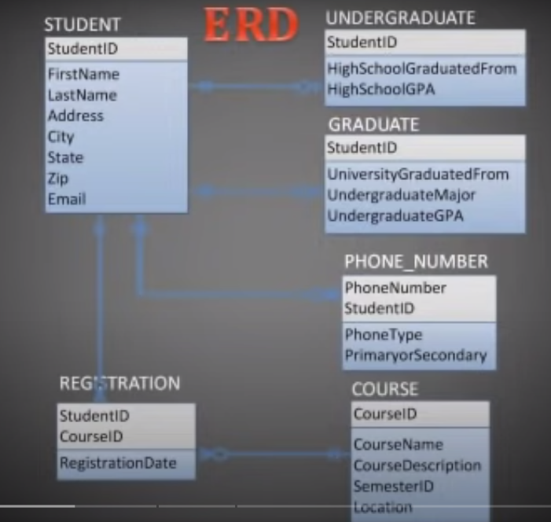

# Entity-Relationship Diagrams (ERDs) (REF [HERE](https://www.youtube.com/watch?v=-fQ-bRllhXc))
* A graphical representation of the data requirements for a database

## Different Parts of ERDs
* **Entity**
  * Represents a person, place or thing that will be tracked in a database
  * This will become a table in the database
  * 
    * 'Student' will become a table that contains entities like student
    * Each occurance of the entity is an **entity instance**
    * Each **entity instance** will be each record or **row** in a table
* Attribute
  * Describles various characteristics about an individual entity
  * These will be the **columns** in the table
  * i.e
    * A student entity instance would have a name and the name would be an attribute
  * Attributes do not have to be unique
* Primary Key
  * An attribute or group of attributes ***that uniquely identifies an instance of the entity.***
  * A phone number may not be the best as it runs the risk of having a student change numbers then a new student uses the same number as the other students last phone number. This would result in an error
  * ***A composite primary key*** is a combination of say a student ID number and a phone number.
* Relationship
  * Describes how one or more entities interact with each other.
  * A verb is often used to describe the relationship
* Cardinality
  * The count of instances that are allowed or are necessary between entity relationships
    * i.e
      * How many rows are needed before a table can be linked with another
  * Minimum Cardinality - Min # of instances that are required in the relationship
  * Maximum Cardinality - Max # of instances that are allowed in the relationship
  * Crows foot notation is used to represent the min/max cardinality
  * 
  * This means that one student can have many phone numbers (One to Many)
    * 
  * It is optional that a student has a phone number but a student MUST be connected to a phone number (Optional Vs Mandatory)
    * 

Diagram B!