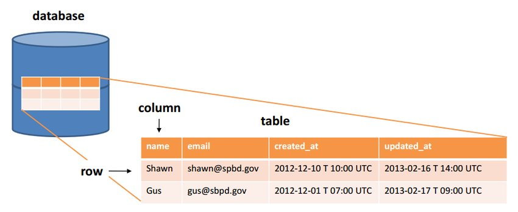
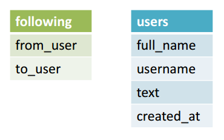
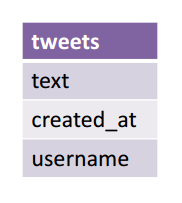
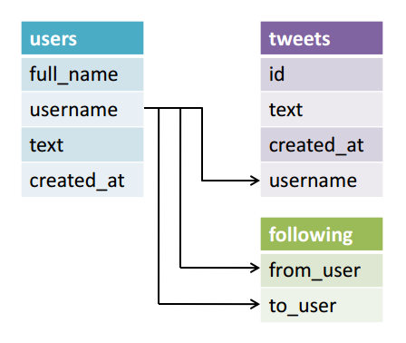

# Relational Database Introduction (Relational Database Management Systems (RDBMS)) (REF [HERE](http://code.tutsplus.com/tutorials/relational-databases-for-dummies--net-30244))

Web apps can be split into two major components:
  1.  a **front-end** that displays and collects information
  2.  a **back-end** for storing the information

* A database stores data in an organized way so that it can be searched and retrieved later.
* It should contain one or more tables.
  * A table is much like a spreadsheet, in that it's made up of rows and columns.
  * All rows have the same columns, and **each column contains the data itself**.
  * If it helps, think of your tables in the same way that you would a table in Excel.



* Data can be **inserted, retrieved, updated, and deleted from a table**. 
* The word, ***created***, is generally used instead of inserted, so, collectively, these four functions ***are affectionately abbreviated as CRUD***.
* **A relational database** is a type of database that ***organizes data into tables, and links them, based on defined relationships.*** 
  * These **relationships** enable you to ***retrieve and combine data from one or more tables with a single query***.

## Step 1: Get Some Data
In the spirit of the Nettuts+ Twitter clone articles (PHP, Ruby on Rails, Django), let's get some Twitter data. I searched Twitter for "#databases" and took the following sample of ten tweets:

### Table 1


|full_name |	username |	text |	created_at |	following_username |
|----------|-----------|-------|-------------|---------------------|
|"Boris Hadjur" |	"_DreamLead" |	"What do you think about #emailing #campaigns #traffic in #USA? Is it a good market nowadays? do you have #databases?" |	"Tue, 12 Feb 2013 08:43:09 +0000" |	"Scootmedia", "MetiersInternet" |
| "Gunnar Svalander" |	"GunnarSvalander" |	"Bill Gates Talks Databases, Free Software on Reddit https://t.co/ShX4hZlA #billgates #databases" |	"Tue, 12 Feb 2013 07:31:06 +0000" |	"klout", "zillow" |
| "GE Software" |	"GEsoftware" |	"RT @KirkDBorne: Readings in #Databases: excellent reading list, many categories: http://t.co/S6RBUNxq  via @rxin Fascinating." |	"Tue, 12 Feb 2013 07:30:24 +0000" |	"DayJobDoc", "byosko" |
| "Adrian Burch" |	"adrianburch" |	"RT @tisakovich: @NimbusData at the @Barclays Big Data conference in San Francisco today, talking #virtualization, #databases, and #flash memory." | 	"Tue, 12 Feb 2013 06:58:22 +0000"	| "CindyCrawford", "Arjantim" |
| "Andy Ryder" |	"AndyRyder5" |	"http://t.co/D3KOJIvF article about Madden 2013 using AI to prodict the super bowl #databases #bus311"	| "Tue, 12 Feb 2013 05:29:41 +0000" |	"MichaelDell", "Yahoo" |
| "Andy Ryder" |	"AndyRyder5" |	"http://t.co/rBhBXjma an article about privacy settings and facebook #databases #bus311"	| "Tue, 12 Feb 2013 05:24:17 +0000" |	"MichaelDell", "Yahoo" |
| "Brett Englebert" |	"Brett_Englebert" |	"#BUS311 University of Minnesota's NCFPD is creating #databases to prevent "food fraud." http://t.co/0LsAbKqJ" |	"Tue, 12 Feb 2013 01:49:19 +0000" |	"RealSkipBayless", "stephenasmith" |
| Brett Englebert	| "Brett_Englebert" |	"#BUS311 companies might be protecting their production #databases, but what about their backup files? http://t.co/okJjV3Bm" |	"Tue, 12 Feb 2013 01:31:52 +0000" |	"RealSkipBayless", "stephenasmith" |
| "Nimbus Data Systems" |	"NimbusData" |	"@NimbusData CEO @tisakovich @BarclaysOnline Big Data conference in San Francisco today, talking #virtualization, #databases,& #flash memory" |	"Mon, 11 Feb 2013 23:15:05 +0000" |	"dellock6", "rohitkilam" |
| "SSWUG.ORG" |	"SSWUGorg" |	"Don't forget to sign up for our FREE expo this Friday: #Databases, #BI, and #Sharepoint: What You Need to Know! http://t.co/Ijrqrz29" |	"Mon, 11 Feb 2013 22:15:37 +0000" |	"drsql",  "steam_games" |

Here's what each column name means:

          MySQL is used at just about every Internet company you have heard of.

* full_name: The user's full name
* username: The Twitter handle
* text: The tweet itself
* created_at: The timestamp of the tweet
* following_username: A list of people this user follows, separated by commas. For briefness, I limited the list length to two

This is all real data; you can search Twitter and actually find these tweets.

This is good. The data is all in one place; so it's easy to find, right? Not exactly.

There are a couple problems with this table.
  * First, there is repetitive data across columns.
    * The "username" and "following_username" columns are repetitive, because both contain the same type of data — Twitter handles. 
  * There is another form of repetition within the "following_username" column. Fields should only contain one value, but each of the "following_username" fields contain two.
  * Second, there is repetitive data across rows.
    * @AndyRyder5 and @Brett_Englebert each tweeted twice, so the rest of their information has been duplicated.

**Duplicates are problematic because it makes the CRUD operations more challenging.** 
  * For example, it would take longer to retrieve data **because time would be wasted going through duplicate rows.**
  * Also, updating data would be an issue; **if a user changes their Twitter handle**, we would **need to find every duplicate and update it.**

            Repetitive data is a problem. We can fix this problem by splitting Table 1 into separate tables. Let's proceed with first resolving the repetition across columns issue.

## Step 2: Remove Repetitive Data Across Columns
* As noted above, the "username" and "following_username" columns in Table 1 are repetitive.
  * This repetition occurred because I was trying to express the follow relationship between users. 
* Let's improve on Table 1's design by splitting it up into two tables:
  1. one just for the following relationships
  2. one for the rest of the information.



Because @Brett_Englebert follows @RealSkipBayless, the following table will express that relationship by storing @Brett_Englebert as the "from_user" and @RealSkipBayless as the "to_user." Let's go ahead and split Table 1 into these two tables:

### Table 2: The following table

| from_user |	to_user |
|-----------|---------|
|_DreamLead |	Scootmedia |
| _DreamLead |	MetiersInternet |
| GunnarSvalander |	klout |
| GunnarSvalander |	zillow |
| GEsoftware |	DayJobDoc |
| GEsoftware |	byosko |
| adrianburch |	CindyCrawford |
| adrianburch |	Arjantim |
| AndyRyder |	MichaelDell |
| AndyRyder |	Yahoo |
| Brett_Englebert |	RealSkipBayless |
| Brett_Englebert |	stephenasmith |
| NimbusData |	dellock6 |
| NimbusData |	rohitkilam |
| SSWUGorg |	drsql |
| SSWUGorg |	steam_games |

### Table 3: The users table

| full_name | username |	text |	created_at |
|-----------|----------|-------|-------------|
| "Boris Hadjur" |	"_DreamLead" |	"What do you think about #emailing #campaigns #traffic in #USA? Is it a good market nowadays? do you have #databases?" |	"Tue, 12 Feb 2013 08:43:09 +0000" |
| "Gunnar Svalander" |	"GunnarSvalander" |	"Bill Gates Talks Databases, Free Software on Reddit http://t.co/ShX4hZlA #billgates #databases"	| "Tue, 12 Feb 2013 07:31:06 +0000" |
 |"GE Software" |	"GEsoftware" |	"RT @KirkDBorne: Readings in #Databases: excellent reading list, many categories: http://t.co/S6RBUNxq  via @rxin Fascinating."	| "Tue, 12 Feb 2013 07:30:24 +0000" |
|"Adrian Burch" |	"adrianburch" |	"RT @tisakovich: @NimbusData at the @Barclays Big Data conference in San Francisco today, talking #virtualization, #databases, and #flash memory." |	"Tue, 12 Feb 2013 06:58:22 +0000" |
|"Andy Ryder" |	"AndyRyder5" |	"http://t.co/D3KOJIvF article about Madden 2013 using AI to prodict the super bowl #databases #bus311" |	"Tue, 12 Feb 2013 05:29:41 +0000" |
|"Andy Ryder" |	"AndyRyder5" |	"http://t.co/rBhBXjma an article about privacy settings and facebook #databases #bus311" |	"Tue, 12 Feb 2013 05:24:17 +0000" |
| "Brett Englebert" |	"Brett_Englebert" |	"#BUS311 University of Minnesota's NCFPD is creating #databases to prevent "food fraud." http://t.co/0LsAbKqJ" |	"Tue, 12 Feb 2013 01:49:19 +0000" |
| Brett Englebert |	"Brett_Englebert" |	"#BUS311 companies might be protecting their production #databases, but what about their backup files? http://t.co/okJjV3Bm" |	"Tue, 12 Feb 2013 01:31:52 +0000" |
| "Nimbus Data Systems" |	"NimbusData" |	"@NimbusData CEO @tisakovich @BarclaysOnline Big Data conference in San Francisco today, talking #virtualization, #databases,& #flash memory" |	"Mon, 11 Feb 2013 23:15:05 +0000" |
| "SSWUG.ORG" |	"SSWUGorg" |	"Don't forget to sign up for our FREE expo this Friday: #Databases, #BI, and #Sharepoint: What You Need to Know! http://t.co/Ijrqrz29" |	"Mon, 11 Feb 2013 22:15:37 +0000" |

This is looking better. **Now in the users table (Table 3), there is only one column with Twitter handles.** ***In the following table (Table 2), the is only one Twitter handle per field in the "to_user" column.***

      Edgar F. Codd, the computer scientist who layed down the theoretical basis of relational databases, called this step of removing repetitive data across columns the first normal form (1NF).

## Step 3: Remove Repetitive Data Across Rows

Now that we've fixed repetions across columns, we need to fix repetitions across rows. Since the users @AndyRyder5 and @Brett_Englebert each tweeted twice, their information is duplicated in the users table (Table 3). This indicates that we need to pull out the tweets and place them in their own table.



As before, "text" stores the tweet itself. Since the "created_at" column stores the timestamp of the tweet, it makes sense to pull it into this table as well. I also include a reference to the "username" column so we know who published the tweet. Here is the result of placing the tweets in their own table:

### Table 4: The tweets table

| text |	created_at |	username |
|------|-------------|-----------|
|"What do you think about #emailing #campaigns #traffic in #USA? Is it a good market nowadays? do you have #databases?" |	"Tue, 12 Feb 2013 08:43:09 +0000" |	"_DreamLead" |
| "Bill Gates Talks Databases, Free Software on Reddit http://t.co/ShX4hZlA #billgates #databases" |	"Tue, 12 Feb 2013 07:31:06 +0000" |	"GunnarSvalander" |
| "RT @KirkDBorne: Readings in #Databases: excellent reading list, many categories: http://t.co/S6RBUNxq  via @rxin Fascinating." |	"Tue, 12 Feb 2013 07:30:24 +0000" |	"GEsoftware" |
| "RT @tisakovich: @NimbusData at the @Barclays Big Data conference in San Francisco today, talking #virtualization, #databases, and #flash memory." |	"Tue, 12 Feb 2013 06:58:22 +0000" |	"adrianburch" |
| "http://t.co/D3KOJIvF article about Madden 2013 using AI to prodict the super bowl #databases #bus311" |	"Tue, 12 Feb 2013 05:29:41 +0000" |	"AndyRyder5" |
| "http://t.co/rBhBXjma an article about privacy settings and facebook #databases #bus311" |	"Tue, 12 Feb 2013 05:24:17 +0000" |	"AndyRyder5" |
| "#BUS311 University of Minnesota's NCFPD is creating #databases to prevent "food fraud." http://t.co/0LsAbKqJ" |	"Tue, 12 Feb 2013 01:49:19 +0000" |	"Brett_Englebert" |
| "#BUS311 companies might be protecting their production #databases, but what about their backup files? http://t.co/okJjV3Bm" |	"Tue, 12 Feb 2013 01:31:52 +0000" |	"Brett_Englebert" |
| "@NimbusData CEO @tisakovich @BarclaysOnline Big Data conference in San Francisco today, talking #virtualization, #databases,& #flash memory" |	"Mon, 11 Feb 2013 23:15:05 +0000" |	"NimbusData" |
| "Don't forget to sign up for our FREE expo this Friday: #Databases, #BI, and #Sharepoint: What You Need to Know! http://t.co/Ijrqrz29" |	"Mon, 11 Feb 2013 22:15:37 +0000" |	"SSWUGorg" |

### Table 5: The users table

| full_name |	username |
|-----------|----------|
| "Boris Hadjur" | 	"_DreamLead" |
| "Gunnar Svalander" |	"GunnarSvalander" |
| "GE Software" |	"GEsoftware" |
| "Adrian Burch" |	"adrianburch" |
| "Andy Ryder" |	"AndyRyder5" |
| "Brett Englebert" |	"Brett_Englebert" |
| "Nimbus Data Systems" |	"NimbusData" |
| "SSWUG.ORG" |	"SSWUGorg" |


After the split, the users table (Table 5) has unique rows for users and their Twitter handles.

            Edgar F. Codd called this step of removing repetitive data across rows the second normal form

## Step 4: Linking Tables with Keys (32' IN TIME)

      Data can be inserted, retrieved, updated, and deleted from a table.

So far, **Table 1 has been split into three new tables:**
  1. following (Table 2)
  2. tweets (Table 4)
  3. and users (Table 5).

But how is this useful? Repetitive data has been removed, but now the data is spread out across three independent tables. In order to retrieve the data, we need to draw meaningful links between the tables. This way we can express queries like, "what a user has tweeted and who a user is following".

***The way to draw links between tables is to first give each row in a table a **unique identifier**, termed **a primary key**, and then reference that primary key in the other table to which you want to link.***

We've actually already done this in users (Table 5) and tweets (Table 4). In users, ***the primary key is the "username" column*** because no two users will have the same Twitter handle. In tweets, we reference this key in the "username" column so we know who tweeted what. Since it is a reference, the "username" column in tweets is called a foreign key. In this way, the "username" key links the users and tweets tables together.

### Is the "username" column the best idea for a primary key for the users table?

On one hand, it's a natural key — it makes sense to search using a Twitter handle instead of assigning each user some numerical ID and searching on that. On the other hand, what if a user wants to change his Twitter handle? That could cause errors if the primary key and all referencing foreign keys aren't updated accurately, errors that could be avoided if a constant numerical ID was used. Ultimately the choice depends on your system. ***If you want to give your users the ability to change their username, it's better to add a numerical auto-incrementing "id" column to users and use that as the primary key. Otherwise, "username" should do just fine.*** I'll continue to use "username" as the primary key for users

Let's move on to tweets (Table 4). **A primary key should uniquely identify each row**, so what should the primary key be here? The "created_at" field won't work because if two users tweet at the exact same time, their tweets would have an identical timestamp. The "text" has the same problem in that if two users both tweet "Hello world," we couldn't distinguish between the rows. The "username" column is the foreign key that defines the link with the users so let's not mess with that. Since the other columns are not good candidates, **it makes sense here to add a numerical auto-incrementing "id" column and use that as the primary key.**

### Table 6: The tweets table with an "id" column

|id |	text |	created_at |	username |
|---|------|-------------|-----------|
|1 |	"What do you think about #emailing #campaigns #traffic in #USA? Is it a good market nowadays? do you have #databases?" |	"Tue, 12 Feb 2013 08:43:09 +0000" |	"_DreamLead" |
|2 |	"Bill Gates Talks Databases, Free Software on Reddit http://t.co/ShX4hZlA #billgates #databases" |	"Tue, 12 Feb 2013 07:31:06 +0000" |	"GunnarSvalander" |
|3 |	"RT @KirkDBorne: Readings in #Databases: excellent reading list, many categories: http://t.co/S6RBUNxq  via @rxin Fascinating." |	"Tue, 12 Feb 2013 07:30:24 +0000" |	"GEsoftware" |
|4 |	"RT @tisakovich: @NimbusData at the @Barclays Big Data conference in San Francisco today, talking #virtualization, #databases, and #flash memory." |	"Tue, 12 Feb 2013 06:58:22 +0000" |	"adrianburch" |
|5 |	"http://t.co/D3KOJIvF article about Madden 2013 using AI to prodict the super bowl #databases #bus311" |	"Tue, 12 Feb 2013 05:29:41 +0000" |	"AndyRyder5" |
|6 | 	"http://t.co/rBhBXjma an article about privacy settings and facebook #databases #bus311" |	"Tue, 12 Feb 2013 05:24:17 +0000" |	"AndyRyder5" |
|7 | "#BUS311 University of Minnesota's NCFPD is creating #databases to prevent "food fraud." | http://t.co/0LsAbKqJ"	"Tue, 12 Feb 2013 01:49:19 +0000" |	"Brett_Englebert" |
|8 |	"#BUS311 companies might be protecting their production #databases, but what about their backup files? http://t.co/okJjV3Bm" |	"Tue, 12 Feb 2013 01:31:52 +0000" |	"Brett_Englebert" |
|9 |	"@NimbusData CEO @tisakovich @BarclaysOnline Big Data conference in San Francisco today, talking #virtualization, #databases,& #flash memory" |	"Mon, 11 Feb 2013 23:15:05 +0000" |	"NimbusData" |
|10 |	"Don't forget to sign up for our FREE expo this Friday: #Databases, #BI, and #Sharepoint: What You Need to Know! http://t.co/Ijrqrz29" |	"Mon, 11 Feb 2013 22:15:37 +0000" |	"SSWUGorg" |


Finally, **let's add a primary key to the following table. In this table, neither the "from_user" column nor the "to_user" column uniquely identifies each row on its own.** However "from_user" and "to_user" together do, since they represent a single relationship. **A primary key can be defined on more than one column, so we'll use both these columns as the primary key for the following table.**

As for the foreign key, "from_user" and "to_user" are each foreign keys since they can be used to define a link with the users table. If we query for a Twitter handle on the "from_user" column, we'll get all the users he follows. Correspondingly, if we query for a Twitter handle on the "to_user" column, we'll get all the users following him.

We've accomplished a lot so far. We removed repetitions across columns and rows by separating data into three different tables, and then we chose meaningful primary keys to link the tables together. This entire process is called normalization and its output is data that is cleanly organized according to the relational model. The consequence of this organization is that rows will appear in the database only once moving forward, which in turn make the CRUD operations easier.

Fig. 4 diagrams the finalized database schema. The three tables are linked together and the the primary keys are highlighted.



## Relational Database Management Systems

      There are small variations in SQL between each RDBMS vendor, termed SQL dialects.

Now that we know how to design a relational database, how do we actually implement one? Relational database management systems (RDBMS) are software that let you create and use relational databases.

There are several commercial and open source vendors to choose from.
  * On the commercial side:
    * Oracle Database
    * IBM DB2
    * Microsoft SQL Server are three well known solutions.
  * On the free and open source side
    * MySQL
    * SQLite, and PostgreSQL are three widely used solutions.

***MySQL is used at just about every Internet company you have heard of. In context of this article, Twitter uses MySQL to store their users' tweets.***

***SQLite is common in embedded systems.*** *iOS and Android let developers use SQLite to manage their app's private database.* Google Chrome uses SQLite to store your browsing history, cookies, and your thumbnails on the "Most visited" page.

***PostgreSQL is also a widely used RDBMS.*** Its PostGIS extension supplements PostgreSQL with geospatial functions that make it useful for mapping applications. A notable user of PostgreSQL is OpenStreetMap.

## Structured Query Language (SQL)
Once you've downloaded and set up an RDBMS on your system, the next step is to create a database and tables inside of it in order to insert and manage your relational data.
  * The way you do this **is with Structured Query Language (SQL)**, ***which is the standard language for working with RDBMSs.***

Here's a brief overview of common SQL statements that are relevant to the example Twitter data above. I recommend you check out the SQL Cookbook for a more complete application-driven list of SQL queries.

* Create a database, named "development"
    * CREATE DATABASE development;
* Create a table named "users"
    * CREATE TABLE users (
      full_name VARCHAR(100),
      username VARCHAR(100)
      );

RDBMSs **require that each column in a table is given a data type**. Here I've assigned the "full_name" and "username" columns the data type ```VARCHAR``` **which is a string that can vary in width**. I've **arbitrarily set a max length of 100**. A full list of data types can be found [here](https://en.wikipedia.org/wiki/SQL#Data_types).

* Insert a record (the Create operation in CRUD)
    * INSERT INTO users (full_name, username)
    * VALUES ("Boris Hadjur", "_DreamLead");
* Retrieve all tweets belonging to @_DreamLead (the Retrieve operation in CRUD)
    * SELECT text, created_at FROM tweets WHERE username="_DreamLead";
* Update a user's name (the Update operation in CRUD)
    * UPDATE users
  * SET full_name="Boris H"
  * WHERE username="_DreamLead";
* Delete a user (the Delete operation in CRUD)
    * DELETE FROM users
  * WHERE username="_DreamLead";

SQL is pretty similar to regular English sentences. ***There are small variations in SQL between each RDBMS vendor, termed SQL dialects,*** but the differences are not dramatic enough that you can't easily transfer your SQL knowledge from one to the other.

