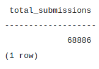
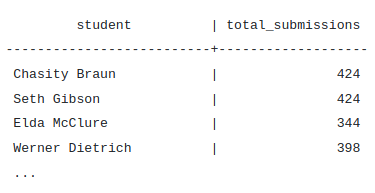
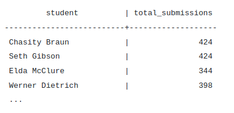
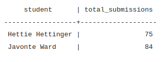

# Group By and Having
## GROUP BY
If we want to calculate the total number of assignment_submissions for all students, the count aggregate function is perfect.
```sql
SELECT count(assignment_submissions.*) as total_submissions
FROM assignment_submissions;
```


But what if we wanted to calculate the total number of assignment_submissions for each student individually, and output the totals next to the student's name?



We want to **apply the count() function to groups of data**, rather than the entire query. The groups in this case are the names of students. **We want to apply the count() function for each students.name.**

We will start by selecting the student's name from the students table, and the and the total submissions from the assignment_submissions table.

```sql
SELECT students.name as student, count(assignment_submissions.*) as total_submissions
FROM assignment_submissions
JOIN students ON students.id = student_id;
```

Now we just need to tell SQL **that we want count(assignment_submissions.*) to be run for each students.name**, instead of the entire query. To do this, we use the ```GROUP BY``` clause.

```sql
SELECT students.name as student, count(assignment_submissions.*) as total_submissions
FROM assignment_submissions
JOIN students ON students.id = student_id
GROUP BY students.name;
```

This will produce a table with the student's names, and the total submission for that student.



## HAVING
Now that we know how to get the total submissions for currently enrolled students, let's refine the query a bit more. Let's only return currently enrolled students who's total submissions are less than 100;

```sql
SELECT students.name as student, count(assignment_submissions.*) as total_submissions
FROM assignment_submissions
JOIN students ON students.id = student_id
WHERE students.end_date IS NULL
GROUP BY students.name
HAVING count(assignment_submissions.*) < 100;
```
Expected Output:



***<u>The HAVING clause is like WHERE but works on aggregated data</u>. Our WHERE clause works on normal data students.end_date and our HAVING clause works on the aggregated data count(assignment_submissions.*).***

# Conclusion
In this exercise we learned how to combine our aggregate functions with GROUP BY and HAVING clauses.

GROUP BY allows us to combine the results based on a column so an aggregate can be applied to each group.
HAVING allows us to filter our results based on the result of an aggregate function.
This makes using aggregate functions much more powerful in our queries.

