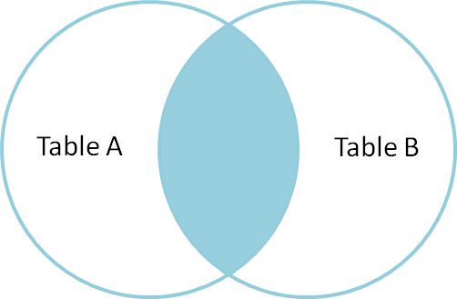
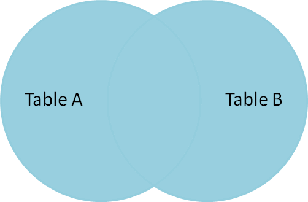
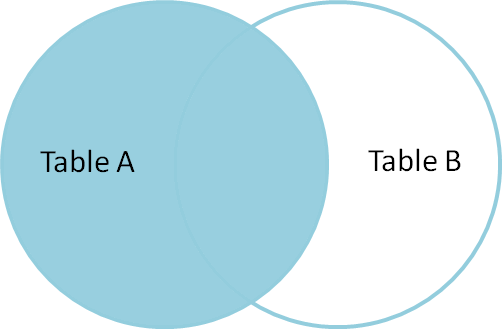
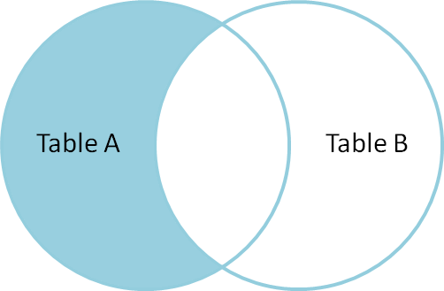
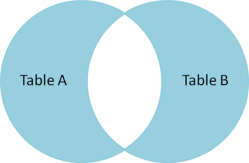

# Outer vs Inner Joins (REF [HERE](https://blog.codinghorror.com/a-visual-explanation-of-sql-joins/))
Assume we have the following two tables. Table A is on the left, and Table B is on the right. We'll populate them with four records each.

|id | name | id | name |
|---|------|----|------|
|1 |  Pirate |     1 |   Rutabaga |
|2 |  Monkey |     2 |   Pirate |
|3 |  Ninja |      3 |   Darth Vader |
|4 |  Spaghetti |  4 |   Ninja |

Let's join these tables by the name field in a few different ways and see if we can get a conceptual match to those nifty Venn diagrams.

## Inner join produces only the set of records that match in both Table A and Table B.
```sql
SELECT * FROM TableA
INNER JOIN TableB
ON TableA.name = TableB.name
id  name       id   name


1   Pirate     2    Pirate

3   Ninja      4    Ninja
```



## Full outer join produces the set of all records in Table A and Table B, with matching records from both sides where available. If there is no match, the missing side will contain null.

```sql
SELECT * FROM TableA
FULL OUTER JOIN TableB
ON TableA.name = TableB.name
id    name       id    name


1     Pirate     2     Pirate

2     Monkey     null  null

3     Ninja      4     Ninja

4     Spaghetti  null  null

null  null       1     Rutabaga

null  null       3     Darth Vader
```



# Left outer join produces a complete set of records from Table A, with the matching records (where available) in Table B. If there is no match, the right side will contain null.

```sql
SELECT * FROM TableA
LEFT OUTER JOIN TableB
ON TableA.name = TableB.name

id  name       id    name
--  ----       --    ----
1   Pirate     2     Pirate
2   Monkey     null  null
3   Ninja      4     Ninja
4   Spaghetti  null  null
```



## To produce the set of records only in Table A, but not in Table B, we perform the same left outer join, then exclude the records we don't want from the right side via a where clause.

```sql
SELECT * FROM TableA
LEFT OUTER JOIN TableB
ON TableA.name = TableB.name
WHERE TableB.id IS null
id  name       id     name


2   Monkey     null   null

4   Spaghetti  null   null
```



## To produce the set of records unique to Table A and Table B, we perform the same full outer join, then exclude the records we don't want from both sides via a where clause.

```sql
SELECT * FROM TableA
FULL OUTER JOIN TableB
ON TableA.name = TableB.name
WHERE TableA.id IS null
OR TableB.id IS null
id    name       id    name


2     Monkey     null  null

4     Spaghetti  null  null

null  null       1     Rutabaga

null  null       3     Darth Vader
```

