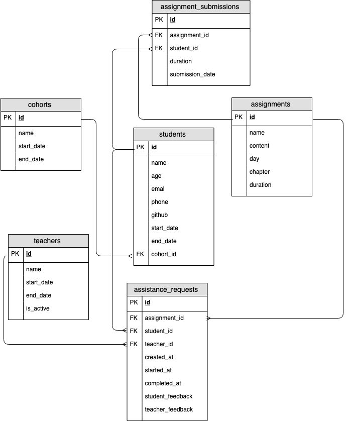
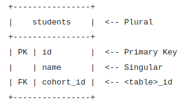

# Creating ERDs (Entity Relationship Diagram)
* We can use a pen and paper, a whiteboard or an online tool like [draw.io](http://draw.io/). The key is to iterate on the design before committing it to the database. This is a situation where we ALWAYS save time by planning.

        Always design a database using an ERD before writing any code.

## Bootcamp ERD

Here is a familiar looking example of an ERD for a Bootcamp.



## The key information that must be present in an ERD:
* Names of the Entities.
* Attributes / properties for the Entities.
* The relations between each entity.

There are multiple options for symbols to draw in order to identify the relationship type, here we are using a crows foot:


## Naming Convention
We use naming conventions to increase consistency which provides us with some level of predictability. We can write queries faster if we don't have to look up column names constantly.

* Use **snake_case** for ***table and column names***.
* ***Pluralize tables names***, **column names should be singular**.
* ****Call your primary key* id***.
**** For most foreign keys use ```<table>```_id.***



