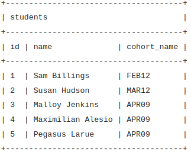
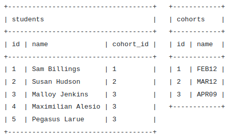

# Database Normalization
* allows us to realize one of the major benefits of relational databases.
  * We normalize our database **to reduce duplicate data.**

## Why Normalize?
### ***To enforce data integrity reduce duplication, and make it easier to manage our data.***

## Denormalized Database
* It is **incredibly difficult to manage a database that stores the same information in several places**.
* Let's imagine that we stored our student data denormalized.



* We would consider **this denormalized because the cohort name is repeated for 3 of the students.**
* In order **to normalize this database we would split the data into two related tables.**
* If a cohort name changes, then we must update all rows with that name. This can get incredibly complex, especially for larger databases.

## Normalized Database



* We still show that each student belongs to a cohort, **but the details of the cohort are stored separately.** 
* When we need to gather this information together, **we use a query to ask the database for it in the structure that we want.** This is when we start joining tables together.
* ***If we needed to change the name of a cohort for any reason we only need to change the one field in the cohorts table.***

      It is normal to create more tables when normalizing a database.

## Normalization in Database (With Example) Various forms of Normalization (REF [HERE](https://blog.udemy.com/normalization-in-database-with-example/))
* Database normalization is the process of making the **data in a database available in the most organized way possible.**
* When you’re normalizing a database, there are two things you need to consider: 
  1. whether the information in the database **has internal redundancies**
  2. whether the **dependencies across the different tables in the database are logically organized**.
* The term normalization **comes from the concept of normal forms**, which ***describe just how organized the information is in the database.***


#### EX
* As an example, let’s imagine we’re creating a database of the children in a class, and the pets they have. When starting to build this database, **the first approach might be to create a simple table with all of the information in one place, and one row for each student.**

```
TABLE: STUDENTS
| Name                | Age | Pet | Pet Name |
----------------------------------------------
| Heather             | 10  | Dog | Rex      |
----------------------------------------------
| Rachel              | 10  | Cat | Fluff    |
----------------------------------------------
| Jimmy               | 11  | Dog | Kimba    |
----------------------------------------------
| Lola                | 1o  | Cat | Thomas   |
```

* This works until you realize that Heather might have two pets, a dog and a cat. How would you represent that in this table? ***In order to do that, we need to introduce first normal form.***

### First Normal Form (video ref [HERE](https://www.youtube.com/watch?v=6Jr1ya1kWWE))
* NO REPEATING GROUPS
* To achieve first normal form for a database, you need to **make sure that no table contains multiple columns that you could use to get the same information.**
* Using the rules of first normal form, there may be redundant information across multiple rows, but each row will be unique.
```
TABLE: STUDENTS
| Name                | Age | Pet | Pet Name |
----------------------------------------------
| Heather             | 10  | Dog | Rex      |
----------------------------------------------
| Heather             | 10  | Cat | Thomas   |
----------------------------------------------
| Rachel              | 10  | Cat | Fluff    |
----------------------------------------------
| Jimmy               | 11  | Dog | Kimba    |
----------------------------------------------
| Lola                | 10  | Cat | Thomas   |
----------------------------------------------
```

### Second Normal Form
* In this first example **there are two rows for Heather, with changes to the second row to show the fact that there are multiple pets.**
* While this is searchable, and **follows first normal form**, it is an inefficient use of space. 
* **To achieve second normal form**, it would be helpful to ***split out the pets into an independent table, and match them up using the student names as foreign keys.***
```
TABLE: STUDENTS
| Name                | Age |
-----------------------------
| Heather             | 10  |
-----------------------------
| Rachel              | 10  |
-----------------------------
| Jimmy               | 11  |
-----------------------------
| Lola                | 10  |
-----------------------------
TABLE: PETS
| Type         | Pet Name  | Owner    |
---------------------------------------
| Dog          | Rex       | Heather  |
---------------------------------------
| Cat          | Thomas    | Heather  |
---------------------------------------
| Cat          | Fluff     | Rachel   |
---------------------------------------
| Dog          | Kimba     | Jimmy    |
---------------------------------------
| Cat          | Thomas    | Lola     |
---------------------------------------
```

### Third Normal Form
* This is a cleaner organization for the information, and avoids repeating the age of the student with two pets, **but the dogs and cats are repeated several times in the pets table.**
* ***Third normal form would suggest making sure each non-key element in each table provides information about the key in the row.***
* In order to establish an unambiguous unique identifier for each pet, it is **useful to include a unique primary key that distinguishes each pet from the others.**
* A similar issue could occur if there were two students with the same name, so creating unique primary key values for the student table is also a good idea.
```
TABLE: STUDENTS
| ID | Name                | Age |
----------------------------------
| 00 | Heather             | 10  |
----------------------------------
| 01 | Rachel              | 10  |
----------------------------------
| 02 | Jimmy               | 11  |
----------------------------------
| 03 | Lola                | 10  |
----------------------------------
TABLE: PETS
| ID | Type         | Pet Name  | Owner ID |
--------------------------------------------
| 00 | Dog          | Rex       | 00       |
--------------------------------------------
| 01 | Cat          | Thomas    | 00       |
--------------------------------------------
| 02 | Cat          | Fluff     | 01       |
--------------------------------------------
| 03 | Dog          | Kimba     | 02       |
--------------------------------------------
| 04 | Cat          | Thomas    | 03       |
--------------------------------------------
```

### Fourth Normal Form
* For this example, **imagine that we needed to show that the cat named Thomas as actually shared between Lola and Heather.**
* To represent this clearly, **we need to add a third table of relationships.**
```
TABLE: STUDENTS
| ID | Name                | Age |
----------------------------------
| 00 | Heather             | 10  |
----------------------------------
| 01 | Rachel              | 10  |
----------------------------------
| 02 | Jimmy               | 11  |
----------------------------------
| 03 | Lola                | 10  |
----------------------------------
TABLE: PETS
| ID | Type         | Pet Name  |
---------------------------------
| 00 | Dog          | Rex       |
---------------------------------
| 01 | Cat          | Thomas    |
---------------------------------
| 02 | Cat          | Fluff     |
---------------------------------
| 03 | Dog          | Kimba     |
---------------------------------
Table: PETS-STUDENTS
| Pet ID | Owner ID |
---------------------
| 00     | 00       |
---------------------
| 01     | 00       |
---------------------
| 02     | 01       |
---------------------
| 03     | 02       |
---------------------
| 01     | 03       |
---------------------
```

* Now we have a flexible and searchable **structure in fourth normal form** that can represent all the available information about each of the students, each of the pets, and the relationships among them.
* An important thing to keep in mind as you learn to structure your data is that the normal **forms are not set in stone as goals for every database.**

# Conclusion
Normalizing our database **reduces duplicate or redundant data and improves data integrity.** This process usually ***involves the creation of new tables in our database.***

There are many normal forms that we can follow, but at this point, we don't need to know them all or necessarily follow them all. **The most important thing to understand is why we would normalize our database.** ***To enforce data integrity reduce duplication, and make it easier to manage our data.***

