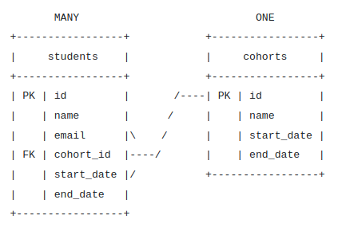
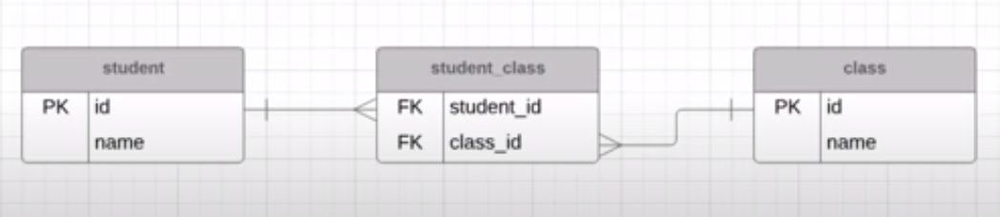
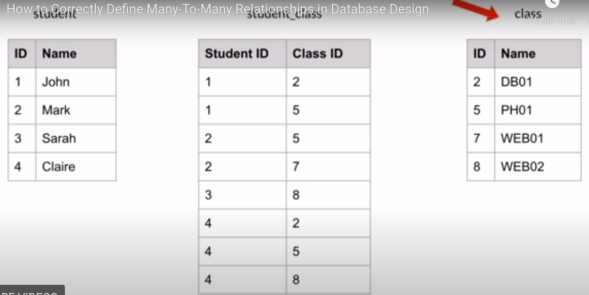
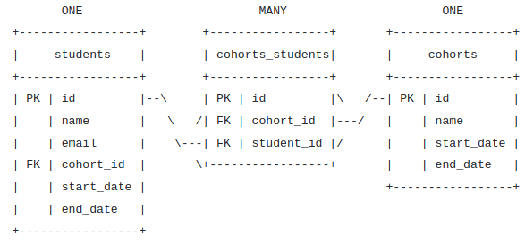
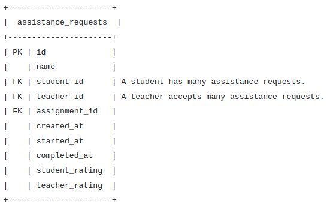

# Relationships Between Tables
* The relationships between tables are based on **primary keys** and **foreign keys**.
* The **two main types of relationships** between tables are **one-to-many** and **many-to-many**. This exercise will explain these relationships.

## One to many (ref [HERE](https://www.youtube.com/watch?v=-C2olg3SfvU))
* ***One record in one table is related to MANY records in another table***
* One customer can have many invoices
* When defining relationships between tables we will often want to create a one-to-many relationship. **An example of this is a cohort having many students.**
* IN javascript:
  *  A cohort has many students. A reasonable way of doing this would be to have a cohort object with a students array:
```javascript
const cohort = {
  name: "FEB02",
  students: ["Armand Hilll", "Stephanie Wolff"]
};
```
* The cohort has many things, so we might add an array to cohorts.
* **This works well in JavaScript, but works terribly in relational databases.**
* Our cohorts table can't contain an array of students, that's just not how these databases work.
* Instead, we will accomplish this relationship **by adding a single row that contains a single value to a single table.** 
  * We place ***a foreign key on the students table that points to a record in the cohorts table.***



* So instead of altering the cohorts, we alter the students. This is much different than our JavaScript approach because we are using a foreign key.

## Foreign Key
* A foreign key is a field in one table that refers to a primary key in another table.
* Foreign keys are how we model relationships in a relational database.
* When we have a one-to-many relationship, **the foreign key goes on the many side**.
  * So ***when a cohort has many students, the foreign key goes on the students side.***

          The Foreign Key is on the many side.  

* ***The foreign key is on the many side. The foreign key is on the many side. The foreign key is on the many side.***
```
(`-')       (`-').->  (`-')  _
( OO).->    (OO )__   ( OO).-/
/    '._   ,--. ,'-' (,------.
|'--...__) |  | |  |  |  .---'
`--.  .--' |  `-'  | (|  '--.
   |  |    |  .-.  |  |  .--'
   |  |    |  | |  |  |  `---.
   `--'    `--' `--'  `------'

                         (`-')   (`-')  _   _                 <-. (`-')_
   <-.          .->   <-.(OO )   ( OO).-/  (_)         .->       \( OO) )
(`-')-----.(`-')----. ,------,) (,------.  ,-(`-')  ,---(`-') ,--./ ,--/
(OO|(_\---'( OO).-.  '|   /`. '  |  .---'  | ( OO) '  .-(OO ) |   \ |  |
 / |  '--. ( _) | |  ||  |_.' | (|  '--.   |  |  ) |  | .-, \ |  . '|  |)
 \_)  .--'  \|  |)|  ||  .   .'  |  .--'  (|  |_/  |  | '.(_/ |  |\    |
  `|  |_)    '  '-'  '|  |\  \   |  `---.  |  |'-> |  '-'  |  |  | \   |
   `--'       `-----' `--' '--'  `------'  `--'     `-----'   `--'  `--'

<-.(`-')   (`-')  _                  _       (`-').->
 __( OO)   ( OO).-/      .->        (_)      ( OO)_
'-'. ,--. (,------.  ,--.'  ,-.     ,-(`-') (_)--\_)
|  .'   /  |  .---' (`-')'.'  /     | ( OO) /    _ /
|      /) (|  '--.  (OO \    /      |  |  ) \_..`--.
|  .   '   |  .--'   |  /   /)     (|  |_/  .-._)   \
|  |\   \  |  `---.  `-/   /`       |  |'-> \       /
`--' '--'  `------'    `--'         `--'     `-----'

           <-. (`-')_     (`-')       (`-').->  (`-')  _
     .->      \( OO) )    ( OO).->    (OO )__   ( OO).-/
(`-')----. ,--./ ,--/     /    '._   ,--. ,'-' (,------.
( OO).-.  '|   \ |  |     |'--...__) |  | |  |  |  .---'
( _) | |  ||  . '|  |)    `--.  .--' |  `-'  | (|  '--.
 \|  |)|  ||  |\    |        |  |    |  .-.  |  |  .--'
  '  '-'  '|  | \   |        |  |    |  | |  |  |  `---.
   `-----' `--'  `--'        `--'    `--' `--'  `------'

<-. (`-')   (`-')  _  <-. (`-')_                 (`-').->   _       _(`-')     (`-')  _
   \(OO )_  (OO ).-/     \( OO) )     .->        ( OO)_    (_)     ( (OO ).->  ( OO).-/
,--./  ,-.) / ,---.   ,--./ ,--/  ,--.'  ,-.    (_)--\_)   ,-(`-')  \    .'_  (,------.
|   `.'   | | \ /`.\  |   \ |  | (`-')'.'  /    /    _ /   | ( OO)  '`'-..__)  |  .---'
|  |'.'|  | '-'|_.' | |  . '|  |)(OO \    /     \_..`--.   |  |  )  |  |  ' | (|  '--.
|  |   |  |(|  .-.  | |  |\    |  |  /   /)     .-._)   \ (|  |_/   |  |  / :  |  .--'
|  |   |  | |  | |  | |  | \   |  `-/   /`      \       /  |  |'->  |  '-'  /  |  `---. ,-.
`--'   `--' `--' `--' `--'  `--'    `--'         `-----'   `--'     `------'   `------' '-'

``` 
LOL

## Many to Many (REF [HERE](https://www.youtube.com/watch?v=1eUn6lsZ7c4))
* TO BE AVOIDED because **it violates NORMALIZATION**
*  I.E
  * Students and classes
  * many different students have many different classes
* A JOINING TABLE will solve the normalization violation
* So
  * students will have a many to one to the join table and the join table will have a one to many to the classes table
  * 
  * An example with real data:
  * 
* Naming can take the names that the joining table is joining and concat them with an underscore OR make a sensible name like 'enrollment'

* **Imagine our requirements change and a student is also suddenly able to have many cohorts.**
  * A student can have many cohorts.
  * A cohort can have many students.

* This is now a many-to-many relationship. But in a relational database, we have no way of directly modeling a many-to-many relationship. Instead, we turn this into two one-to-many relationships using a 'join' table.



* This is a very basic example where our join table only contains two foreign keys. But it could contain many foreign keys and any other data that would help model our relationship.
  * Look at the following join table:



* This is a join table that represents the many-to-many relationship between students and teachers.
  * A teacher can help many students.
  * A student can be helped by many teachers.

* This join table has more purpose. It holds lots of information relevant to the relationship. In this case an assistance request joins students to teachers. Assignments are also attached but that isn't required.


        There are no direct many-to-many relationships, only multiple one-to-many relationships using a join table.