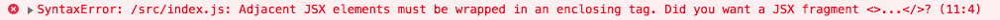

# What Is React?
* React makes it painless to create interactive UIs. Design simple views for each state in your application, and React will efficiently update and render just the right components when your data changes.
* Declarative views make your code more predictable and easier to debug.

So it's saying that **React has a way to manage the state** (***the current status of each view***) in our application. *React takes care of updating and rendering what we see in the browser to reflect the current state.* Let's look at some other points:
  * Build encapsulated components that manage their own state, and then compose them to make complex UIs.
  * Since component logic is written in JavaScript instead of templates, you can easily pass rich data through your app and keep state out of the DOM.

They are talking about something called **encapsulation**. A group of elements can be stored inside a component, and a component can be called by another component!
  * Encapsulation: In OOP refers to *the bundling of data with the methods that operate on that data,* or the restricting of direct access to some of an object's components.
    * Encapsulation is **used to hide the values or state of a structured data object inside a class**, *preventing direct access to them by clients* in a way that could expose hidden implementation details or violate state invariance maintained by the methods.

# Template Engines
* A long time ago, websites were written directly in HTML since there was no languages that could generate HTML automatically, those were the days of the static pages.
* After a while, a couple of languages and syntaxes became popular and that gave rise to what became known as template engines.
  * Like:
    * PHP
    * EJS
    * ERB
    * Liquid
* The thing they had in common was that they were mostly HTML. The only difference was that those engines all had a special tag to execute code, to show dynamic content.
```html
  <!-- Static HTML way -->
  <ul>
    <li>1</li>
    <li>2</li>
    <li>3</li>
    <li>4</li>
    <li>5</li>
  </ul>

  <!-- EJS way -->

  <ul>
    <% for(let i = 1; i <= 5; i++) { %>
      <li><%= i %></li>
    <% } %>
  </ul>
```

Since React will be creating HTML for us through the rendering process, **we will need an easy way to create React elements.**
  * **JSX** is the language that allows us to do that, and **lets us declare what the user interface should look like.**

## React: Behind The Scenes
```React.createElement```

* Creating a React element with JSX means **defining the type of element and any properties that we want to pass to it.** Notice how it looks a lot like HTML, but it is not HTML.

JSX:
```jsx
const element = <h2 className="name">Name</h2>
```

***The code above is run through a tool that knows how to turn JSX into JavaScript. The tool produces a JavaScript expression that creates a React element using React.createElement, as seen below.***

JavaScript:
```javascript
const element = React.createElement("h2", {
  className: "name"
}, "Name")
```

        Notice that JSX uses className instead of class to define CSS classes. Some of the properties do not map directly to HTML attributes. React is helpful with the warnings it provides. In this example, we would see Warning: Invalid DOM property 'class'. Did you mean 'className'? in the console if we use class.

The ```React.createElement(type, [props], [...children])``` function **allows us to create a hierarchy of DOM nodes.** The following JSX **describes a static tweet.**

```jsx
import React from "react";

function Tweet() {
  return (
    <article className="tweet">
      <header className="tweet__header">
        
        <h2 className="tweet__header-name">React</h2>
      </header>
      <main className="tweet__content">
        <p>A JavaScript library for building user interfaces</p>
      </main>
      <footer className="tweet__footer">May 29th, 2013</footer>
    </article>
  );
}
```

**To create the same elements without using ```JSX```,** we would have to write the code seen below. ***This code is automatically generated by the conversion tool.***
```javascript
import React from "react";

function Tweet() {
  return React.createElement(
    "article",
    {
      className: "tweet"
    },
    React.createElement(
      "header",
      {
        className: "tweet__header"
      },
      React.createElement("img", {
        className: "tweet__header-avatar",
        src: "https://api.adorable.io/avatars/64/react@adorable.png",
        alt: "Avatar"
      }),
      React.createElement(
        "h2",
        {
          className: "tweet__header-name"
        },
        "React"
      )
    ),
    React.createElement(
      "main",
      {
        className: "tweet__content"
      },
      React.createElement(
        "p",
        null,
        "A JavaScript library for building user interfaces"
      )
    ),
    React.createElement(
      "footer",
      {
        className: "tweet__footer"
      },
      "May 29th, 2013"
    )
  );
}
```

A Tweet component is created with ```const tweet = <Tweet />```. ***React requires that we always start component names with a capital letter.*** When JSX is being converted, **it uses the case of the tag name to determine if we are describing a component or an HTML element.**

        !!!!!!!!!!!!!!Always start component names with a capital letter!!!!!!!!!!!!!!!!!!!!!

```ReactDOM.render```
**An element can be "rendered" into any DOM node using the react-dom library.** This example requires ```<div id="root"></div>``` to be declared in the HTML. In the example below ```document.getElementById("root")``` in the call to ```ReactDOM.render``` is used to access the "root" DOM node. **Everything inside of it will be managed by React.**
```jsx
import React from "react";
import ReactDOM from "react-dom";

function Tweet(props) {
  return (
    <article className="tweet">
      <header className="tweet__header">
        
        <h2 className="tweet__header-name">{ props.name }</h2>
      </header>
      <main className="tweet__content">
        <p>{ props.content }</p>
      </main>
      <footer className="tweet__footer">{ props.date }</footer>
    </article>
  );
}
ReactDOM.render(
  <Tweet
    name="React"
    avatar="https://api.adorable.io/avatars/64/react@adorable.png"
    content="A JavaScript library for building user interfaces"
    date="May 29th, 2013"
  />,
  document.getElementById("root")
)
```

**Most applications call ```ReactDOM.render(element, container)``` a single time to render the application.**

## Expressions In JSX
With an earlier project (TinyApp), we used EJS to create dynamic content out of HTML. JSX is going to feel very similar in its usage. It looks like a template language but it is purely JavaScript. This means that we can include expressions within the JSX. **In this example we pass an unformatted date to a component**. It is the **responsibility of the component to format the date.**

The ***format function is called each time the component renders.***
```jsx
import { format } from "date-fns";

function Footer(props) {
  return (
    <footer className="tweet__footer">
      {format(props.date, "MMMM Do, YYYY")}
    </footer>
  );
}

ReactDOM.render(
  <Footer
    date="2013-05-29"
  />,
  document.getElementById("root")
);
```

# JSX Rules. JSX Rules!
**JSX is more strict than HTML**. There are few rules to keep in mind when using JSX.

## Rule 1
All tags **must be closed.** There are two ways to close a tag.

* **Use two tags** (an open tag and a close tag - as with ```<div>...</div>``` below).
* **Use one self-closing tag** (as with ```<Album />``` below).
```jsx
<div>
  
  <Album />
</div>
```
The unclosed `````` tag above **produces the following error** (the correct syntax would be ``````).


## Rule #2
**A child tag must close before its parent**. We are creating a tree structure. So the last one to open is the next one to close.
```jsx
<div>
  <ul>
    <li>
    </ul>
  </li>
</div>
```
These **incorrectly nested tags produce the following error**.


## Rule #3
All JSX **expressions must result in one root level element**. **A function can only return one value**. A component is defined using a JavaScript function so the same rules apply.

Good:
```jsx
return (
  <div>
    <input />
  </div>
)

/* becomes */

return React.createElement("div", null, React.createElement("input", null))
```
Bad:
```jsx

return (
  <div>
  </div>
  <input />
)

/* becomes? */

return (
  React.createElement("div", null)
  React.createElement("input", null)
)

/* Nope. Functions can't return multiple values like that. */
```
These adjacent JSX elements produce the following error.



## Rule #4
***No HTML comments.***
```jsx
return (
  <div>
    <!--- Not allowed --->
    {/* Allowed */}
  </div>
)
```

# Summary
JSX is a powerful language that allows us to declare how an interface looks. **It is not a template language but it shares the declarative benefits of one.**

**We can take any JSX expression and render it to the DOM using ```ReactDOM.render```.** ***Normally this is done once for an application.*** An expression must be valid so it is important to follow the JSX rules.

1. All tags must be closed
2. A child tag must close before its parent
3. All JSX expressions must result in one root level element
4. No HTML comments