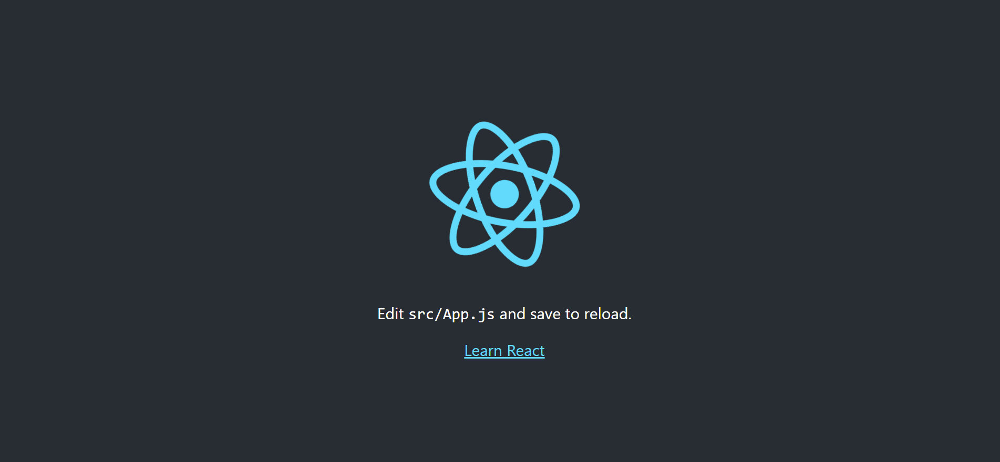

# Create React App

It's possible to build a React application from scratch by importing the proper packages, but that would involve a lot of configuration and setup to have a good working environment.

The ```create-react-app``` package is a tool that **enables us to create a fully fledged React app in one command!** The three main points we should use it are (based on their website):
  1. Less To Learn
    * You don't need to learn and configure many build tools. Instant reloads help you focus on development. When it's time to deploy, your bundles are optimized automatically.

  2. Only One Dependency
    * Your app only needs one build dependency. We test Create React App to make sure that all of its underlying pieces work together seamlessly – no complicated version mismatches.

  3. No Lock-In
    * Under the hood, we use webpack, Babel, ESLint, and other amazing projects to power your app. If you ever want an advanced configuration, you can ”eject” from Create React App and edit their config files directly.

## Using create-react-app

Those points are pretty interesting! Let's see if they hold true by creating our first React app.

### Installation\
```shell
  $ npx create-react-app example-app
```

We should first see this showing up in the terminal...

```shell
  Creating a new React app in /home/******/projects/example-app.

  Installing packages. This might take a couple of minutes.
  Installing react, react-dom, and react-scripts with cra-template...
```
```shell
...and if everything goes well, we should see the following after ~45 seconds.

  Created git commit.

  Success! Created example-app at /home/******/projects/example-app
  Inside that directory, you can run several commands:

  yarn start
    Starts the development server.

  yarn build
    Bundles the app into static files for production.

  yarn test
    Starts the test runner.

  yarn eject
    Removes this tool and copies build dependencies, configuration files
    and scripts into the app directory. If you do this, you can’t go back!

  We suggest that you begin by typing:

  cd example-app
  yarn start

Happy hacking!
```

## Available Scripts

Let's look at the **available scripts that the installer provided us with.**

### start

The start script **will start the development server and show us what our app looks like.** The base code provides something that should look like the image below.



### build

Once you're **finished developing the app and you want to deploy it,** the build task **will create a static version of your app that you can upload to any web server.** It is necessary if we want to deploy our app.

### test
This set of tools already comes with a testing library installed, ```Jest```. **To run your test suite, the command is already available for you.**

### eject
The ```eject``` **command is about removing ```create-react-app```, and replacing it with all the dependencies to make your app work.** Doing this will disable future updates from the ```create-react-app group``` and *****is an irreversible change.*****