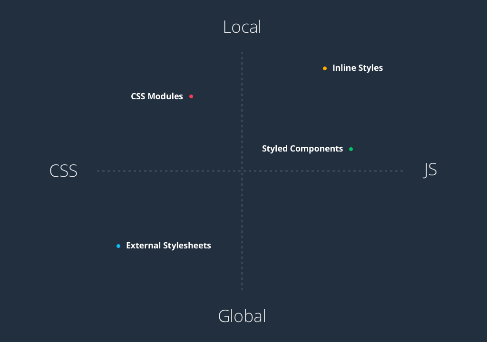

# Styling Components

React does not have an opinion on how we should style components. **There are many acceptable ways.** A simple search for "ways to style react components" reveals a number of articles on the subject.
  * [Four ways to style react components](https://codeburst.io/4-four-ways-to-style-react-components-ac6f323da822)
  * [5 Ways to Style React Components in 2019](https://blog.bitsrc.io/5-ways-to-style-react-components-in-2019-30f1ccc2b5b)

## [Four ways to style react components](https://codeburst.io/4-four-ways-to-style-react-components-ac6f323da822)
* If you want to ***add just a few style properties***, then **inline styling is the best option**.
* When you **want to reuse your style properties in the same file** then ***style-component are perfect***.
* When **your application is more complex** I ***recommend CSS Modules or regular CSS stylesheets***.

### 1. CSS Stylesheet

The component:
```jsx
import React from 'react';
import './DottedBox.css';

const DottedBox = () => (
  <div className="DottedBox">
    <p className="DottedBox_content">Get started with CSS styling</p>
  </div>
);

export default DottedBox;
```

Simply **import css file** import './DottedBox.css' **so you can have a separate css file for each component**.

The css:
```css
.DottedBox {
  margin: 40px;
  border: 5px dotted pink;
}

.DottedBox_content {
  font-size: 15px;
  text-align: center;
}
```

### 2. Inline styling

In React, **inline styles are not specified as a *string***. Instead ***they are specified with an object whose key is the camelCased version of the style name***, and whose **value is the style’s value, usually a *string***.

The component AND the css in variables:
```jsx
import React from 'react';

const divStyle = {
  margin: '40px',
  border: '5px solid pink'
};
const pStyle = {
  fontSize: '15px',
  textAlign: 'center'
};

const Box = () => (
  <div style={divStyle}>
    <p style={pStyle}>Get started with inline style</p>
  </div>
);

export default Box;
```

**We can create a variable that stores style properties** and ***then pass it to the element like*** ```style={nameOfvariable}```
We can also **pass the styling directly** ```style={{color: 'pink'}}```


### 3. CSS Modules

A **CSS Module is a CSS file in which all class names and animation names are scoped locally by default**.
  * Great article about css modules [here](https://medium.com/@pioul/modular-css-with-react-61638ae9ea3e#.re1pdcz87).

The component:
```jsx
import React from 'react';
import styles from './DashedBox.css';

const DashedBox = () => (
  <div className={styles.container}>
    <p className={styles.content}>Get started with CSS Modules style</p>
  </div>
);

export default DashedBox;
```

Similar to css we import css file import styles './DashedBox.css'
then we access to className as we access to object

```css

 :local(.container) {
   margin: 40px;
   border: 5px dashed pink;
 }
 :local(.content) {
   font-size: 15px;
   text-align: center;
 }
```

```:local(.className)```-this **when you use *create-react-app* because of webpack configurations**

```.className```-this **if you use your own react boilerplate**.

________________________________________________________________________________________________________________________________________________________________________

### <center>To make CSS modules work with Webpack **you only have to include the modules mentioned above and add the following loader to your ```webpack.config.js``` file:**</center>

```js
. . .
{
  test: /\.css$/,
  loader: 'style!css-loader?modules&importLoaders=1&localIdentName=[name]__[local]___[hash:base64:5]' 
}
. . .
```

________________________________________________________________________________________________________________________________________________________________________


### 4. Styled-components 💅

[Styled-components](https://github.com/styled-components/styled-components) is a library for React and React Native that **allows you to use component-level styles in your application that are written with a mixture of ```JavaScript``` and ```CSS```**

```jsx
import React from 'react';
import styled from 'styled-components';

const Div = styled.div`
  margin: 40px;
  border: 5px outset pink;
  &:hover {
   background-color: yellow;
 }
`;

const Paragraph = styled.p`
  font-size: 15px;
  text-align: center;
`;

const OutsetBox = () => (
  <Div>
    <Paragraph>Get started with styled-components 💅</Paragraph>
  </Div>
);

export default OutsetBox;
view raw
```

* First we **need to install ```styled-components``` library**
* ```npm install styled-components --save```
* Now we **can create a variable by selecting a particular html element where we store our style keys** ```const Div = styled.htmlElemnet`color: pink````
* Then we **use the name of our variable as a wrapper** ```<Div></Div>``` kind of react component:)
* **Tips to use emoji icons key shortcut CTRL+CMD+SPACE 💡**

# Back to main topic

## Component.css

This is **the default approach provided by create-react-app and the one used by CodeSandbox.**
  * **When we create a component called Component.js we also create a corresponding Component.css file beside it.**
  * With vanilla ES6 modules we cannot import CSS files. Support for this built into create-react-app, **but it is webpack and babel doing the heavy lifting.**

```css
.component {
  color: gold;
}
```

```jsx
import "./Component.css";

function Component(props) {
  return <div className="component">Gold</div>
}
```

## More on adding a style sheet (ref [here](https://facebook.github.io/create-react-app/docs/adding-a-stylesheet))
* You should be aware that this makes your code less portable to other build tools and environments than webpack.
* In development, **expressing dependencies this way allows your styles to be reloaded on the fly as you edit them.**
* In **production**, ***all CSS files will be concatenated into a single minified .css file in the build output***.

## Using Sass

We can use Sass for styling.

First we **need to install the ```node-sass``` library** which has already been done for this project.
  * When ```node-sass``` is installed **we can rename any .css files to .scss**. They will be processed into CSS through webpack.

More detailed information can be found on the official [documentation](https://facebook.github.io/create-react-app/docs/adding-a-sass-stylesheet).

## Common Styles
Due to time limitations, all of the styles for this project have already been provided to us. As an application grows in size the styles can become hard to manage. **A collection of common styles can be found in the ```src/styles/``` folder.**

The **application styles are contained in src/index.scss.** They are being **imported by ```src/index.js``` and ```stories/index.js```**. This enables the styles for the application and the Storybook environment.

## BEM

This project uses a BEM naming convention for all of the component styles. Learning BEM will help with future CSS architecture. Before we start looking at classes we need to understand **the basics of how the names are chosen.**

Let's take our future ```DayListItem``` component as an example. This component is responsible for representing a single day in the sidebar. **When it is selected it needs to show a white background.** ***When it is full it needs to have a lowered opacity***. These are slight modifications to the default style.

With BEM we have **three types of CSS classes. The *Block*, the *Element* and the *Modifier*.**

* **Block**: ***Encapsulates a standalone entity that is meaningful on its own***. In our case this is the ```.day-list```.
* **Element**: ***An element that is tied to its block***. In our case this is the ```.day-list__item```.
* **Modifier**: An ***modification to a block or an element***. In our case this is ```.day-list__item---selected``` or ```.day-list__item---full```.

We use combinations of these classes to define the different visual states an element can have.
```html
<li class="day-list__item">Default</li>
<li class="day-list__item day-list__item---selected">Selected</li>
<li class="day-list__item day-list__item---full">Full</li>
<li class="day-list__item day-list__item---selected day-list__item---full">Selected & Full</li>
```

### One of the main things to notice about BEM **is that it is not tied to the DOM structure. The *specificity is enforced through naming* rather than complex selectors.**

# Summary
There are two concepts that tend to differentiate these approaches for CSS with React.

1. The scoping of the styles.
2. The language used to declare the styles.



With **standard CSS we cannot have two classes with the same name.** There is a conflict because the classes are available to a document globally. This is the "External Stylesheets" approach that we are using. Even though we define the styles in different files they all end being combined by the build tools. **We solve this problem by using BEM to ensure that there are no conflicts.**

Enabling **"CSS Modules"** ***allows us to write CSS scoped to a component***. This can **reduce the long class names seen in our project**. This approach **allows us to move away from the verbose nature of BEM while still retaining organization benefits**.

**A lot of the features provided by Sass are now available through the more modern "CSS-in-JS" libraries.** This list provides a starting point for research at a later date. **These are popular options that could be explored while building a final project.**

* [JSS](https://cssinjs.org/)
* [Emotion](https://emotion.sh/docs/introduction)
* [Styled Components](https://www.styled-components.com/)
* [Aphrodite](https://github.com/Khan/aphrodite)