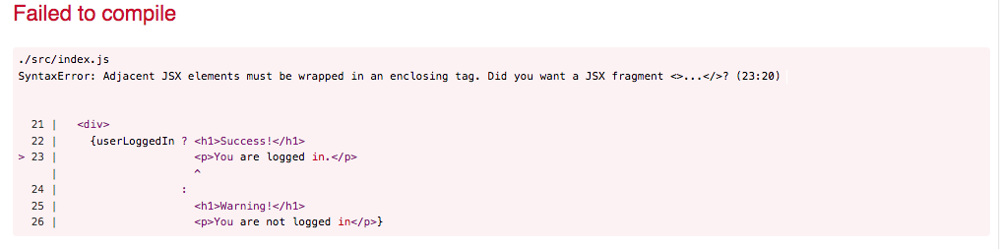

# Fragments

One of the **rules of React** is that ***JSX expressions must have only one parent element***.

This means that:
  1. **Components can only return JSX with one root element**.
  2. **Conditional expressions that resolve to JSX must also only have one root element.**


Let's look at an example of each.

## Returning a Component
In React, **this is incorrect** because the ```<h1>``` and ```<h2>``` are adjacent. **There are two root elements being returned.**
```jsx
// INCORRECT
return (
  <h1>A heading</h1>
  <p>A paragraph</p>
)
```

#### The code above would result in the following error:


It **could be fixed** by wrapping both elements in a ```<div>```:
```jsx
// Correct
return (
  <div>
    <h1>A heading</h1>
    <p>A paragraph</p>
  </div>
)
```

**Sometimes this is an acceptable solution**, but *it isn't ideal*. Ask yourself: **Does the ```<div>``` have any other function**? *Is it related to the layout* or *necessary to the structure of the page* in any way?

________________________________________________________________________________________________________________________________________________________________________

#### <center>Extra unnecessary ```<div>``` tags **can result in bugs related to CSS**.</center>

________________________________________________________________________________________________________________________________________________________________________


So, you may want to consider a ```<Fragment>```. Unlike a ```<div>```, a React ```<Fragment>``` ***does not create any extra DOM nodes***, which can clutter up your HTML output and cause problems with your layout.

**```Fragment```** is available as part of the React library. To use a React ```Fragment```, you can do this:
```jsx
return (
  <React.Fragment>
    <h1>A heading</h1>
    <p>A paragraph</p>
  </React.Fragment>
)
```

This seems a little verbose, so you can also pull the Fragment from the library in the import statement:
```jsx
import React, { Fragment } from 'react';
```
Then you can use ```<Fragment>``` like this:
```jsx
return (
  <Fragment>
    <h1>A heading</h1>
    <p>A paragraph</p>
  </Fragment>
)
```
Finally, you can also use a shorthand for ```<Fragment>``` **which looks like a blank tag.** The **opening tag is ```<>```** and **the closing tag is ```</>```**:
```jsx
return (
  // JSX fragment shorthand opening tag
  <>
    <h1>A heading</h1>
    <p>A paragraph</p>
  // Closing tag
  </>
)
```
________________________________________________________________________________________________________________________________________________________________________

#### <center>Note that the short hand method ***does not accept attributes (props)***. You need to use ```<Fragment>``` **if you want to pass that fragment any props**.</center>

________________________________________________________________________________________________________________________________________________________________________

## Conditional Expressions that **result in Multiple Elements**
As you read before, **JSX supports conditional expressions using *ternary* and *short circuit* operators.**

For example, let's say ```userLoggedIn``` boolean that is used with a ternary operator to determine which ```<h1>``` to render on the page:
```jsx
const userLoggedIn = false;

return (
  // WRONG
  <Fragment>
    {userLoggedIn ? 
      <h1>Success!</h1>
      <p>You are logged in.</p>
    : 
      <h1>Warning!</h1>
      <p>You are not logged in</p>
    }
  </Fragment>
)
```
#### ***This will result in an error.***



Although we have the an outer ```<Fragment>``` that is returning the entire component, **we have two expressions that do not resolve to single root elements** (the ```<h1>``` and ```<p>``` tags).

To wrap these in fragments (we'll use shorthand in this example), we would do this:
```jsx
const userLoggedIn = false;

return (
  // RIGHT, it used fragments to ensure a single root level element is returned
  <Fragment>
    {userLoggedIn ? 
    <>
      <h1>Success!</h1>
      <p>You are logged in.</p>
    </>
    :
    <>
      <h1>Warning!</h1>
      <p>You are not logged in</p>
    </>
    }
  </Fragment>
)
```

## Summary

### Use **fragments** **when you do not want to add unnecessary DOM nodes** (i.e. extra ```<div>``` tags). Use shorthand where possible, but use ```<Fragment>``` **if the component should be passed props.**

