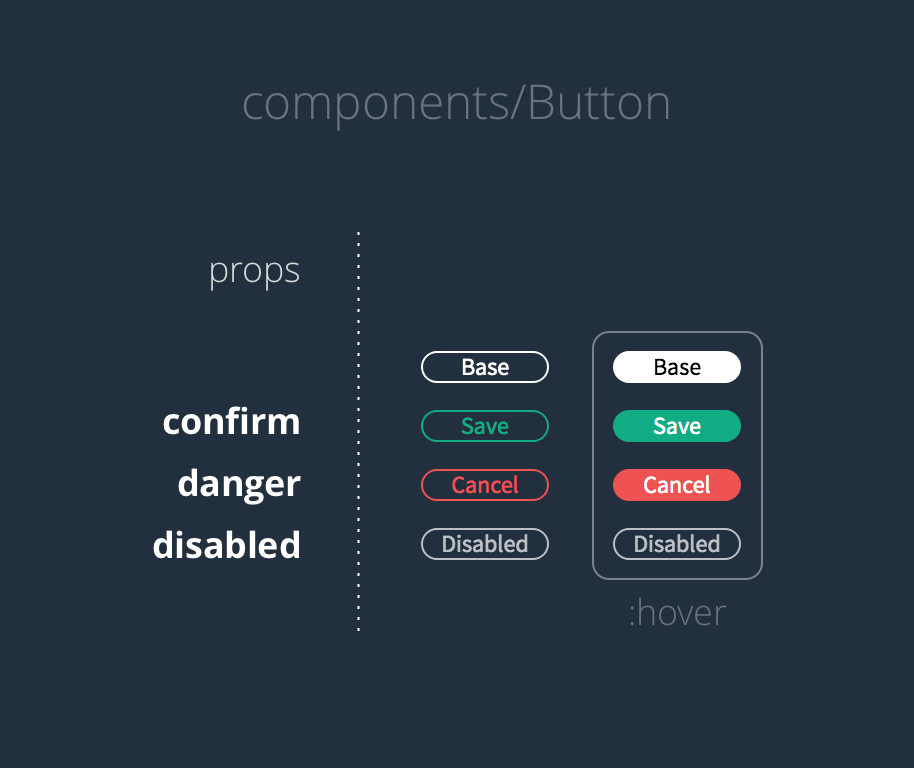

# Buttons (stories and react)



The CSS ```:hover``` selector to manage the styles applied on hover. **It is possible to make React responsible for applying styles on hover, but it is unnecessarily complex.**
```jsx
<Button danger={true}>Cancel</Button>
```
Each prop (```confirm```, ```danger```, ```disabled```) **will be set to either true or false** (more specifically, **each prop will resolve to a "truthy" or a "falsy" *expression***).

Since JSX considers that **writing the name of the prop is sufficient to be considered truthy**, we can write the shorthand version like so. In the example below, the **prop danger is given a truthy to be true by default** if it is declared in this way
```jsx
<Button danger>Cancel</Button>
```

## props.children

In parent component:
```jsx
function App() {
  return (
    <Button>
      Click Me!
    </Button>
  );
}
```

In child component:
```jsx
function Button(props) {
  return (
    <button>{props.children}</button>
  );
}
```

Would render a button with "Click Me!" as the inner text!

## To render various html attr
```jsx
// In Button
...
  let buttonClass = "button";

  if (props.confirm) {
    buttonClass += " button--confirm";
  }

  if (props.danger) {
    buttonClass += " button--danger";
  }


  return (
    <button
      className={buttonClass}
      onClick={props.onClick}
      disabled={props.disabled}
    >
      {props.children}
    </button>
  );
...
```

### will render:
```jsx
<Button confirm>Confirm</Button>
// Render
<button class="button button--confirm">Confirm</button>

<Button danger>Cancel</Button>
// Will render
<button class="button button--danger">Cancel</button>

<Button onClick={action("button-clicked")}>Clickable</Button>
// Will render
<button class="button" onclick="action('button-clicked')">Clickable</button>

<Button disabled onClick={action("button-clicked")}>Disabled</Button>
// Will render
<button class="button" onclick="action('button-clicked')" disabled="">Disabled</button>
```