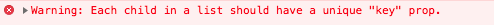

# Keys for array

Each item in a list of children MUST have a unique identifier called a **key**.

The **value must be named** ```key``` and **each ```key``` must be unique**.

Your application may still work if you haven't supplied unique keys, but you will see the following error message in your browser's console:



To satisfy this requirement, **we will make use of the fact that each day has an id value that uniquely identifies each object.** We can use this as the value for the key prop.