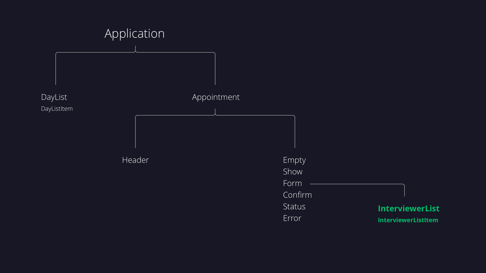

# Choosing where to put State

When choosing *which component to track a particular piece of data in*, we need to **consider all the components that will need to know the value** of that data. We also need to **consider the structure of the component tree** (seen below). The component tree gives you an idea of the next pieces that we'll be building later in this project.



You may think that we should store the state of the day in the ```<DayList>``` component. We could do that, but later on we'll build an ```<Appointment>``` component that shows information about one particular appointment. We'll also be writing code in the ```<Application>``` component to display a list of appointments based on the value of day.

Since the ```<Application>``` component will need to know the day to display the appropriate list of appointments, we need to track the state of day at a level in the component tree where it can be used by both the ```<Application>``` and the ```<DayList>```.

In React, ***data most easily flows in a one-way direction down the tree of components***. Passing data down using props is easy, but **passing data back up, while possible, isn't ideal**. 

#### **If two components need access to the same data**, then it should be placed in ***their closest common ancestor and passed down to them.***

**Since ```<Application>``` and ```<DayList>``` will both need to know the value of day, we should track day in ```<Application>``` (the closest common ancestor of both components).**
