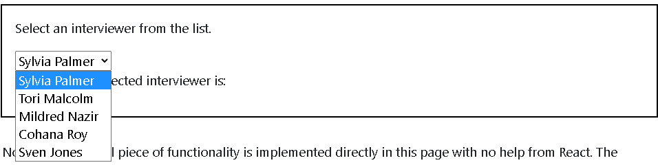

# Controlled List

#### Recall that the pattern for controlling a component with React involves:
  1. Setting the **```value``` attribute on the form element with a variable that is stored in state.**
  2. Using an ```onChange``` (camelCase, because it's React!) event **that fires the setter function** set a new value when the input changes.

## Controlled Lists
For our purposes, we will define a Controlled List as **a select list that takes user input, but is built without using any type of HTML form input** (no ```input``` tags, no ```select``` tags). Both the DayList and the InterviewerList were built this way.

The thing to note here is that because these lists are built without HTML form inputs, **the lists do not have built-in ```value``` or ```onChange``` attributes**. Let's think about how we are able to receive user input and detect changes without using form elements.

To start, we're going to take a **step back and look at how a select list might be implemented in HTML.**

## HTML Select Lists
Below is a basic HTML select list with a little JavaScript embedded at the top. Note that:
  * HTML ```select``` with ```option``` is used to create the list.
  * An ```onchange``` event fires and runs ```displayInterviewer``` when the ```option``` is changed by the user.

```jsx
<script>
  function displayInterviewer() {
    const currentInterviewer = document.querySelector("#interviewer-list").value;
    document.querySelector("#interviewer-output").innerHTML = `The currently selected interviewer is: <strong>${currentInterviewer}</strong`;
  }
</script>

<p>Select an interviewer from the list.</p>

<select id="interviewer-list" onchange="displayInterviewer()">
  <option value="Sylvia Palmer">Sylvia Palmer</option>
  <option value="Tori Malcolm">Tori Malcolm</option>
  <option value="Mildred Nazir">Mildred Nazir</option>
  <option value="Cohana Roy">Cohana Roy</option>
  <option value="Sven Jones">Sven Jones</option>
</select>

<p id="interviewer-output">The currently selected interviewer is:</p>
```

outputs: 



Note that this small piece of functionality is implemented directly in this page with no help from React. The selected ```option``` is tracked and displayed. The ```select``` tag **supports an ```onchange``` attribute which is an event that fires if you change the selected option.**

If you think about it, **```onchange``` is bound to the value of an input field.** ```onchange``` only fires if the value changes.

```html
<select id="interviewer-list" onchange="displayInterviewer()">
  <option value="Sylvia Palmer">Sylvia Palmer</option>
  <option value="Tori Malcolm">Tori Malcolm</option>
    ...
```

In React, we could create the same element except we would write ```onChange``` (camelCase) instead of all lowercase onchange and we would wrap the function name in curly braces.
```jsx
<select id="interviewer-list" onChange={displayInterviewer}>
  <option value="Sylvia Palmer">Sylvia Palmer</option>
  <option value="Tori Malcolm">Tori Malcolm</option>
  ...
```

### Reviewing Our Lists
***We didn't use a select tag to build our lists of days and interviewers. Why not?***

A select tag has built-in functionality which is nice; it's a functioning drop down list and it manages its own state. **However, it can be more cumbersome to style and it is often desirable to provide a different user experience**. For instance, ***instead of a drop-down list of text options, we might want to display a row of images to select from.*** **Moreover, a select list manages its own state. We want React to be the source of truth for the state of our application's data.**

When we created the InterviewerList and the DayList components, instead of using select with option tags, we used a ul with li elements for each option. This is easy to read in JSX and it makes sense conceptually. HTML lists are also easy to style and alter the appearance of as you wish. Using ul and li to create select lists is a common pattern in React.

**However, there is something to be aware of when using ul with li in place of select with option.** 
  * ***ul and li tags don't come with a built-in value attribute or an onChange event handler.***

To **solve that, we used React props to assign a piece of data** (a day name or interviewer ID) to each li. Then we stored a value in state (day or interviewer). The value stored in state is similar to the selected option on an HTML select list.

**How did we allow a user to change the value and detect that change?** Our lists were not drop down select lists. Instead, **we displayed all the options at once (all the days or all the interviewer's pictures). We used ```onClick``` on each ```li```.** When the click was registered, setDay or setInterviewer was run and the new day/interviewer was set. React detected a change and updated the value of day or interviewer in state.

This is how we received input and updated the data without using an HTML select list!


## Example
```jsx
const [day, setDay] = useState("Monday");
//...
<DayList 
  days={days} 
  day={day} 
  setDay={setDay} 
/>
```
### Controlled List Naming Pattern
The code above works just fine. However, with a slight adjustment in how we name our props, **we can make it very clear as to why we are passing day and setDay as props and what they represent.** We can use the words ```value``` and ```onChange``` **to mimic a standard HTML select list, like so:**
```jsx
<DayList 
  days={days} 
  value={day} 
  onChange={setDay} 
/>
```
At first glance, you might think we're just using the onChange event and value property, right? **No! We are choosing the name of our props to be the same as those keywords.**

**This makes it clear that our DayList component is used to receive input from a user.** The value and onChange prop names allow a developer to quickly understand this. By mimicking the structure of a regular HTML select list, we have created something familiar that abstracts away the underlying complexity.

***Remember that the words value and onChange in the code above are not actually ```keywords```. ```value``` and ```onChange``` are keywords only when they are used on an input tag or select tag or some other form element, but not on other tags like ul or li or your own React component.***