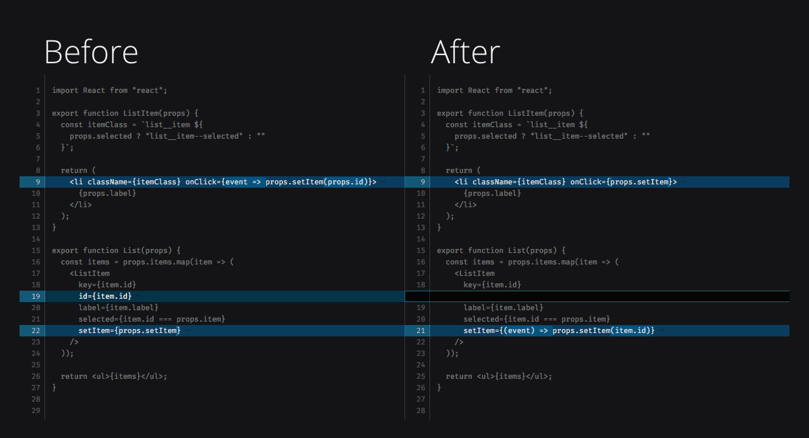

# Reducing the Number of Props

### The process we have to go through **to get data to lower parts of the React Component tree** is referred to as ***prop drilling*** (or ***threading***).
#### What is prop drilling? [REF](https://kentcdodds.com/blog/prop-drilling)
Prop drilling (also called "threading") refers to the process you have to go through to get data to parts of the React Component tree.

You may have noticed a pattern between the ```DayList``` and the ```InterviewerList```:
  * DayList passes the setDay function down to the DayListItem
  * InterviewerList passes the setInterviewer function down to the InterviewerListItem

Looking at our implementation, we can identify a general React pattern:
  * List passes a setItem function down to the ListItem

Finally, **both lists also pass down a parameter that is used by their respective setItem functions**. setDay takes a day name as an argument and setInterviewer takes an interviewer's id as an argument. It's a subtle difference, but remember this last point. We'll come back to it later.

          ℹ️ In the screenshot below, when we reference List and ListItem, we are talking about generic components. The code in the screenshot below does not represent the exact code in our components presently. It's just an example of the pattern.

On the left side of the image below,** notice there are two components in the same file** (```List``` and ```ListItem```). ```List``` passes ```id``` and ```setItem``` to ```ListItem``` as props. Note that we have to pass id to ListItem because we need to use it as an argument for the setItem function.



However, if we look at the right side of the image above, ***we see another approach: define the function in the List component instead.*** Then, we pass it to our ListItem while we are iterating over the array. **With this change, we no longer need to pass the id down to the ListItem.**