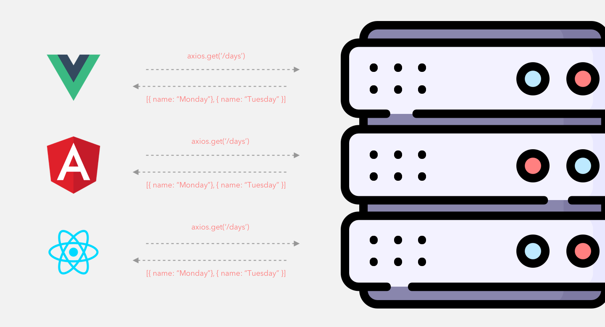

# Data Fetching with Axios

## $.ajax/axios

```jQuery``` made the ```Ajax``` request famous. Today many libraries allow you to make requests using the XMLHttpRequest API. We no longer need the powerful selectors and DOM manipulation tools that jQuery provides. We will use a modern library designed explicitly for data fetching.

**The library that we are going to use for making our API requests is called [axios](https://github.com/axios/axios)**. ***It allows us to use Promises to handle asynchronous requests.***

The documentation mentions the async/await syntax. **We are going to use Promises for this project to get more practice**. Understanding Promises is a pre-requisite to using the async/await syntax.

***We can use axios with any of the popular view libraries available. Its responsibility is limited to making HTTP requests.***



## Usage
We can install axios for a project using the command ```npm install axios```. We **import it like any other dependency using its default export**. Once we have access to the axios object, **we can access the four most common methods. These methods match the actions we want to take on a resource.**
  * axios.get(url[, config])
  * axios.post(url[, config])
  * axios.put(url[, config])
  * axios.delete(url[, config])

Below is a simple example of how we can make a GET request to the /appointments path. **The axios library will provide a response object when the Promise resolves.**

```jsx
axios.get("/api/appointments").then((response) => {
  console.log(response);
});
```

**When we want to send data to the server**, we need to ***provide a second argument***. **Here we update the appointment with the id equal to 2. We provide an object that contains the data for the record we are updating.**
```jsx
axios
  .put(`/api/appointments/2`, {
    id: 2,
    time: "1pm",
    interview: {
      student: "Archie Cohen",
      interviewer: 9,
    },
  })
  .then((response) => {
    console.log(response);
  });
```

## Errors
There are **situations where an API server responds with status codes that we treat as errors**. With axios ***you can use the Promise catch method to handle them***. The *error argument includes the status code*.
```jsx
axios
  .get("/api/appointments")
  .then((response) => {
    console.log(response);
  })
  .catch((error) => {
    console.log(error.response.status);
    console.log(error.response.headers);
    console.log(error.response.data);
  });
```

This pattern allows us to handle HTTP requests. **When a user tries to login with the incorrect credentials**, we would ***expect ```error.response.status``` to equal 401***. If they **try to access a resource without permission**, the ***response returns 403*** status code.

# Summary
In earlier weeks, we used the ```request``` library in ```nodejs```. ***Axios is one of the more popular HTTP request libraries***. It **works in the Browser and nodejs**. There are a lot of advanced features supported by axios that we did not cover. These advanced features allow axios to scale with the project as requirements increase in complexity.
  * We can cancel an in-progress request.
  * Can set a timeout for a response.
  * It supports CSRF (Cross-site request forgery) protection.

We don't need to learn about CSRF today. It is a feature built into axios that may be useful for a more advanced project.