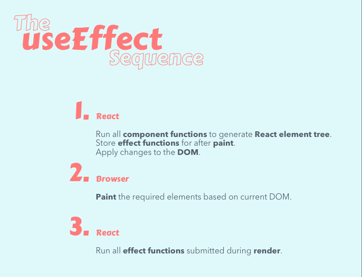

# Client Requests and Handling Side Effects

**React doesn't have a built-in function for fetching data** so we will need to use **a third party library called** ```axios``` to perform the actual data fetching. The details about the library we use for making the request don't matter until we answer the following questions:
  1. When should we request the data?
    * When the search term changes
  2. Where should we store the retrieved data?
    * In the results state
  3. What changes cause us to make the request again?
    * Changes to term state

## Requests as a Side Effect

Let's consider **how a modern search function might work**. Imagine that we have **a simple app with a component called ```LiveSearch```** that **displays a SearchBar** and **a list of Results**. Our **app accepts a search term from a user as input**, and **uses that term in an API call which runs the search** for us and returns data. **The data is used to render a list of results** which are **updated as the user types more characters into the input**.

```LiveSearch``` **keeps track of a term in state**, a value that is ***dependent on what the user types into the search field***. LiveSearch **also keeps track of results**, **which is initially empty**.

For this reading, we don't need to worry about the inner workings of SearchBar and Results. **Just know that SearchBar is an input field and Results is a list of search results.**

```jsx
function LiveSearch(props) {
  const [term, setTerm] = useState("");
  const [results, setResults] = useState([]);

  /* Some code goes here that will use the `term`
   * to request data from a search API and update
   * the `results` with that data using `setResults`.
   */

  return (
    <>
      <SearchBar value={term} onChange={setTerm} />
      <Results results={results} />
    </>
  );
}
```

We **want to request the data when someone finishes typing their search term** into the input. **Unless we have a default search term, we won't know which term to use,** ***initially***.

We **would then store the retrieved data in state as results in our LiveSearch component** and **pass the results array to the Results component as a prop**.

There is **a sequence of operations that runs when the term changes**. To the user, it happens when they type in another search term.
  1. We make the request again.
  2. We replace the results state.
  3. React renders the component again.
  4. The **request is dependent on the value of term**. The **term changes whenever the SearchBar calls the onChange prop**.** When the term changes, we make the request again to get the correct data.** Let's examine the main component again:

```jsx
function LiveSearch(props) {
  const [term, setTerm] = useState("");
  const [results, setResults] = useState([]);

  /* Some code goes here that will use the `term`
   * to request data from a search API and update
   * the `results` with that data using `setResults`.
   */

  return (
    <>
      <SearchBar value={term} onChange={setTerm} />
      <Results results={results} />
    </>
  );
}
```

The **request depends on the value of ```term``` changing**, causing the render to occur again. **The request is a side effect of the ```LiveSearch``` component function being called by React**.

### NOTE
________________________________________________________________________________________________________________________________________________________________________________

In computer science, an **operation**, **function** or **expression** **is said to have a side effect** **if it modifies some state variable value(s) *outside its local environment***, *that is to say has an observable effect besides returning a value (the main effect) to the invoker of the operation*.
________________________________________________________________________________________________________________________________________________________________________________

It would be nice if we could just do this:
```jsx
function LiveSearch(props) {
  const [term, setTerm] = useState("");
  const [results, setResults] = useState([]);

  fetch(`/search?term=${term}`).then(setResults);

  return (
    <>
      <SearchBar value={term} onChange={setTerm} />
      <Results results={results} />
    </>
  );
}
```


The fetch API exists in modern browsers. **This example is not exactly how we would use it**. For our purposes, it illustrates the point. We are planning on using axios in future activities.

This function will make a ```GET``` request to a ```/search``` endpoint with the term as a query string. **When the results are sent back in the response, we use them to set the results array**. This code causes an infinite loop. Every time React renders the component, it will start a request. The completion of the request causes the component to render again, creating another request.

The **LiveSearch now creates a side effect every time it renders.** ***When we talk about side effects, we're referring to things like API calls, updates to the DOM, and event listeners, among other things.*** The React Hook API provides a method called ```useEffect``` to help us manage these.

## ```React.useEffect```

One of the React team members has written a very long post about [```useEffect```](https://overreacted.io/a-complete-guide-to-useeffect/). The subtitle says that it is a "49 min read", but the introduction will take fewer than five minutes.

We are fortunate that the "old way" is unfamiliar to us. It means there is little to unlearn. Don't worry if you don't get it right away. ```useEffect``` can be complicated to understand. Over the next few exercises, hopefully we'll slowly gain an understanding of useEffect and eventually be able return to that article with a better grasp of the core concepts!

The **useEffect Hook is a named export from React**. We can ***import it in the same way as useState***. With useEffect we can safely manage side effects within component function calls.

**React calls the function provided to the useEffect method of a component *after render*.** Think of it ***like giving React an instruction to hold onto the function that passes to useEffect and then make adjustments to the DOM after the render has happened plus any updates after that.***



## The Rules of Hooks
We follow some essential rules when using Hooks. Before we dive too deep into useEffect, let's learn **a few of the things we can't do with Hooks.** The following example shows a basic effect.
```jsx
useEffect(() => console.log("Side Effect"));
```
Technically a ```console.log``` **is a side effect because it is something that happens in addition to the component returning React elements**. It is *safe to use them in components because they are run synchronously and don't cause a render.*

### Rule #1
***Don't call Hooks inside loops, conditions, or nested functions.***

If we **only want to run the side effect when the results length is greater than zero**, the following ***code would not work*** as intended.
```jsx
function LiveSearch(props) {
  const [term, setTerm] = useState("");
  const [results, setResults] = useState([]);

  if(results.length > 0) {
    useEffect(() => console.log("Results Set"));
  }

  return (
    <>
      <SearchBar value={term} onChange={setTerm} />
      <Results results={results} />
    </>
  );
}
```
We can accomplish our goal of** only logging when the results array has one or more items** by ***putting the condition INSIDE of the effect method***.
```jsx
function LiveSearch(props) {
  const [term, setTerm] = useState("");
  const [results, setResults] = useState([]);


  useEffect(() => {
    if(results.length > 0) {
      console.log("Results Set");
    }
  });

  return (
    <>
      <SearchBar value={term} onChange={setTerm} />
      <Results results={results} />
    </>
  );
}
```
It is not necessary to get into the details of why this is a requirement. We can use Hooks without knowing all of the details. **We haven't covered it yet, but you also cannot put a useState call in a condition either.**

With this change, **the useEffect function is called every time, but the console.log only executes when the results array has at least one element.**

### Rule #2
**Only call Hooks from inside React components**.

We **can also call Hooks from within custom Hooks**. Since a custom Hook must follow the same rules, then it can only be called directly by a component.

### Rule #3
**The effect method that we pass to useEffect must either return undefined or a function**.

The **function will be used for side effect clean up**, which we will cover in the next activity.

***The easiest way to avoid issues with this rule is always to declare your effect as a multiline function.***

## Dependencies
Before we can learn how we apply useEffect to make our request, we need to learn about dependencies. In the previous example, we looked at a useEffect hook that will log to the console. We have made this Hook depend on the results state. **We don't want to run this effect after each render, instead we only want to run the effect when results changes.**

**We can tell React to skip applying an effect if certain values haven't changed between re-renders.** To do so, ***we pass an array as an optional second argument to useEffect.***
```jsx
useEffect(() => {
  if(results.length > 0) {
    console.log("Results Set");
  }
}, [results]); // Only re-run the effect if results changes
```
This example is basic enough that it doesn't cause any issues to call it after every render. It is meant to highlight that effects are usually dependent on state and props, and that we must declare those dependencies in the list.

## Requests
Now we can apply what we know about useEffect to make an HTTP request. The pattern for data fetching typically follows the same steps.
  1. The component has no results when React renders it the first time.
  2. The component makes an asynchronous request to the API server.
  3. The data for the component is returned in the response.
  4. The component can now be updated with the data using an action that sets the state.
  5. We can implement this pattern in any component with useEffect.
```jsx
function LiveSearch(props) {
  const [term, setTerm] = useState("");
  const [results, setResults] = useState([]);

  useEffect(() => {
    fetch(`/search?term=${term}`).then(setResults);
  }, [term]);

  return (
    <>
      <SearchBar value={term} onChange={setTerm} />
      <Results results={results} />
    </>
  );
}
```
We request the data after the initial render. The effect will be run each time the component renders due to term changing. The request depends on the value of term so we have declared it as a dependency to run the effect. When we call setResults it will update the component and render with the latest results. React doesn't run the effect because the term has not changed, only the results and the results are not a dependency of the effect.

## Classes
Classes have an API that allows us to use this same type of pattern. We do have to think of it as a different approach. In the case of a class, you would do the same thing using the lifecycle methods. With any class-based component you can implement one of the following functions.
  * componentDidMount
  * componentDidUpdate
  * componentWillUnmount

These represent the lifecycle events that we are interested we would use to implement a similar pattern. **We would make the initial request in the ```componentDidMount``` function**. **When the component updates, its ```componentDidUpdate``` function is called**. **Within the ```componentDidUpdate``` we would check to see if the term has changed**. ***If it has, then we would make the API request.***

We are not using classes for this application so we won't be diving into any detail. The purpose of this section is to make you aware of the different side effects API for class-based components.

# Summary
When we **make requests to an API server it is considered a side effect of rendering a component**. We can manage a side effect like this one with the useEffect Hook provided by the React library.

**We must follow specific rules when using Hooks. ESLint configurations help us ensure we are compliant.**
  1. Don't call Hooks inside loops, conditions, or nested functions.
  2. Only call Hooks from inside React components.

The **useEffect hook usually depends on props, state, or both.** In our example, the results value was the dependency that we declared in the dependency array provided to useEffect.

There is an older way of making requests using this a similar pattern when we create components as Classes.