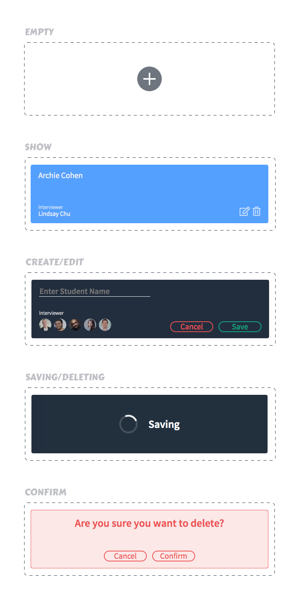
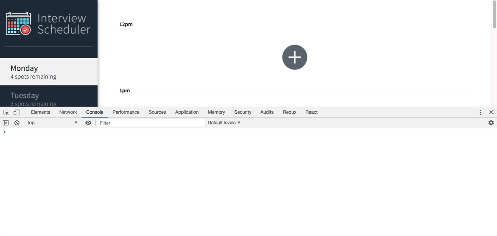
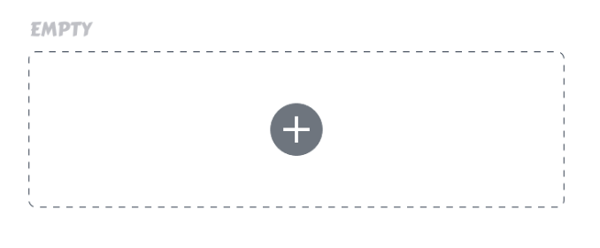

# Building a Hook

As we saw in the previous reading, custom Hooks can be used to share logic between components. We are going to practice building one in this exercise. Remember all the UI components we built for our Appointment earlier this week? In this activity, we are going to build a Hook that allows our Appointment components to keep track of the "mode" that they are in, as a user interacts with them to do things like create a new appointment, delete an appointments, etc. There will be several modes, and the list below matches the modes to the different components that we built earlier in Storybook.



We will need to track the current mode as a stateful variable that will be used to render the Appointment child components conditionally. As we interact with the application, we will use two different functions to change between the modes.

* A transition function that will allow us to advance to any other mode
* A back function will allow us to return to the previous mode

The transition function might be used to transition from the "EMPTY" component to the "CREATE" component when a user would like to create a new appointment in a currently empty time slot. The back function could be used to pop back to the most recent component, such as backing out of the "CONFIRM" component by clicking "Cancel" to go back to the "SHOW" component.

## Setup
A developer from the future has implemented the Appointment component to handle this behaviour. They were kind enough to console.log each transition action to the console. Pay close attention to the order that the components are displayed in, and how each interaction navigates us forward to a new component, or back to a previously seen component.



The rest of this activity will encourage you to take a Test Driven Development approach to writing your code. Be sure to read the tests carefully before you start implementing the required functions.

Create an empty src/hooks/useVisualMode.js file and a src/hooks/__tests__/useVisualMode.test.js file.

The automated tests that we ran in previous activities were implemented with Jest and an additional library called react-testing-library. Hooks can only be used within React components, so we need to make sure that the testing environment supports this constraint. We'll install a new package that will allow us to test Hooks without needing to use them within a component for the test.

Install the [react-hooks-testing-library](https://github.com/Drumshtick/react-hooks-testing-library). Once it's installed, copy and paste the code from below into the test file.
```jsx
import { renderHook, act } from "@testing-library/react-hooks";

import useVisualMode from "hooks/useVisualMode";
```
Start the Jest test runner. Install the missing react-test-renderer dependency that it complains about in the output.

The react-hooks-testing-library has a dependency on react-test-renderer. We will need to install the version that matches our current version of React. Check the package.json file to determine what version of React we are using. At the time of this writing, the current of React is 16.9.0. To install the matching renderer, we would use npm install --save-dev react-test-renderer@16.9.0.

Start the Jest test runner. Install the missing react-test-renderer dependency that it complains about in the output.

The react-hooks-testing-library has a dependency on react-test-renderer. We will need to install the version that matches our current version of React. Check the package.json file to determine what version of React we are using. At the time of this writing, the current of React is 16.9.0. To install the matching renderer, we would use npm install --save-dev react-test-renderer@16.9.0.

## Setting the Initial Mode
When the Appointment component loads, we want it to be empty, so we need to initialize the mode to EMPTY. For the test case, we can create a mode called FIRST.



Add the code below to the test file.
```jsx
const FIRST = "FIRST";

test("useVisualMode should initialize with default value", () => {
  const { result } = renderHook(() => useVisualMode(FIRST));

  expect(result.current.mode).toBe(FIRST);
});
```
The test runner should report that the test is failing because TypeError: (0 , _useVisualMode.default) is not a function. It is necessary to read the message carefully to determine if a test is failing because of the assertions. In this case, the code is failing because there is no function being exported from src/hooks/useVisualMode.js.

Create and export a useVisualMode function in src/hooks/useVisualMode.js and ensure the first test passes by following these next steps.

To pass the first test our useVisualMode Hook will need to:

take in an initial mode
* set the mode state with the initial mode provided
* return an object with a mode property

After you've attempted this, reveal the code snippet below to see an example of a solution:
```jsx
export default function useVisualMode(initial) {
  const [mode, setMode] = useState(initial);

  return { mode };
}
```

## Transition
We'll add a second test now to help us develop the "transition" functionality. Our Hook will let us update the current mode to a new mode. Since we're following a Test-Driven approach, we'll write a failing test first.

We created a mode constant earlier called FIRST to test that we could successfully set an initial state. To test the "transition" functionality we'll make a second mode constant to assert that the hook can successfully transition from FIRST to SECOND.

Add the SECOND constant under the FIRST constant in our test file.
```jsx
const SECOND = "SECOND";
```
This test will initialize the mode to FIRST, then transition to SECOND and then check to see what the current value of mode is.
```jsx
test("useVisualMode should transition to another mode", () => {
  const { result } = renderHook(() => useVisualMode(FIRST));

  act(() => result.current.transition(SECOND));
  expect(result.current.mode).toBe(SECOND);
});
```
We'll expect this test to fail because our hook doesn't currently return a transition function, so we can proceed to create that now.

Create a transition function within useVisualMode that will take in a new mode and update the mode state with the new value. If we used useState to initialize the mode state in useVisualMode, what will we have to do to update the mode value?

This custom Hook will need to add the transition property to the object that useVisualMode returns. The property will point to a function that we implement directly in the custom Hook. Reveal the code below to see an example of this pattern.

```jsx
function useCustomHook() {
  function action() {}

  return { action };
}
```

## Back
Now we need to make sure that we can transition back to our previous mode. To do this we'll need to add a third mode constant in our test, THIRD.

Add the THIRD mode constant and the following tests to the our file.

This next test will initialize the mode to FIRST and then transition to SECOND. The first assertion confirms that we made it to SECOND. If we do not include this assertion, then it's possible for the test to pass even if back isn't working. Then, our test will attempt to transition to THIRD. Afterwards, the test will attempt to pop back to the most recent mode, which should be SECOND. After another back, we should find ourselves back at the FIRST mode.
```jsx
test("useVisualMode should return to previous mode", () => {
  const { result } = renderHook(() => useVisualMode(FIRST));

  act(() => result.current.transition(SECOND));
  expect(result.current.mode).toBe(SECOND);

  act(() => result.current.transition(THIRD));
  expect(result.current.mode).toBe(THIRD);

  act(() => result.current.back());
  expect(result.current.mode).toBe(SECOND);

  act(() => result.current.back());
  expect(result.current.mode).toBe(FIRST);
});
```
Consider the following scenario where we don't include both assertions.

We call transition(SECOND) but nothing changes.
We call back() and it doesn't do anything either.
We expect that mode is FIRST, but it never changed.
Even though there is another test to confirm that transition works. We have to think of our tests as being run independently. In this test, we want to confirm that it made it to SECOND and was able to go back to FIRST.

Add an empty back() function to the Hook that allows us to go back to the previous mode. You don't need to implement any logic for this function yet. Be sure to add the back property to the object that useVisualMode returns, just like you did with the transition() function.