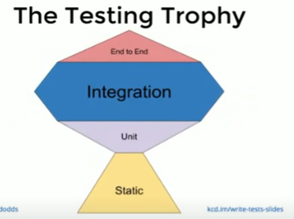

# Automated Testing

There are **many ways to prove that a program works as expected**. The ***most common way is to run the program and look at the output***. As *Web Developers, we mostly perform these tests in the console or the browser*. While we are learning to write software, **we use a manual approach to testing because it is the most familiar.**

**Manual testing** will always have a place in software development, ***but as a project grows different strategies for testing need to be applied***. **We cannot rely entirely on a *manual process***.

## Automating Repetative Work
Testing is repetitive work, which makes it a perfect candidate for automation. **We don't automate all testing because writing tests takes time**. ***So how do we know which tests to automate?*** The answer to this question is different for every project.

We will focus our time learning about the different types of testing that we can do. Testing is not a brand new topic since we have already been using automated tests during previous activities. **We will learn how to plan and write tests for our project.**

## Confidence
**Testing is about gaining confidence in the code that we write**. As we learn the different types of tests, we can ***apply them strategically to achieve a level of confidence that is hard to match with manual testing alone***. We can **ensure that the code is being tested consistently *after every change***.

Responsible **software developers test their software after each change**, but the amount of testing done at different stages of the development cycle will vary. *Early in a project, there isn't a lot of code, so it is easier to manage with manual tests*. As a project grows in complexity, it creates a history of breaks and fixes over time. Ideally, when we find bugs, we fix them. How can we be sure that a bug never returns?

***Regression testing*** is the **process of verifying that previously uncovered bugs have not returned in all subsequent versions of the software**. It is a lot of work to manage and execute this type of testing manually and as a result, often makes the change process difficult.

## Write Tests ([REF](https://www.youtube.com/watch?v=Fha2bVoC8SE))
This video provides a quick overview of the type of testing that is common today. It does not offer any details on how to write specific tests, but it helps us answer our initial question. Which tests do we automate?
```
* Why do we write tests?
  1. Enhances work flow (increase production)
  2. Confidence in your work!

* Not too many tests!
  * Code coverage - Program says 'Hey! you never tested this piece of code!' OR 'You never tested this "else" block!'
    * How Much? - Depends how fast the product needs to be produced or if perfection is of the utmost importance
      * Libs should get 100%                                                    ^
      * Apps at 100% coverage may be a waste of time!                          / \
        * Will the user EVER do the action youre testing?                     /   \
  * Test integration!                                                        /     \
    * The testing pyramid                                                   /       \
                                                                           /         \
                                                                          / E2E Tests \
                                                                         /     (UI)    \
                                                                        /_______________\
                                                                       /   Integration   \
                                                                      /___________________\
                                                                     /     Unit Tests      \
                                                                    /_______________________\
```
  * ***Static Code Analysis*** - Like ESlint! Doesnt require running the test! or [FLOW](https://flow.org/)
    * Eliminates a massive amount of testing
  * ***Unit Testing*** - Like jest, mocha & chai, Karma
    * the process of testing the specified block of code to check whether everything is perfectly fine as per developed. It basically run over the specified block and check the output for the given input. It is useful for developers for checking the individual section of code and to identify and fix the errors
  * ***Integration tests*** - involves servers databases, looks for memory leaks, actually making test requests to the API, VERY IMPORTANT
  * ***End to End (E2E) Tests*** - Like [Karma](https://www.npmjs.com/package/karma)
    * Essentially a fake user that is operating the app

* The testing trophy!

  

  * Integration is important!
  * Going up on the trophy is time expensive and money expensive!
  * Going up is slower!
  * As you go up confidence goes up!
  * Integration test are a great balance of
    * Price
    * Time
    * And ease
  
  * When testing a feature TEST HIGHER UP THE TREE, NEVER JUST A BUTTON!
# Summary
  1. Write tests. Certain types of testing should be automated.
  2. Not too many. We don't need 100% code coverage to have a high level of confidence.
  3. Mostly integration. These types of tests are more thorough and test how the different parts of the application work together.