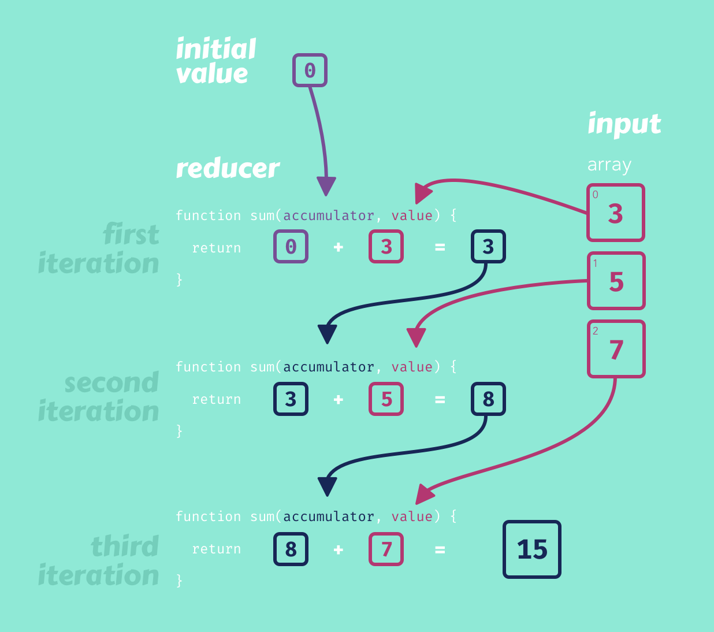

# reduce
Array.prototype.reduce
The same pattern is used in the Array.prototype.reduce function. We call the reducer function on each value accumulating a single result over the entire process.
```js
const values = [3, 5, 7];

const result = values.reduce((accumulator, value) => accumulator + value, 0);

console.log(result); // 15
```



We can use this with any type of value, including objects. Using an Object allows us to extend this simple addition operation into something that can handle either addition or subtraction. We have a list of actions that describe the various changes to the state. Once we run all of the actions through the reducer, we end up with the final result.
```js
[
  { type: "add", value: 3 },
  { type: "subtract", value: 5},
  { type: "add", value: 7}
].reduce((state, action) => {
  if(action.type === "add") {
    return state + action.value;
  }
  if(action.type === "subtract") {
    return state - action.value;
  }
}, 0);
```
Consider what the result would be for the previous code block. Check the answer after considering the different steps the code will take.

The result will be 5.

The initial value is 0.
We pass the initial value and first action to the reducer. Add 0 and 3.
We pass the value 3 and the second action to the reducer. Subtract 5 from 3.
We pass the value -2 and the third action to the reducer. Add -2 and 7.
There are no more actions, so the result is returned as 5.

Application Reducers
Reducers are the foundation of the [Redux](https://redux.js.org/) library.

We are not going to be using the Redux library for this project. Instead, we will focus on learning some of the concepts that Redux popularizes.

We will use the useReducer Hook that React provides. The useReducer Hook is an alternative to the useState Hook and is preferred when we are managing more complex state logic.

We don't know all of the actions that will be taken by the user when the application loads. When we want to alter the state with a reducer, we dispatch an action that describes the change we want to make. In this example of a boring calculator, we can see the three buttons used to dispatch actions.
```js
function reducer(state, action) {
  if (action.type === "add") {
    return state + action.value;
  }
  if (action.type === "subtract") {
    return state - action.value;
  }

  return state;
}

function BoringCalculator() {
  const [state, dispatch] = useReducer(reducer, 0);

  return (
    <div>
      <button onClick={() => dispatch({ type: "add", value: 3 })}>Add 3</button>
      <button onClick={() => dispatch({ type: "subtract", value: 5 })}> Subtract 5</button>
      <button onClick={() => dispatch({ type: "add", value: 7 })}>Add 7</button>
      <h2>{state}</h2>
    </div>
  );
}
```
When we dispatch an action, we expect the reducer to handle it and replace the current state. When the component renders, it will use the latest state to generate an updated view.

Fork [Boring Calculator](https://codesandbox.io/s/boring-calculator-forked-ogucl) on code sandbox and add a fourth button that will multiply by 11.