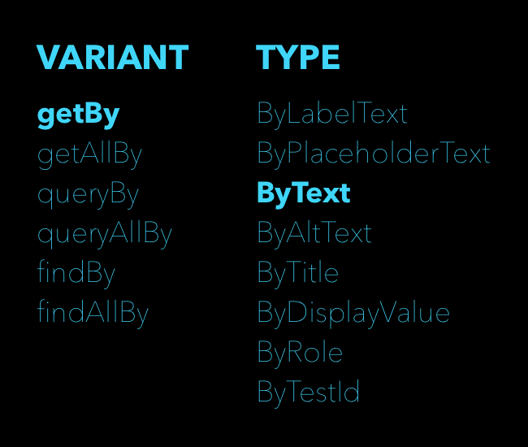
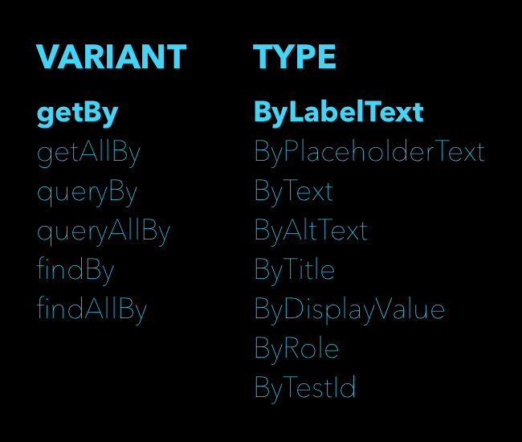

# Testing React

We only want to write valuable tests, and **with React a lot of the useful tests require integrating multiple units.** We will use the ```react-testing-library``` **to write our React tests**. ***A component and all of its children will be considered a unit.*** We will review the existing unit tests to explore the anatomy of a test and the API of our testing library.

### NOTE
____________________________________________________________________________________________________________________________________________________
Throughout the activities, we will refer to react-testing-library and @testing-library/react. We are calling the library react-testing-library, but we are importing the module named @testing-library/react. When we import the module, always use @testing-library/react.
____________________________________________________________________________________________________________________________________________________

## Structure
We can **break a unit test into *three* phases**.
  1. Initialize the component that we would like to test.
  2. Trigger the change that executes the unit.
  3. Verify that the unit produced the expected result.

We will identify these different phases for the tests found in the ```src/components/__tests__/Button.test.js``` file. The **most basic test we will do for any React component is a test render.** This test *verifies that we can render the component to the DOM without throwing an error.*
```jsx
it("renders without crashing", () => {
  render(<Button />);
});
```
We declare the test using the ```it``` function provided by Jest. **The first argument** ***is a descriptive name for the test***. The example uses ```"renders without crashing"```.

**The second argument** is a ***function that contains the test code***. Our function includes a single line that handles all three phases. The state change is going from unmounted to mounted.

We use the render function provided by the react-testing-library to render the Button. The verification process is implied in this case because the tests will fail if the Button is unable to render.

## Testing Helpers
**A more sophisticated test requires more access to the rendered state of the component.** We use a combination of libraries for testing the components. It can be confusing trying to determine the source of all of the different magic functions. To understand the layers of testing libraries, we will dissect our second Button test.
```js
it("renders its `children` prop as text", () => {
  const { getByText } = render(<Button>Default</Button>);
  expect(getByText("Default")).toBeInTheDocument();
});
```
  * The ```render``` function is imported from the ```react-testing-library```.
  * The ```expect``` function **is injected into the global scope** by Jest.
  * The ```getByText``` [query](https://testing-library.com/docs/dom-testing-library/api-queries) function **is returned by the render function but is a part of the the ```dom-testing-library```**.
  * The ```toBeInTheDocument``` function **is a [matcher](https://jestjs.io/docs/en/expect) provided through Jest by the ```jest-dom``` library**.

### NOTE
____________________________________________________________________________________________________________________________________________________
The ```toBeInTheDocument``` matcher is not provided by default. The project boilerplate is configured to extend the default matchers with more specific [matchers](https://github.com/testing-library/jest-dom) that help test the DOM. The ```src/setupTests.js``` file configures Jest to use ```jest-dom```.
____________________________________________________________________________________________________________________________________________________


## Jest
We'll run our tests using the Jest testing framework. The framework provides default matchers. It is not easy to remember all of the available matchers so be sure to use the [documentation](https://jestjs.io/docs/en/expect) for reference. **Some of the more common matchers are** ```toBe```, ```toHaveLength```, ```toHaveProperty``` and ```toBeGreaterThan```. ***We can add more matchers by extending the defaults.***

## jest-dom
The ```jest-dom``` library ***provides the DOM specific matchers***. This library is the source of the ```toBeInDocument``` matcher. The ```toHaveClass``` and ```toHaveValue``` matchers are examples of the types of helpers that make DOM testing easier. ***These matchers help us verify expected behaviour.***

## react-testing-library
The ```react-testing-library``` is **one of many *view testing* library implementations in the Testing Library collection.** It provides React specific helper functions, including the render function.

When we call the render function, we gain access to functions that help us interact with the DOM. The rerender and unmount helpers are examples of React specific API. The react-testing-library inherits access to a variety of queries provided by the dom-testing-library.

**The other functions that we can import from the ```react-testing-library``` are ```cleanup``` and ```act```.**

## dom-testing-library
The ```queries``` come from the ```dom-testing-library```. **A query is a combination of a *query variant* and a *query type***. The query we want to use is ```getByText```. The variant is ```getBy``` and the type is ```ByText```.



We can also combine the **variant** ```getBy``` **with the type** ```ByLabelText``` to access the ```getByLabelText``` query.



**We access these functions by *destructuring* the object *returned by the render function* in react-testing-library.**

## Choosing Queries

### From official [guide](https://testing-library.com/docs/guide-which-query) on choosing queries

### Priority

Your test should *resemble how users interact with your code* (component, page, etc.) as much as possible. With this in mind, **we recommend this order of priority:**

  * **Queries Accessible to Everyone** Queries that reflect the experience of visual/mouse users as well as those that use assistive technology.
    * ```getByRole```: This can be used to **query every element that is exposed in the accessibility tree**. With the name option you can filter the returned elements by their accessible name. This should be your top preference for just about everything. There's not much you can't get with this (if you can't, it's possible your UI is inaccessible). Most often, this will be used with the name option like so: getByRole('button', {name: /submit/i}). Check the list of roles.
    * ```getByLabelText```: This method is really good for form fields. When navigating through a website form, users **find elements using label text**. This method emulates that behavior, so it should be your top preference.
    * ```getByPlaceholderText```: A placeholder is not a substitute for a label. But if that's all you have, then it's better than alternatives.
    * ```getByText```: Outside of forms, text content is the main way users find elements. This method can be used to find non-interactive elements (like divs, spans, and paragraphs).
    * ```getByDisplayValue```: The current value of a form element can be useful when navigating a page with filled-in values.
  * **Semantic Queries** HTML5 and ARIA compliant selectors. Note that the user experience of interacting with these attributes varies greatly across browsers and assistive technology.
    * ```getByAltText```: If your element is one which supports alt text (img, area, input, and any custom element), then you can use this to find that element.
    * ```getByTitle```: The title attribute is not consistently read by screenreaders, and is not visible by default for sighted users
  * **Test IDs**
    * getByTestId: The user cannot see (or hear) these, so this is only recommended for cases where you can't match by role or text or it doesn't make sense (e.g. the text is dynamic).


  * The difference between ```getByText``` and ```queryByText``` is that ```getBy``` expects to find a value. If one is not found, it will throw an error. ```queryBy```, on the other hand, doesn’t expect a value, **so it can be used to test if something is null or when you’re having trouble using getBy.**

## Expecting
We use the helpers to implement each phase of the test. Our example is testing that the text "Default" is in the document after we render the ```<Button>Default</Button>``` component. **We expect that an element with the text "Default" is somewhere in the document.**

```Storybook``` is a test environment **that we use to isolate components**. ***We render a component with specific props, and then we verify with our eyes that the component is working as expected.*** Our brains expect to see the text "Default" within a button in the document.

There are a lot of examples of different assertions that we can make about the nodes returned by queries.
```jsx
expect(getByText("Default")).toHaveClass("button");
expect(getByPlaceholderText("Enter Student Name")).toHaveValue("");
expect(getByTestId("student-name-input")).toHaveValue("Lydia Miller-Jones");
```
There is no shortcut to learning the queries and matchers. Having to constantly look them up will make writing tests slow at first. Most testing solutions follow this pattern but don't always use the same terminology.

In the final example above, we use a query called ```ByTestId```. **This is the equivalent to ```querySelector("[data-testid=student-name-input]")``` and it requires us to alter the JSX to include a data-testid prop.** If there is no reliable way to query for a node then attaching the data-testid prop provides a good compromise. **Sometimes we need to change our code to improve its testability.**

# Summary
We can customize our testing software with different libraries to make our tests easier to write. **When we design a test, we need to consider the three phases.**
  1. Setup
  2. Change
  3. Verify


**Basic tests might describe all three phases with a single line of code**. ***More complex tests will include multiple lines to set the initial state of a test***. We can also use the ```expect``` function a few times in the same test **to verify more than one behaviour within a single test.**

## Firing Events
We need to simulate the click of the "Save" button as part of the test. Usually, this would not be an easy task, but the react-testing-library provides an event API. The Firing Events documentation describes three functions.

We will use the fireEvent[eventName] functions to trigger events on specific nodes. An example eventName would be "click", which lets us access the function as ```fireEvent.click()```. We pass an argument that is the element we want to click. The example uses the getByText query to find the "Save" button and then click it.
```js
/* with the rest of the imports */
import { fireEvent } from "@testing-library/react";

/* within a test */
fireEvent.click(getByText("Save"));
```