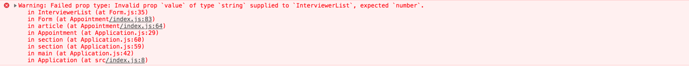

# Type Checking with Prop Types

There is an [optional library](https://www.npmjs.com/package/prop-types), maintained by the React team that we can use to validate component props. The library is called prop-types and we must install it separately.

Another developer may not know that this is supposed to be an ```Array```, and **without validation, they might pass in another type** (e.g. an object) accidentally. This could happen with any component and its props, such as a developer passing a string into a component that expects a number.

**Larger project teams would likely use ```TypeScript``` or ```Flow``` to validate the arguments passed to components as props**. We are going to rush through the basics of the prop-types library. This activity is only an introduction in case we encounter this library in the wild.

```TypeScript``` and ```Flow``` **enable static type checking**. The ````prop-types```` library **provides runtime validation**.

## Setup
To get started with prop-types, we need to install the library and import it into the InterviewerList component.

Type ````npm install --save-dev prop-types```` from the root of the Interview Scheduler project. Import PropTypes by following the example in the link below.

When we import the [PropTypes](https://reactjs.org/docs/typechecking-with-proptypes.html#proptypes) object, we can start using it to define the validation configuration for any of our components.

## Validating Props
The prop that we are going to validate is interviewers. We will make sure that the interviewers prop is an Array and that it is required.

```js
function InterviewerList(props) {
  ...
}

InterviewerList.propTypes = {
  interviewers: PropTypes.array.isRequired
};

export default InterviewerList;
```

If we try and pass a different type for the interviewers prop, we will see a Warning in the Chrome Developer Tools console. The error below, for example, shows what would happen if we supplied a string to a prop that was expected to be a number.



# Summary
The prop-types library is another option for providing us with confidence in our code. We can enforce a contract between the components that we write and the code that uses them. With tools like this, we are informed early of potential bugs caused by inconsistent types. Deciding not to use the prop-types library is reasonable as long as we can gain the same level of confidence elsewhere.

Even though more complicated static languages like TypeScript and Flow are preferred by larger teams, the prop-types library is still a quick way to build some confidence that we always pass the correct values to our components.

