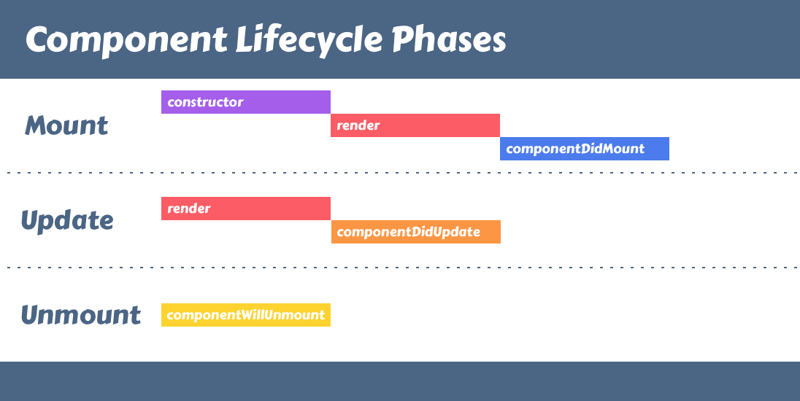
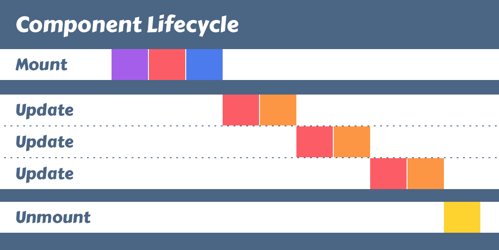

# Component Lifecycle

Components that we declare as classes provide us with the option to override certain "lifecycle methods". The React library calls these methods when certain events occur while our application is running.

The **first phase** is the ***mount phase***, and it **happens once when we create a component instance**. The *three most important lifecycle methods for the mount phase* are the **constructor**, **render** and **componentDidMount**.

The **second phase** is the **update phase**. A **component that is mounted can be updated**. There are **two ways that we update components**. We can **pass them props when a parent renders**, or **we can update the internal state**.

**Each time the component is updated, React calls the update lifecycle methods**. The ones that we are going to use are render and componentDidUpdate.

The **third and final phase is the unmount phase**. It **also only happens once**. The **only lifecycle method** that React will call during this phase is ```componentWillUnmount```.



The following diagram illustrates that the mount and unmount phases only occur once, while a component can update zero or more times based on the application.



ex 
```jsx
class Dashboard extends Component {
  state = { /* do not replace your initial state */ };

  componentDidMount() {
    const focused = JSON.parse(localStorage.getItem("focused"));

    if (focused) {
      this.setState({ focused });
    }
  }

  componentDidUpdate(previousProps, previousState) {
    if (previousState.focused !== this.state.focused) {
      localStorage.setItem("focused", JSON.stringify(this.state.focused));
    }
  }

  render() { /* do not replace your render method */ }
}
```