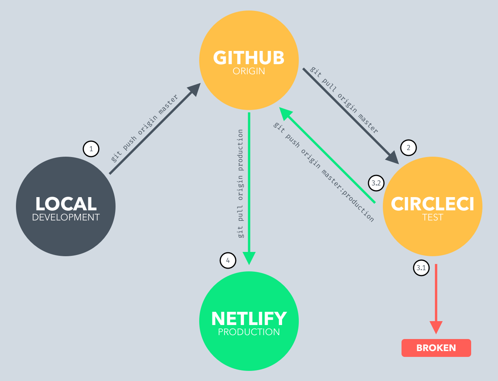

# Continuous Pipeline

We have automated tests and can quickly check to see if we have broken our application. Deploying our application to our end users is another task that we should automate. We want to automate the entire process of running our tests and deploying the application if all of the tests pass.

We can work locally in branches. When we are happy with our feature, we will merge our changes to master. Pushing our changes to master on GitHub will start the automated pipeline.

## The Pipeline
There are two new services that we will introduce today. [CircleCI](https://circleci.com/) will manage our continuous integration process, and [Netlify](https://www.netlify.com/) will serve our static client assets.



1. Local development can happen independently. We can merge and branch until we want to push our changes to the remote master branch. To start the process, we type ```git push origin master```.
2. ***CircleCI*** is **configured to watch for new changes to the master branch**. We don't have to tell CircleCI to start the process because it **will pull the latest changes when it notices that they are available. CircleCI builds the environment and runs the tests.**
3. There are two possible outcomes from the test process.
  1. If the **tests fail**, then the build is considered broken, and the team is informed. We can configure this to use email, Slack or a combination of services.
  2. If the **tests pass**, then the build is successful, and we want to deploy to production automatically. **CircleCI performs a second job that pushes the master branch to a production branch**.
4. **Netlify** is **watching for changes to the production branch**, and when it notices changes, **it will automatically pull the latest from the production branch to build**.