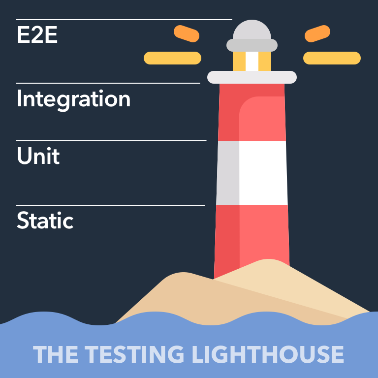

# End to End Testing

At the top of our testing lighthouse is a category of tests called end-to-end. This kind of testing is valuable because it can be used to test the full stack integration of the client and the server in a real browser environment. Until now, all of our integration tests have run against a JavaScript DOM implementation called [jsdom](https://github.com/Drumshtick/jsdom).

**Jest is fast because it doesn't have to render anything; it only has to create a representation of the DOM**. Using it for a lot of our integration tests is still going to be a good strategy. We still need to know the difference and sometimes choose to use end-to-end tests that overlap existing Jest coverage.

The **difference between the existing Jest tests and the end-to-end tests is the amount of mocking**. With **end-to-end tests, we want to verify that the common user path is functional *with minimal mocking at the client, server or environment* level.**

## Running the Server
Eventually, we will want to run our end-to-end tests using an environment that is as close to production as possible. Learning to write end-to-end tests can be done in any environment. We will use the test environment so that we can freely reset the database between each test impacting our development data.

When it comes time to run the Cypress tests, we will review the commands that we will need to use the API server in test mode.

## Cypress

Although **it is possible to use Cypress for *unit testing***, we will limit our focus to end-to-end tests. We will build up our understanding of the Cypress API by increasing the scope of what we test, starting with the loading of the application.

#### Writing your first test with cypress [HERE](https://youtu.be/VvLocgtCQnY)