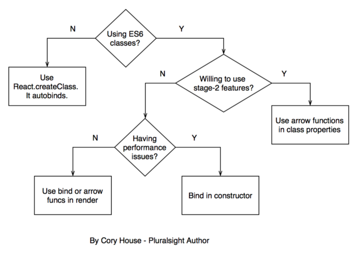

# React Binding Patterns: 5 Approaches for Handling `this`

## 1. Use ```React.createClass```

If you use ```React.createClass```, **React autobinds all functions to this**. So the this keyword is bound to your component’s instance automatically:
```jsx
// This magically works with React.createClass
// because `this` is bound for you.
onChange={this.handleChange}
```

However, with the advent of ES6 classes, this non-standard approach to creating classes isn’t the future of React. In fact, **```createClass``` is likely to be extracted from React core in a future release.**

## 2. Bind in Render

The rest of these approaches **assume you’re declaring React components via ES6 classes.** ***If you use an ES6 class, React no longer autobinds***. One way to resolve this **is to call bind in render**:\
```jsx
onChange={this.handleChange.bind(this)}
```

This approach is terse and clear, however, **there are performance implications since the function is reallocated on every render.** This sounds like a big deal, but the performance implications of this approach are **unlikely to be noticeable in most apps.** So ruling this out at the start for performance reasons is a premature optimization. That said, here’s an [example](https://medium.com/@esamatti/react-js-pure-render-performance-anti-pattern-fb88c101332f#.hv3l5i8vb) where the performance impact of this approach mattered.

***Bottom-line, if you’re experiencing performance issues, avoid using bind or arrow functions in render.***

## 3. Use Arrow Function in Render
This approach is similar to #2. You can avoid changing the this context by using an arrow function in render:
```jsx
onChange={e => this.handleChange(e)}
```

This approach has the same potential performance impact as #2.
***The alternative approaches below are worth considering because they offer superior performance for little extra cost.***

## 4. Bind in Constructor
One way to avoid binding in render **is to bind in the constructor** (the other approach is discussed in #5 below).

```jsx
constructor(props) {
  super(props);
  this.handleChange = this.handleChange.bind(this);
}
```

This is the approach **currently recommended in the React docs for “better performance in your application”**. This is also the approach I use in “[Building Applications with React and Redux in ES6](https://app.pluralsight.com/courses/react-redux-react-router-es6)” on Pluralsight.

However, on **most apps the performance implications of approach #2 and #3 won’t be noticeable**, so the readability and maintenance advantages of approach #2 and #3 may outweigh performance concerns in many apps.
But if you’re willing to use stage-2 features, the final option below is likely your best bet.

## 5. Use Arrow Function in Class Property
This technique **relies upon the proposed class property feature**. To use this approach, you must enable transform-class-properties or enable stage-2 in Babel.
```jsx
handleChange = () => {
  // call this function from render 
  // and this.whatever in here works fine.
};
```
This approach has multiple advantages:
  1. Arrow functions adopt the this binding of the enclosing scope (in other words, they don’t change the meaning of this), so things just work automatically.
  2. It avoids the performance issues of approaches #2 and #3.
  3. It avoids the repetition in approach #4.
  4. It’s straightforward to refactor from the ES5 createClass style into this style by converting relevant functions into arrow functions. In fact, there’s a completely automated way to handle this using a codemod.

  Summary
This flowchart that sums up the decision.



```jsx
// Approach 1: Use React.createClass
var HelloWorld = React.createClass({
  getInitialState() {
    return { message: 'Hi' };
  },

  logMessage() {
    // this magically works because React.createClass autobinds.
    console.log(this.state.message);
  },

  render() {
    return (
      <input type="button" value="Log" onClick={this.logMessage} />
    );
  }
});

// Approach 2: Bind in Render
class HelloWorld extends React.Component {
  constructor(props) {
    super(props);
    this.state = { message: 'Hi' };
  }

  logMessage() {
    // This works because of the bind in render below.
    console.log(this.state.message);
  }

  render() {
    return (
      <input type="button" value="Log" onClick={this.logMessage.bind(this)} />
    );
  }
}

// Approach 3: Use Arrow Function in Render
class HelloWorld extends React.Component {
  constructor(props) {
    super(props);
    this.state = { message: 'Hi' };
  }

  logMessage() {
    // This works because of the arrow function in render below.
    console.log(this.state.message);
  }

  render() {
    return (
      <input type="button" value="Log" onClick={() => this.logMessage()} />
    );
  }
}

// Approach 4: Bind in Constructor
class HelloWorld extends React.Component {
  constructor(props) {
    super(props);
    this.state = { message: 'Hi' };
    this.logMessage = this.logMessage.bind(this);
  }

  logMessage() {
    // This works because of the bind in the constructor above.
    console.log(this.state.message);
  }

  render() {
    return (
      <input type="button" value="Log" onClick={this.logMessage} />
    );
  }
}

// Approach 5: Arrow Function in Class Property
class HelloWorld extends React.Component {
  // Note that state is a property,
  // so no constructor is needed in this case.
  state = {
    message: 'Hi'
  };

  logMessage = () => {
    // This works because arrow funcs adopt the this binding of the enclosing scope.
    console.log(this.state.message);
  };

  render() {
    return (
      <input type="button" value="Log" onClick={this.logMessage} />
    );
  }
}
```