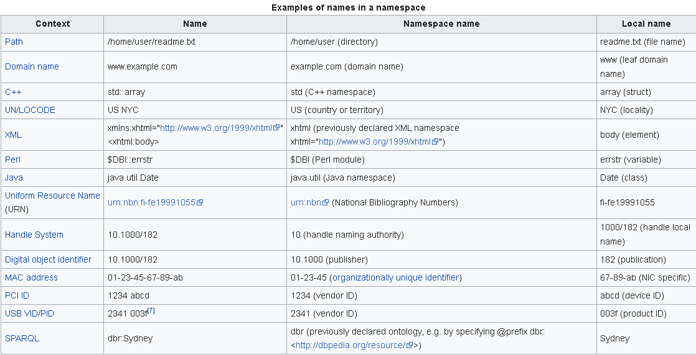

# Constants and Namespacing in Ruby

Constants in Ruby mean something different than what they do in most other languages, including JavaScript. In this activity we will look at how constants and namespacing are used throughout the language, how they are used and how they relate.

## Reading: Constants

Open up irb and type the following code:
```rb
Math::PI
```
What comes back is: 3.141592653589793

At the risk of stating the obvious, PI is a constant.

However, so is Math. It's a constant that refers to a Module in much the same way that PI does for its floating value.
```rb
Math.class # => Module
Math::PI.class # => Float
```
In ruby, any keyword with a capitalized first letter is considered a constant. Try this:
```rb
Apple
```
Since we expect that Apple is not a defined module, we expect Ruby to complain saying something like "Undefined Module" or "Module not found". Instead it raises the following error:
```rb
NameError: uninitialized constant Apple
```

The fact is that Ruby doesn't know what to expect of Apple. It could be a Module, a Class or a simple value like a Float or String.

## Reading: Namespacing in Ruby
You may rightfully also wonder WTF (What's That For™) when looking at the ```::``` in ```Math::PI```.

Simply put, the Math library is being respectful by defining the constant ```PI``` within the Math space. Any time we want to refer to ```PI``` from outside of the ```Math``` namespace, we must be explicit in our reference and use ```Math::PI```.

Both Module and Class constants create a namespace within which other constants can be placed. This type of nesting can be limitless.


#### Namespacing is an important concept in Computer Science and not just Ruby or JavaScript. [Check Wikipedia](https://en.wikipedia.org/wiki/Namespace).

* In computing, a namespace is a set of signs (names) that are used to identify and refer to objects of various kinds. A namespace ensures that all of a given set of objects have unique names so that they can be easily identified.
* Namespaces are commonly structured as hierarchies to allow reuse of names in different contexts.
* Similarly, hierarchical file systems organize files in directories. Each directory is a separate namespace, so that the directories "letters" and "invoices" may both contain a file "to_jane".
* ***In computer programming, namespaces are typically employed for the purpose of grouping symbols and identifiers around a particular functionality and to avoid name collisions between multiple identifiers that share the same name.***
* In networking, the Domain Name System organizes websites (and other resources) into hierarchical namespaces.

##### Naming system
A name in a namespace consists of a namespace name and a local name.[5][6] The namespace name is usually applied as a prefix to the local name.

In augmented Backus–Naur form:
```
name = <namespace name> separator <local name>
```
When local names are used by themselves, name resolution is used to decide which (if any) particular name is alluded to by some particular local name.




### Why is namespacing important?

In ruby, when you require a library (so that you can use it to build cool apps), unlike in some other languages like JavaScript, there is no variable reference pointing to the contents of the library.

#### JavaScript Example:
```js
const express = require('express');
// Now the things that the express module exports are only available via the express variable.
```
Instead, in Ruby our require does not return the contents of the module:

#### Ruby Example:
```rb

require 'some_library'
```

This means that **required files in Ruby have the ability to and are expected to define constants in the global namespace!** Yikes.

Let's see an example by using a library called [_Money](https://github.com/RubyMoney/money#introduction).

Let's first install it as a system-wide gem, so that it is available to any program.
```sh
gem install money
```
In irb:
```rb
require "money"
```

Now you can reference Money in the global namespace. Try the following next (within the same irb session):
```rb
Money # => does not throw NameError regarding constant Money
```
```rb
Money.constants
```
```rb
Money::Bank.class
```
```rb
Money::Bank.constants
```

We can see that the only constant that ```Money``` defines (and hopes for that best that it is not previously defined by another library or own code) is: ```Money```. The other constants are all nested directly or indirectly within.

## Creating constants and namespaces

Finally let's see how we can define our own constants globally and within an existing namespace. Try this out in irb:
```rb
module Apple
  FOUNDED_BY = "L. Ron Hubbard"
end
```

Now that we've created these two new constants, in the same irb session we can:

```rb
Apple
Apple.class
Apple::FOUNDED_BY
```

# Conclusions
In Ruby:
  * Capitalized words can be used to define a constant
  * A constant can refer to a Module, a Class or simple data like Floats and Strings
  * Namespacing is used heavily to limit the exposure of constants defined in the global namespace
  * The :: Syntax is used to access constants (Modules, Classes, etc)
  * It is convention to only capitalize the first letter when defining Class and Module constants like Apple
  * It is convention to capitalize and underscore the entire name when defining value constants like FOUNDED_BY

## Stretch Reading
Ruby actually inserts all constants within the Object namespace. This SO™ answer gives an in-depth (and very technical) answer, in case you are curious:

http://stackoverflow.com/a/31124152/1305625

In the same irb session as above, try the following: