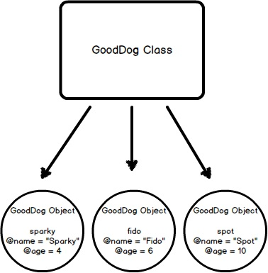

# The Object Model [HERE](https://launchschool.com/books/oo_ruby/read/the_object_model)
## Why Object Oriented Programming?
  * **Object Oriented Programming**, often referred to as **OOP**, is a programming paradigm that was created to deal with the growing complexity of large software systems.
    * Programmers **needed a way to create containers for data that could be changed and manipulated without affecting the entire program.**
    * They needed a way to section off areas of code that performed certain procedures **so that their programs could become the interaction of many small parts, as opposed to one massive blob of dependency.**
  * **Encapsulation** is ***hiding pieces of functionality and making it unavailable to the rest of the code base***.
    * It is a form of data protection, so that data cannot be manipulated or changed without obvious intention.
    * **Allows your code to achieve new levels of complexity**.
    * **Ruby**, like many other OO languages, **accomplishes this task by creating objects**, **and exposing interfaces** (i.e., methods) ***to interact with those objects***.
    * Another **benefit of creating objects** is that they allow the programmer to **think on a new level of abstraction**. ***Objects are represented as real-world nouns*** and can be given **methods that describe the behavior** the programmer is trying to represent.
  * **Polymorphism** is the ability for **different types of data to respond to a common interface**.
    * For instance, **if we have a method that expects argument objects that have an ```move``` method**, we can pass it any type of argument, **provided it has a compatible ```move``` method**.
    * The object might represent a human, a cat, a jellyfish, or, conceivably, even a car or train. That is, **it lets objects of different types respond to the same method invocation.**
    * "***Poly***" stands for "**many**" and "***morph***" stands for "**forms**". OOP **gives us flexibility in using pre-written code for new purposes**.

The concept of **inheritance** is used in Ruby **where a class inherits the behaviors of another class**, referred to as the ***superclass***. This gives Ruby programmers the power to **define basic classes with large reusability** and **smaller subclasses for more fine-grained, detailed behaviors**.
  * Another way to apply polymorphic structure to Ruby programs **is to use a ```Module```**.
    * **Modules are similar to classes in that they contain shared behavior**.
    * However, **you cannot create an ```object``` with a ```module```**. 
    * A module **must be mixed in with a class using the ```include``` method invocation**.
      * ***This is called a mixin***.
        * After **mixing in a ```module```**, the **behaviors declared in that module are available to the class and its objects**.

## What Are Objects?

**Not everything in Ruby is an object**. However, *anything that can be said to have a value is an object*: that includes **numbers**, **strings**, **arrays**, and even **classes** and **modules**. However, ***there are a few things that are not objects***: ***methods***, ***blocks***, and ***variables*** *are three that stand out*.
  * **Objects are created from classes.**
    * Think of **classes as molds** and ***objects as the things you produce out of those molds***.
    * Individual **objects will contain different information from other objects**, ***yet they are instances of the same class***.
    * Here's an example of two objects of the String class:
      ```rb
        irb :001 > "hello".class
          # => String
        irb :002 > "world".class
          # => String
          # both are objects of the same class but they contain DIFFERENT INFORMATION
      ```
## Classes Define Objects
  * Ruby **defines the attributes** and **behaviors** of its objects **in classes**.
  * You can think of **classes as basic outlines of what an object should be made of and what it should be able to do.**
  * **To define a class**, we use syntax similar to defining a method.    
    * We replace the ```def``` with ```class``` and use the **CamelCase** naming convention to create the name.
    * We then use the reserved word ```end``` **to finish the definition.**
    * **Ruby file names** should be in **snake_case**, **and reflect the class name**.
    * Thus, ***in the below example***, the file name is ```good_dog.rb``` and the class name is ```GoodDog```.
      ```rb
        class GoodDog
        end

        sparky = GoodDog.new
      ```
    * **In the above example**, we created an instance of our ```GoodDog``` class and **stored it in the variable ```sparky```.** ***We now have an object***. We say that ```sparky``` is an ```object``` or instance **of class ```GoodDog```**.
    * **This entire workflow of creating a new object or instance from a class is called *instantiation***
      ______________________________________________________________________________________________________________________
      | * so **we can also say** that **we've *instantiated* an *object* called ```sparky``` from the *class* ```GoodDog```**. |
      ______________________________________________________________________________________________________________________
      * the important fact here is that **an object is returned by calling the class method ```new```**.

      

## Modules

  * **Modules** are **another way to achieve polymorphism (gives us flexibility in using pre-written code for new purposes) in Ruby**.
  * A module is **a collection of *behaviors* that is usable in other classes via *mixins***.
  * A module is **"mixed in" to a class using the ```include``` method invocation**.
    * Let's say we wanted our ```GoodDog``` class **to have a speak method** ***but we have other classes that we want to use a speak method with too***. Here's how we'd do it.
    ```rb
      module Speak
        def speak(sound)
          puts sound
        end
      end

      class GoodDog
        include Speak
      end

      class HumanBeing
        include Speak
      end

      sparky = GoodDog.new
      sparky.speak("Arf!")        # => Arf!
      bob = HumanBeing.new
      bob.speak("Hello!")         # => Hello!
    ```
    * Note that in the above example, both the ```GoodDog``` object, which we're calling ```sparky```, as well as the ```HumanBeing``` object, which we're calling ```bob```, **have access to the ```speak``` instance method**.
      * **This is possible through "mixing in" the module ```Speak```**. ***It's as if we copy-pasted the ```speak``` method into the ```GoodDog``` and ```HumanBeing``` classes***.

## Method Lookup
  * Ruby **has a distinct lookup path that it follows each time a method is called**.
  * Let's use our program from above **to see what the method lookup path is for our ```GoodDog``` class**.
    * We can use the ```ancestors``` **method on any class to find out the method lookup chain**.
    ```rb
      module Speak
        def speak(sound)
          puts "#{sound}"
        end
      end

      class GoodDog
        include Speak
      end

      class HumanBeing  
        include Speak
      end

      puts "---GoodDog ancestors---"
      puts GoodDog.ancestors
      puts ''
      puts "---HumanBeing ancestors---"
      puts HumanBeing.ancestors
    ```

#### Output would like like:

    ```sh
      ---GoodDog ancestors---
      GoodDog
      Speak
      Object
      Kernel
      BasicObject

      ---HumanBeing ancestors---
      HumanBeing
      Speak
      Object
      Kernel
      BasicObject
    ```

* The ```Speak``` module **is placed right in between our custom classes** (i.e., ```GoodDog``` and ```HumanBeing```) **and the Object class that comes with Ruby**.
  * In [Inheritance](https://launchschool.com/books/oo_ruby/read/inheritance) you'll **see how the *method lookup chain works* when working with both *mixins* and *class* *inheritance***.
* This means that since the ```speak``` **method is not defined in the ```GoodDog``` class**, **the next place it looks is the ```Speak``` module**. 
* This ***continues in an ordered, linear fashion, until the method is either found, or there are no more places to look.***

## Qs
  1. How do we create an object in Ruby? Give an example of the creation of an object.
    ```rb
      class Animal  # The class
        # stuff
      end0

      bird = Animal.new # The newly instantiated object from class Animal
    ```
  2. What is a module? What is its purpose? How do we use them with our classes? Create a module for the class you created in exercise 1 and include it properly.

    * A module allows us to group reusable code into one place. We use modules in our classes by using the include method invocation, followed by the module name. Modules are also used as a namespace.

    ```rb
      module Poop
        def poop(type)
          puts "Gross #{type} poop."
        end
      end

      class Animal  # The class
        include Poop
      end

      bird = Animal.new # The newly instantiated object from class Animal
      puts bird.poop("White")
    ```
