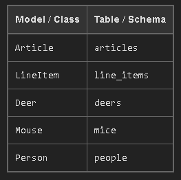

# Active Record
* Here are some of the basics of Active Record (AR), the ORM of choice for Ruby/Rails devs.
## Introduction
  * Active Record (AR) was **developed as part of Rails** with the specific **purpose of defining Database Models to allow the web app to easily *work with a SQL database using Classes***.
  * **Each AR Class** ***aka Model*** **corresponds to an existing table in the database** and provides ***attributes that map to each column/field*** in the table.
  * It then allows us to ***CRUD records in that table using that Class and its instances***.
  * For example, the ```User``` **model will automatically connect to the ```users``` table in the database**.
    *  If the **table has two fields** ```name``` and ```email``` (along with id the Primary Key of course) then **AR will allow us to ```get```/```set``` these on a given instance of ```User```**.
    * EX:
    ```rb
      # Executes the following SELECT and returns an instance attributes for that record:
      #   SELECT * FROM users WHERE email = 'bob@loblaw.com' LIMIT 1;
      user = User.find_by(email: 'bob@loblaw.com')

      # Reads an attribute (like an attr_reader)
      user.id # => 5

      # These are just like an attr_writers, performing changes in memory (no UPDATE sql)
      user.name  = 'Bob'
      user.email = 'bob@loblaw.org'

      # Executes the following UPDATE statement:
      #   UPDATE users SET name = 'Bob', email = 'bob@loblaw.org' WHERE id = 1;
      # (Assuming id of record was 1)
      user.save
    ```
  * As you can see from the example above, **AR combined with Ruby's elegant syntax makes it quite clear what is happening.**
## Active Record Basics (Ref [HERE](http://edgeguides.rubyonrails.org/active_record_basics.html))
### What is Active Record?
  * Active Record is the M in MVC (Model. View. Controller - which is the layer of the system responsible for representing business data and logic) 
### Object Relational Mapping
  * commonly referred to as its abbreviation ORM
  * Is a technique **that connects the rich objects of an application to tables in a relational database management system.**
### Convention over Configuration in Active Record
  * When writing applications using other programming languages or frameworks, it may be necessary to write a lot of configuration code.
  * This is particularly true for ORM frameworks in general. **However**, **if you follow the conventions adopted by Rails, you'll need to write very little configuration** (in some cases no configuration at all) when creating Active Record models. 
  * Explicit configuration would be needed only in those cases where you can't follow the standard convention.
    * The idea is that if you configure your applications in the very same way most of the time then this should be the default way.
### Naming Conventions
  * By default, Active Record uses some naming conventions to find out how the mapping between models and database tables should be created.
  * **Rails will pluralize your class names to find the respective database table**.
  * So, for a class ```Book```, you should have a database table called ```books```.
  * When using **class names composed of two or more words**, the ***model class name should follow the Ruby conventions***, using the ```CamelCase``` form, while the **table name must use the ```snake_case``` form**.
  * EX
    * **Model** Class - **Singular** with the ***first letter of each word capitalized*** (e.g., ```BookClub```).
    * **Database** Table - **Plural** ***with underscores separating words*** (e.g., ```book_clubs```).

    * 
### Schema Conventions
  * Active Record **uses naming conventions for the columns in database tables**, ***depending on the purpose of these columns***.
    * **Foreign keys**
      * These fields should be named following the pattern ```singularized_table_name_id``` (e.g., ```item_id```, ```order_id```).
      * These are the **fields that Active Record will look for when you create associations between your models**.
    * **Primary keys** 
      * By default, Active Record **will use an integer column named** ```id``` ***as the table's primary key*** (```bigint``` for **PostgreSQL** and **MySQL**, ```integer``` for **SQLite**).
      * **When using Active Record Migrations to create your tables**, ***this column will be automatically created***.
  * There are also some **optional column names** that will ***add additional features to Active Record instances***:
    * ```created_at```
      * Automatically **gets set to the current date and time** when the ***record is first created***.
    * ```updated_at```
      * Automatically **gets set to the current date and time** whenever the ***record is created or updated***.
    * ```lock_version```
      * Adds **optimistic locking** to a model.
    * ```type```
      * Specifies that the **model uses Single Table Inheritance**.
    * ```(association_name)_type```
      * Stores the **type for polymorphic associations**.
    * ```(table_name)_count```
      * Used to **cache the number of belonging objects on associations**.
      * For example, a ```comments_count``` **column in an ```Article``` class that has many instances of ```Comment``` will cache the ***number of existent comments for each article*****.
### Creating Active Record Models
  * To create Active Record models, **subclass the ```ApplicationRecord``` class** and you're good to go:
  ```rb
    class Product < ApplicationRecord
    end
  ```
  * This will create a ```Product``` model, mapped to a ```products``` table at the database.
  * By doing this **you'll also have the ability to map the columns of each row in that table with the attributes of the instances of your model**.
  * Suppose that the ```products``` table was created using an ```SQL``` (or one of its extensions) statement like:
  ```sql
    CREATE TABLE products (
      id int(11) NOT NULL auto_increment,
      name varchar(255),
      PRIMARY KEY  (id)
    );
  ```
  * The schema above **declares a table with two columns**: ```id``` and ```name```.
  * **Each row of this table represents a certain product with these two parameters**.
  * Thus, you would be able to write code like the following:
  ```rb
    p = Product.new
    p.name = "Some Book"
    puts p.name # "Some Book"
  ```
### Overriding the Naming Conventions
  * ```ApplicationRecord``` inherits from ```ActiveRecord::Base```, which defines a number of helpful methods.
  * You can use the ```ActiveRecord::Base.table_name=``` ***method to specify the table name that should be used***:
  ```rb
    class Product < ApplicationRecord
      self.table_name = "my_products"
    end
  ```
  * If you do so, **you will have to define manually the class name that is hosting the fixtures** (```my_products.yml```) using the ```set_fixture_class``` method in your test definition:
  ```rb
    class ProductTest < ActiveSupport::TestCase
      set_fixture_class my_products: Product
      fixtures :my_products
      # ...
    end
  ```
  * It's also **possible to override the column that should be used as the table's *primary key*** using the ```ActiveRecord::Base.primary_key=``` method:
  ```rb
    class Product < ApplicationRecord
      self.primary_key = "product_id"
    end
  ```
_______________________________________________________________________________________________________________________________________________________________________________________________________________
### ***NOTE***
<center>**Active Record does not support using non-primary key columns named id**</center>

________________________________________________________________________________________________________________________________________________________________________________________________________________
### CRUD: Reading and Writing Data
#### Create
  * **Active Record objects can be created from** a ***hash, a block, or have their attributes manually set after creation***.
  * The **```new``` method will return a new object while ```create``` will return the object and save it to the database.**
  * For example, given **a model** ```User``` **with attributes of** ```name``` and ```occupation```, the ```create``` method call **will create and save a new record into the database**:
  ```rb
    user = User.create(name: "David", occupation: "Code Artist")
  ```
  * Using the ```new``` method, **an object can be instantiated *without being saved*:**
  ```rb
    user = User.new
    user.name = "David"
    user.occupation = "Code Artist"
  ```
  * A call to ```user.save``` **will commit the record to the database**.
  * Finally, **if a block is provided**, both ```create``` and ```new``` **will yield the new object to that block for initialization**:
  ```rb
    user = User.new do |u|
      u.name = "David"
      u.occupation = "Code Artist"
    end
  ```
#### Read
  * Active Record provides a rich API for accessing data within a database.
  * Below are a few examples of different data access methods provided by Active Record.
  ```rb
    # return a collection with all users
    users = User.all

    # return the first user
    user = User.first

    # return the first user named David
    david = User.find_by(name: 'David')

    # find all users named David who are Code Artists and sort by created_at in reverse chronological order
    users = User.where(name: 'David', occupation: 'Code Artist').order(created_at: :desc)
  ```
  * You can learn more about querying an Active Record model in the [Active Record Query Interface guide](https://edgeguides.rubyonrails.org/active_record_querying.html).
#### Update
  * **Once an Active Record object has been retrieved**, its ***attributes can be modified and it can be saved*** to the database.
  ```rb
    user = User.find_by(name: 'David')
    user.name = 'Dave'
    user.save
  ```
  * A shorthand for this is to **use a hash mapping attribute names to the desired value**, like so:
  ```rb
    user = User.find_by(name: 'David')
    user.update(name: 'Dave')
  ```
  * This is **most useful when updating several attributes at once**.
  * If, on the other hand, **you'd like to update several records in bulk, you may find the** ```update_all``` class method useful:
  ```rb
    User.update_all "max_login_attempts = 3, must_change_password = 'true'"
  ```
  * This is the same as if you wrote:
  ```rb
    User.update(:all, max_login_attempts: 3, must_change_password: true)
  ```
#### Delete
  * Likewise, ***once retrieved an Active Record object can be destroyed which removes it from the database***.
  ```rb
    user = User.find_by(name: 'David')
    user.destroy
  ```
  * If you'd like to **delete several records in bulk**, you may use ```destroy_by``` or ```destroy_all``` method:
  ```rb
    # find and delete all users named David
    User.destroy_by(name: 'David')

    # delete all users
    User.destroy_all
  ```
### Validations
  * Active Record **allows you to validate the state of a model before it gets written into the database**.
  * There are several methods that you can use to check your models and **validate that an attribute value is not empty**, **is unique and not already in the database**, **follows a specific format**, and many more.
  * Validation is a very important issue to consider when persisting to the database, so the methods ```save``` and ```update``` take it into account when running: **they return ```false``` when validation fails and they don't actually perform any operations on the database.**
  * All of **these have a bang counterpart** (that is, ```save!``` and ```update!```), which are stricter in that they raise the exception ```ActiveRecord::RecordInvalid``` if validation fails.
  * A quick example to illustrate:
  ```rb
    class User < ApplicationRecord
      validates :name, presence: true
    end
  ```

  ```irb
    user = User.new
    user.save
    user.save!
  ```
  * You can learn more about validations in the [Active Record Validations guide](https://edgeguides.rubyonrails.org/active_record_validations.html).
### Callbacks
  * Active Record callbacks **allow you to attach code to certain events in the life-cycle of your models**.
  * This enables you to **add behavior to your models by transparently executing code when those events occur**, ***like when you create a new record***, ***update it***, ***destroy it***, and so on.
  * You can learn more about callbacks in the [Active Record Callbacks guide](https://edgeguides.rubyonrails.org/active_record_callbacks.html).
#### Migrations
  * Rails **provides a domain-specific language for managing a database schema called migrations**.
  * Migrations **are stored in files which are executed against any database that Active Record supports using ```rake```**.
  * Here's a migration that creates a table:
  ```rb
    class CreatePublications < ActiveRecord::Migration[7.1]
      def change
        create_table :publications do |t|
          t.string :title
          t.text :description
          t.references :publication_type
          t.integer :publisher_id
          t.string :publisher_type
          t.boolean :single_issue

          t.timestamps
        end
        add_index :publications, :publication_type_id
      end
    end
  ```
  * **Rails keeps track of which files have been committed to the database and *provides rollback features***.
  * To actually **create the table**, you'd run ```bin/rails db:migrate```, and **to roll it back**, ```bin/rails db:rollback```.
________________________________________________________________________________________________________________________________________________________________________________________________________________
#### Note that the above code **is database-agnostic**: it will run in MySQL, PostgreSQL, Oracle, and others. You can learn more about migrations in the [Active Record Migrations guide](https://edgeguides.rubyonrails.org/active_record_migrations.html).
________________________________________________________________________________________________________________________________________________________________________________________________________________
