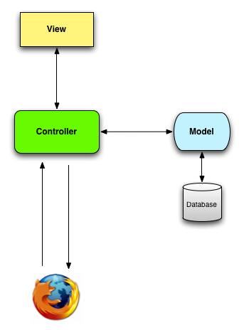
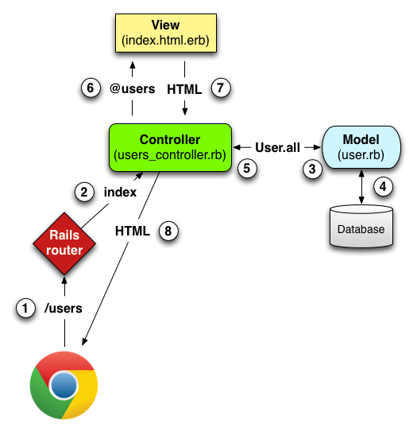
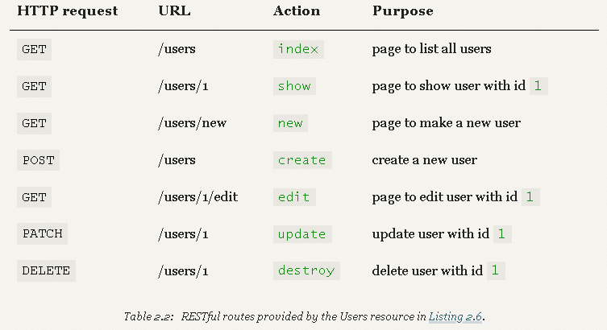

# Data flow in MVC
  * Let's further explore the topic of Model-View-Controller (MVC), specifically how it is implemented in Rails.
## Reading
  * The **Model-View-Controller** (MVC) is an architectural pattern that has been adopted to build modern web applications.
  * **Rails is not the first** MVC web framework, but **likely one of the most popular**.
  * We've spent some time **with the "M" which is *ActiveRecord***, but the rest is still very new.

## Rails Tutorial (Ref [HERE](https://www.railstutorial.org/book/))
### High Level Overview (1.2.3)
#### MVC
  * You might have noticed that the standard Rails application structure (Figure 1.11) **has an application directory called** ```app/```
    * which **includes subdirectories called** ```models```, ```views```, and ```controllers``` (among others)
  * (MVC) architectural pattern, **which enforces a separation between the data in the application** (such as user information) **and the code used to display it**, which is a common way of structuring a graphical user interface (GUI).
  * **When interacting with a Rails application**
    * a **browser sends a request**, which is **received by a webserver and passed on to a *Rails controller***, which is in charge of what to do next.
      * In some cases, **the controller will immediately render a view**, which is a template that gets converted to HTML and sent back to the browser.
    * More commonly **for dynamic sites**, **the controller interacts with a *model***, which is a Ruby object that represents an element of the site (such as a user) and is in charge of communicating with the database. 
    * **After invoking the model**, ***the controller then renders the view and returns the complete web page*** to the browser as HTML.



### MVC In Action (2.2.2)
  * Our strategy will be to **describe the results of a typical browser hit*****—a visit to the user index page*** at ```/users—in``` terms of MVC


  * Here is a summary of the steps shown in Figure 2.12:
    1. The browser issues a request for the /users URL.
    2. Rails routes /users to the index action in the Users controller.
    3. The index action asks the User model to retrieve all users (User.all).
    4. The User model pulls all the users from the database.
    5. The User model returns the list of users to the controller.
    6. The controller captures the users in the @users variable, which is passed to the index view.
    7. The view uses embedded Ruby to render the page as HTML.
    8. The controller passes the HTML back to the browser.4


