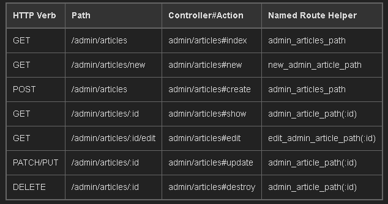
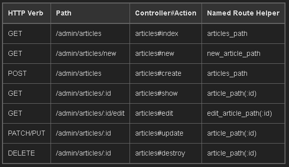

# Namespaces
  * Yet another fundamental concept of OOP that appears in many languages
  * **Two libraries** (or gems, node packages, etc) **could have functions that are named the same thing**.
    * When the function gets called, **the program doesn't know which one you want and throws an error.**
  * **To get around this problem** many programming languages **use namespacing to organize functionality into named categories**. If you break apart the word "namespace", it basically describes itself!
## Namespacing in Ruby (Ref [HERE](https://rubymonk.com/learning/books/1-ruby-primer/chapters/35-modules/lessons/80-modules-as-namespaces))
### Collision course
  * Namespacing is a **way of bundling logically related objects together**.
  * **Modules serve as a convenient tool for this**.
  * **This allows classes or modules with conflicting names to co-exist** while avoiding collisions.
  * Think of this as storing different files with the same names under separate directories in your filesystem.
  * Modules can also hold classes. In this example, we'll try and define an Array class under our Perimeter module from the last lesson. Notice how it does not affect Ruby's Array class at all.
  ```rb
    module Perimeter
      class Array
        def initialize
          @size = 400
        end
      end
    end

    our_array = Perimeter::Array.new
    ruby_array = Array.new

    p our_array.class
    p ruby_array.class
  ```
  * We have these two classes alongside each other. This is possible because we've namespaced our version of the Array class under the Perimeter module.

  * ```::``` is a constant lookup operator that looks up the Array constant only in the Perimeter module.
  * What happens when we don't namespace our Array class?
  ```rb
    class Array
      def initialize
        @size = 400
      end
    end

    our_array = Array.new

    p our_array.class
  ```
  * Because Ruby has open classes, doing this simply extends the Array class globally throughout the program, which is dangerous and of course not our intended behaviour.
  * The examples above are a bit contrived for the sake of simplicity. The real problem that namespacing solves is when you're loading libraries. If your program bundles libraries written by different authors, it is often the case that there might be classes or modules defined by the same name.
  * We're assuming these two libraries gym and dojo have classes as shown in the comment above them.
  ```rb
    # class Push
    #   def up
    #     40
    #   end
    # end
    require "gym" # up returns 40
    gym_push = Push.new
    p gym_push.up

    # class Push
    #   def up
    #     30
    #   end
    # end
    require "dojo" # up returns 30
    dojo_push = Push.new
    p dojo_push.up
  ```
  * As the dojo library is loaded after gym, **it has overriden gym's class definition of Push and therefore creates an instance of Push defined in dojo.**
  * The way to **solve this problem is to wrap these classes in appropriate namespaces using modules**.
  ```rb
    # module Gym
    #   class Push
    #     def up
    #       40
    #     end
    #   end
    # end
    require "gym"

    # module Dojo
    #   class Push
    #     def up
    #       30
    #     end
    #   end
    # end
    require "dojo"

    dojo_push = Dojo::Push.new
    p dojo_push.up

    gym_push = Gym::Push.new
    p gym_push.up
  ```
  * When you're creating libraries with Ruby, it is a good practice to namespace your code under the name of your library or project.
### Constant lookup
  * We used the constant lookup (```::```) operator in the last section to scope our class to the module. As the name suggests, you can scope any constant using this operator and not just classes.
  ```rb
    module Dojo
      A = 4
      module Kata
        B = 8
        module Roulette
          class ScopeIn
            def push
              15
            end
          end
        end
      end
    end

    A = 16
    B = 23
    C = 42

    puts "A - #{A}"
    puts "Dojo::A - #{Dojo::A}"

    puts

    puts "B - #{B}"
    puts "Dojo::Kata::B - #{Dojo::Kata::B}"

    puts

    puts "C - #{C}"
    puts "Dojo::Kata::Roulette::ScopeIn.new.push - #{Dojo::Kata::Roulette::ScopeIn.new.push}"
  ```
  * There are a few things going on the example above.
    * Constant A is scoped within Dojo and accessing it via ```::``` works as expected.
    * Same for constant B which is nested further inside Kata.
    * Class ScopeIn is nested even deeper inside Roulette which has a method returning 15.
  * This tells us two important things.** One, we can nest constant lookups as deep as we want**. **Second, we aren't restricted to just classes and modules**.
  * You are given a library called ```RubyMonk```. It **contains a module Parser which defines a class CodeParser**. Write another class ```TextParser``` in the same namespace that parses a string and returns an array of capitalized alphabets.
  ```rb
    module RubyMonk
      module Parser
        class TextParser
          def self.parse(str)
            str.upcase.split("")
            # define method
          end
        end
      end
    end
    RubyMonk::Parser::TextParser.parse("RubyMonk")
      # => ['R', 'U', 'B', 'Y', 'M', 'O', 'N', 'K']
  ```
  * If you prepend a constant with :: without a parent, the scoping happens on the topmost level. In this exercise, change push to return 10 as per A = 10 in the topmost level, outside the Kata module.
  ```rb
    module Kata
      A = 5
      module Dojo
        B = 9
        A = 7
        
        class ScopeIn
          def push
            Kata::A * 2
          end
        end
      end
    end

    A = 10
  ```
  * Using modules and namespacing is the standard way of organizing libraries with Ruby. It's a good practice to keep this in mind while writing one.
## Namespacing in Rails Routes (REf [HERE](https://guides.rubyonrails.org/routing.html#controller-namespaces-and-routing))
### Controller Namespaces and Routing 
  * You may wish to **organize groups of controllers under a namespace**.
  * Most commonly, you might **group a number of administrative controllers under an ```Admin::``` namespace**, and **place these controllers under the ```app/controllers/admin``` directory**.
  * **You can route to such a group by using a ```namespace``` block**
  ```rb
    namespace :admin do
      resources :articles, :comments
    end
  ```
  * This will **create a number of routes for each of the ```articles``` and ```comments``` controller.** For ```Admin::ArticlesController```, Rails will create:



  * If instead you want to route ```/articles``` (**without the prefix ```/admin```**) to ```Admin::ArticlesController```, you can **specify the module with a scope block**:
  ```rb
    scope module: 'admin' do
      resources :articles, :comments
    end
  ```
  * This can also be done for a single route:
  ```rb
    resources :articles, module: 'admin'
  ```
  * If instead you want to route ```/admin/articles``` to ```ArticlesController``` (**without the ```Admin::``` module prefix**), you can **specify the path with a scope block:**
  ```rb
    scope '/admin' do
      resources :articles, :comments
    end
  ```
  * This can also be done for a single route:
  ```rb
    resources :articles, path: '/admin/articles'
  ```
  * In both of these cases,** the named route helpers remain the same as if you did not use scope**.
  * **In the last case, the following paths map to ArticlesController**:

  

  * If you need to use a different controller namespace inside a namespace block you can specify an absolute controller path, e.g: ```get '/foo', to: '/foo#index'```.
